<!--pmd
id:"home"
title:"Everything you can display using portable.md"
kind:"home"
updated:"2026-10-05"
showUpdated:"false"
seoTitle:"Everything you can display using portable.md"
description:"A visual tour of everything the portable.md reader can show: text, callouts, tables, code, math, 35 diagram types, media, Canvas, queries, and every way to change the reader's look and navigation."
-->
# Everything you can display

This project shows what the **portable.md** reader can put on a page, and what you can change about how the reader looks and moves. One Markdown file and a handful of small files make all of it. Nothing here is a screenshot.

{{pages parent="home" view="cards"}}

::::columns 3
### Content
Text, callouts, tables, code, math, diagrams, media, queries, Canvas and more.

[Start with text](#/content/text) · [All content](#/content)
::::column
### Look and navigation
Theme, table of contents, tree, page graph and the reading surface.

[Start with the theme](#/look/theme) · [All of it](#/look)
::::column
### Take a tour
Two paths through the pages, one step at a time.

[Content tour](journey:Content%20tour) · [Look and feel tour](journey:Look%20and%20feel%20tour)
::::

## Try these first

- Press <kbd>G</kbd> for the fullscreen page graph, then <kbd>T</kbd> to switch theme.
- Press <kbd>?</kbd> for every keyboard shortcut, or <kbd>/</kbd> to search.
- Open [Everything, back to back](#/stress): the whole project on one page.

## The pages on one graph

{{pages tag="gallery" view="graph"}}

:::info
This project only shows. To learn how to write any of it, read the field guide that comes with [portable.md](https://portable.md/).
:::

<!--pmd
id:"content"
title:"Content"
parent:"home"
updated:"2026-10-05"
showUpdated:"false"
description:"Thirteen kinds of content a portable.md page can hold."
-->
# What a page can hold

Thirteen kinds of content, one page each. Follow the [Content tour](journey:Content%20tour) or choose a card.

{{pages parent="content" view="cards"}}

<!--pmd
id:"text"
title:"Text and typography"
parent:"content"
tags:"gallery"
journey:"Content tour" "1"
updated:"2026-10-03"
-->
# Text and typography

Inline marks, paragraph flow, lists, tasks and emoji.

## Inline marks

**Bold** · *italic* · ***both*** · ++underline++ · ~~retired~~ · ==highlight== · ||spoiler|| · H~2~O · x^2^ · `code` · <kbd>Ctrl</kbd>+<kbd>K</kbd>

-# Subtext sits quietly beneath a main idea.

The marks nest: ==**bold inside a highlight**==, ++underline with `code` inside++, **bold with ==a highlight== and H~2~O**, and ||a spoiler hiding **bold**, `code` and [a link](#/content)||.

## Paragraph flow

A soft break keeps the line in the same paragraph.  
This line follows two trailing spaces.

> A quotation keeps its own voice, and can run to a second paragraph.
>
> That second paragraph stays inside the quotation.

<left>Left aligned</left>

<center>Centered</center>

<right>Right aligned</right>

---

## Lists and tasks

- An unordered item
  - A nested item
    - A third level
- Another item

1. A first step
2. A second step
   1. A sub-step
3. A third step

- [x] A completed task, saved in the source
- [ ] An open task, saved in the source
- [?] A reader checkbox: click it, it is not saved

## Emoji

Built-in :rocket: :sparkles: :books: :tada: and a project emoji :demo: from `CUSTOM_EMOJI`. Raw unicode passes through: 🚀 🎉 and joined sequences such as 👩‍🚀 and 👨‍👩‍👧‍👦.

## Edge cases that stay quiet

Escaped markup stays literal: \*not italic\*, \==not highlighted\==, \`not code\`.

Delimiters around nothing are not marks: `== ==` stays == ==, `^ ^` stays ^ ^, `++ ++` stays ++ ++.

Strikethrough keeps its tildes: ~~struck~~ next to H~2~O.

A very long unbroken string wraps inside the column instead of widening the page: Pneumonoultramicroscopicsilicovolcanoconiosis_and_then_some_more_characters_without_any_spaces_to_break_on.

## Reading measure

Good typography is mostly a matter of line length and rhythm. The reader sets text in a column of about seventy characters, because eyes lose their place on lines much longer than that. On a wide screen, the reading-width button lets the column use the whole window; on a phone, the column simply fills the screen.

Headings, quotes and lists keep their own spacing, so a page that mixes them still reads as one voice. Try the width button, then come back to this paragraph.

<!--pmd
id:"callouts"
title:"Callouts and spoilers"
parent:"content"
tags:"gallery"
journey:"Content tour" "2"
updated:"2026-10-02"
-->
# Callouts and spoilers

Asides with the right weight, and content that waits to be asked for.

## Alerts

> [!NOTE]
> Background worth keeping nearby.

> [!TIP]
> A practical improvement.

> [!IMPORTANT]
> A prerequisite or a key constraint.

> [!WARNING]
> A consequential problem to avoid.

> [!CAUTION]
> A risk that needs attention before acting.

## Callout blocks

:::info
A callout holds **Markdown** and several blocks:

- a list
- with `code`

| And | a table |
| --- | --- |
| inside | the callout |
:::

:::success
A verified outcome.
:::

:::warning
A longer warning, with normal Markdown inside.
:::

:::danger
A concrete danger, not decorative red.
:::

## Spoilers

:::spoiler Click to reveal
Spoiler blocks are disclosure controls, not privacy controls.

```js
const answer = 6 * 7
```
:::

:::spoiler A spoiler holding a callout
:::success
A callout inside a spoiler.
:::
Text after the inner callout stays in the spoiler.
:::

Inline spoilers hide a word: the answer is ||forty-two||.

## Raw HTML disclosure

<details>
<summary>A plain details element</summary>
<p>The browser's own <code>details</code> and <code>summary</code> elements work as well.</p>
</details>

## Quotations

> The reader keeps quotations visually quiet.
>
> > A nested quotation sits one level deeper.

<!--pmd
id:"layout"
title:"Columns, tables and alignment"
parent:"content"
tags:"gallery"
journey:"Content tour" "3"
updated:"2026-10-01"
-->
# Columns, tables and alignment

Side-by-side blocks and tables that behave on every screen.

## Columns

::::columns 2
### Before
The original approach, in ordinary Markdown.
::::column
### After
The revised approach, next to it.
::::

::::columns 3
### One
A column can hold a list:

- first
- second
::::column
### Two
Or a callout:

> [!TIP]
> Columns scroll sideways on a narrow screen.
::::column
### Three
Or an image:


::::

::::columns 4
Four
::::column
short
::::column
columns
::::column
wide
::::

## Tables

| Facet | Purpose | Sample pages |
| :--- | :---: | ---: |
| **Left aligned** | Centered | Right aligned |
| `code` in a cell | ==highlight== | [a link](#/content) |
| A pipe, escaped | A \| B | 2 |

### A wide table scrolls instead of breaking the page

| Surface | Where | Changes with | Shown by | Kept in | Reset by | Example | Note |
| --- | --- | --- | --- | --- | --- | --- | --- |
| Theme | Whole reader | Toggle or config | Colors | Browser | Clearing site data | Dark | One per reader |
| Width | Content | Toggle | Column | Browser | Clearing site data | Full | Wide screens |
| Panels | Sides | Buttons, swipes | Layout | Session | Reload | Hidden | Phones swipe |

### A ragged table and a long cell

| Short | A long cell | Missing |
| --- | --- | --- |
| a | https://example.com/a/very/long/address/that/has/no/spaces/to/wrap/on/and/keeps/going/and/going |
| b | A sentence that wraps at word boundaries inside its column | c | extra |

## Rules

---

***

<!--pmd
id:"code"
title:"Code"
parent:"content"
tags:"gallery"
journey:"Content tour" "4"
updated:"2026-09-30"
-->
# Code

Fenced blocks are highlighted by language, never run, and have a copy button.

## A dozen languages

```js
const pages = ["text", "code", "math"]
console.log(pages.map(title => title.toUpperCase()).join(" / "))
```

```python
def tour(stops):
    for number, stop in enumerate(stops, start=1):
        print(f"{number}. {stop}")
```

```ts
interface Page { id: string; tags: string[] }
const home: Page = { id: "home", tags: [] }
```

```bash
for file in assets/*.png; do
  echo "$file: $(wc -c < "$file") bytes"
done
```

```json
{ "TITLE": "Everything", "ACCENT": "#e8833a" }
```

```yaml
reader:
  theme: dark
  accent: "#e8833a"
```

```html
<figure>
  
  <figcaption>Raw HTML in a code block stays text.</figcaption>
</figure>
```

```css
.demo-skin { --color-accent: #e8833a; border-radius: var(--r-md); }
```

```sql
SELECT title, updated FROM pages WHERE tags LIKE '%gallery%' ORDER BY updated DESC;
```

```rust
fn main() {
    let tags = ["gallery", "visual"];
    println!("{}", tags.join(", "));
}
```

```go
package main

import "fmt"

func main() { fmt.Println("hello, reader") }
```

```diff
- ACCENT: "#3fabd1"
+ ACCENT: "#e8833a"
```

## Aliases and plain text

`py` and `sh` are aliases for Python and Bash. A fence with no language stays plain:

```
No language: no highlighting, same spacing,
    and   the   whitespace   is   kept.
```

## A fence that contains a fence

````md
```js
console.log("a fence inside a fence")
```
````

## A wide block scrolls

```text
This line is deliberately far wider than the reading column so the block scrolls sideways instead of stretching the page or wrapping: 0123456789 0123456789 0123456789 0123456789 0123456789 0123456789 0123456789 0123456789
```

## Inline code

Use `inline code` for names, `a` `b` `c` side by side, and ``a `backtick` inside`` with a longer run.

<!--pmd
id:"math"
title:"Math"
parent:"content"
tags:"gallery"
journey:"Content tour" "5"
updated:"2026-09-29"
-->
# Math

KaTeX formulas, inline and display, with prices left alone.

## Inline

The mass–energy relation $E=mc^2$ stays in the sentence, and so does a braced number ${2+3}$. Prices such as $5 to $10 remain text.

## Display

$$
x = \frac{-b \pm \sqrt{b^2 - 4ac}}{2a}
$$

$$
\begin{aligned}
f(x) &= x^2 + 1 \\
f'(x) &= 2x \\
\int_0^1 f(x)\,dx &= \tfrac{4}{3}
\end{aligned}
$$

## Matrices, sums and cases

$$
A = \begin{pmatrix} 1 & 2 \\ 3 & 4 \end{pmatrix}, \qquad
\sum_{n=1}^{\infty} \frac{1}{n^2} = \frac{\pi^2}{6}
$$

$$
|x| = \begin{cases} x & \text{if } x \ge 0 \\ -x & \text{otherwise} \end{cases}
$$

## Sets and symbols

$\mathbb{R} \subset \mathbb{C}$, $\forall \epsilon > 0\ \exists \delta > 0$, $\binom{n}{k}$, $\sqrt[3]{27} = 3$, $\vec{v} \cdot \vec{w}$.

## Math stays out of code

Inside code `$not math$` is literal, and so is a fence:

```text
$$ not math $$
```

<!--pmd
id:"diagrams"
title:"Diagrams"
parent:"content"
tags:"gallery"
journey:"Content tour" "6"
updated:"2026-10-04"
-->
# Diagrams

Thirty-five diagram types from Mermaid, drawn by the reader in the project's colors. They are grouped here by what they describe.

{{pages parent="diagrams" view="cards"}}

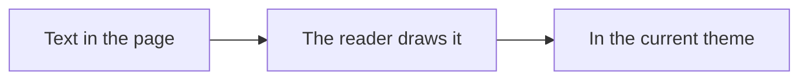

<!--pmd
id:"diagrams_flow"
title:"Flows and structure"
parent:"diagrams"
journey:"Content tour" "7"
updated:"2026-10-04"
-->
# Flows and structure

How things connect: steps, roles, messages, classes, states, records, requirements, systems and blocks.

## flowchart

A process, decision tree or dependency path. Label decisions and outcomes; split an unreadable tangle.

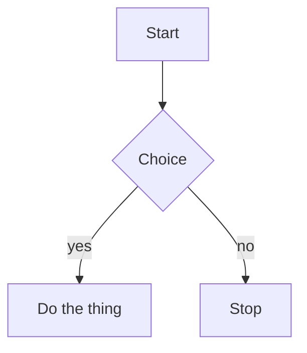

## swimlane-beta

A process divided by responsibility. Keep lanes consistent and label handoffs between teams or systems.

```mermaid
swimlane-beta LR
  subgraph Author
    Draft[Write draft]
    Revise[Revise page]
  end
  subgraph Reviewer
    Check{Ready to publish?}
  end
  subgraph Publisher
    Publish[Publish page]
  end
  Draft -->|Request review| Check
  Check -->|Changes needed| Revise
  Revise --> Check
  Check -->|Approved| Publish
```

## usecase-beta

Actors and the goals a system supports. Show system boundaries and distinguish required included behavior from optional extensions.

```mermaid
usecase-beta
  direction LR
  actor Reader
  actor Author
  systemBoundary Wiki[Knowledge space]
    Browse(Browse pages)
    Search(Search notes)
    Edit(Edit a page)
  end
  Reader --> Browse
  Reader --> Search
  Author --> Edit
```

## sequenceDiagram

Messages between actors over time. Keep participants stable and distinguish alternatives from parallel work.

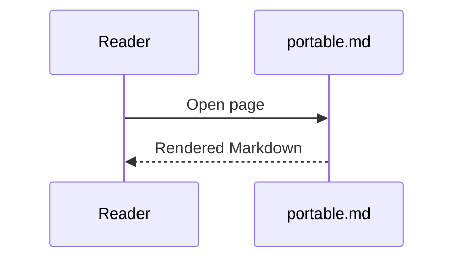

## classDiagram

Software types and their relationships. Use only attributes and methods supported by the source.

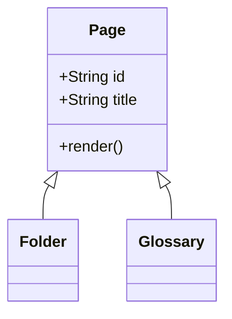

## stateDiagram-v2

States and allowed transitions. Show a state machine, not a chronological task list.

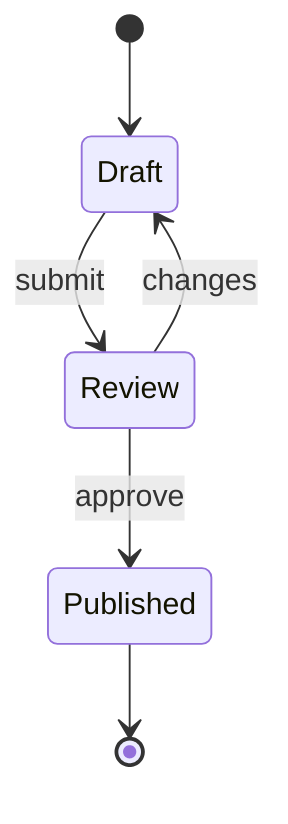

## erDiagram

Data entities, keys and cardinality. Do not invent a relationship because two records share a word.

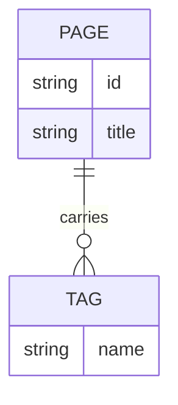

## requirementDiagram

Trace requirements to verification and dependent elements. Preserve IDs and source evidence.

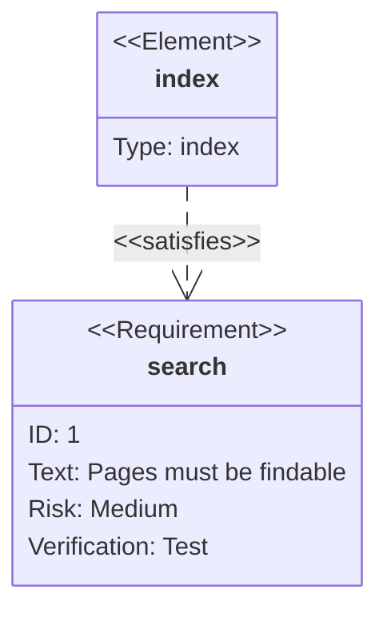

## C4Context

People and systems, or containers within a system. Choose the right abstraction level and name boundaries.

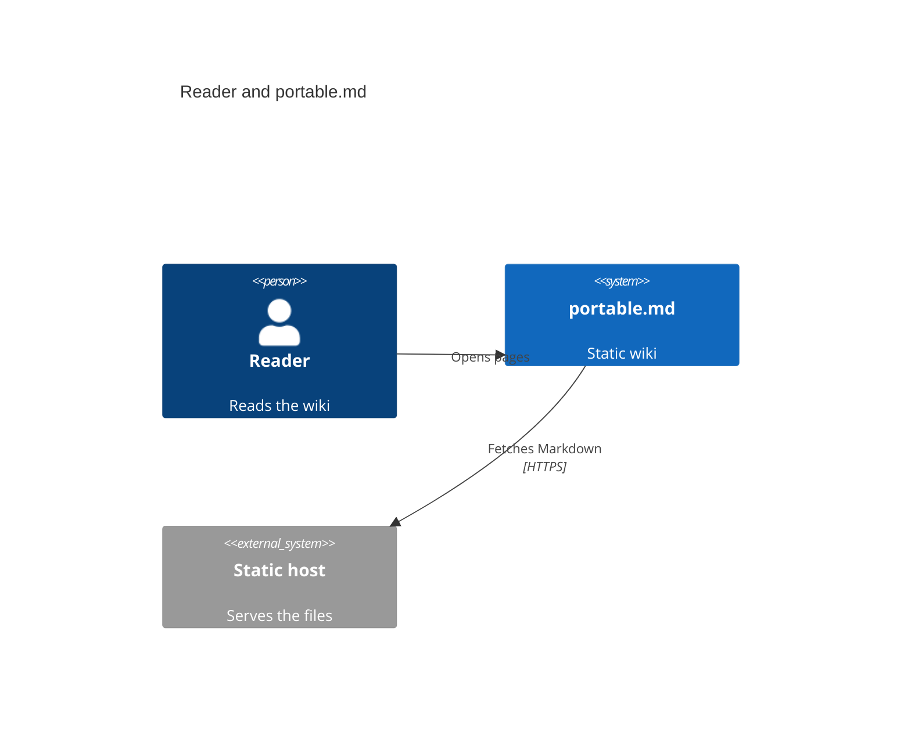

## block-beta

A deliberate block arrangement or layered structure. Prefer flowchart when layout is secondary to connections.

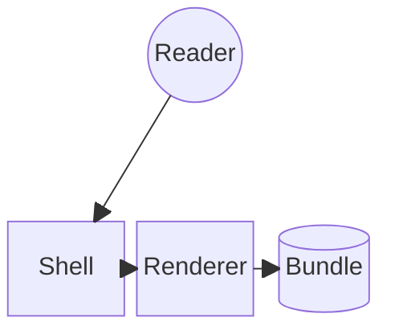

## architecture-beta

Services, infrastructure groups and links. Diagram actual components rather than decorative cloud boxes.

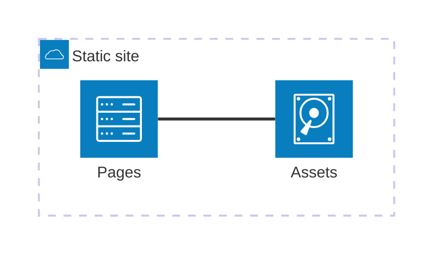

## zenuml

A sequence diagram in ZenUML notation. PMD loads its pinned registration; do not relabel arbitrary Java-like code as a diagram.

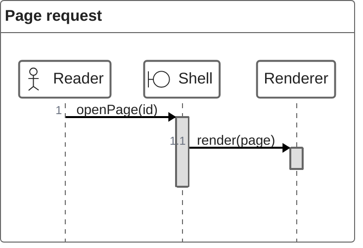

<!--pmd
id:"diagrams_time"
title:"Time, plans and journeys"
parent:"diagrams"
journey:"Content tour" "8"
updated:"2026-10-04"
-->
# Time, plans and journeys

How things unfold: schedules, histories, boards and the order of events.

## journey

A person’s experience across stages and actors. Scores must be supplied or explicitly labeled illustrative; this is distinct from a PMD reading journey.

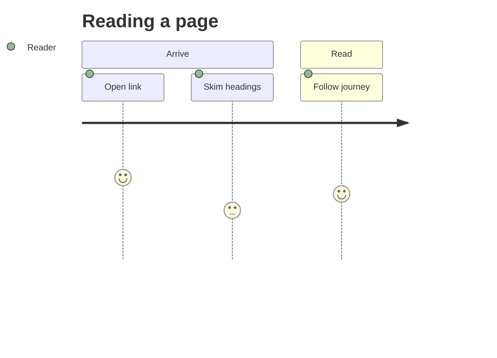

## gantt

A schedule with actual dates/durations/dependencies. Proposed plans must be labeled; do not convert update dates into commitments.

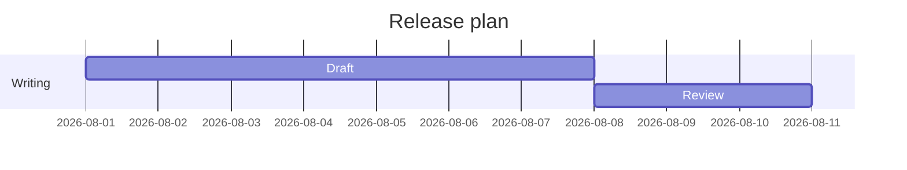

## timeline

Named historical periods/events. Keep dates factual and distinguish this authored diagram from a page-update timeline.

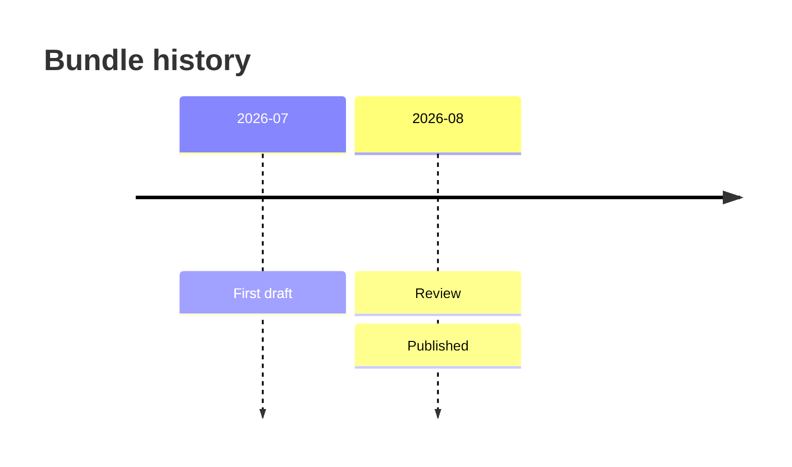

## gitGraph

Branch/merge history or a proposed workflow. A diagram does not create Git commits.

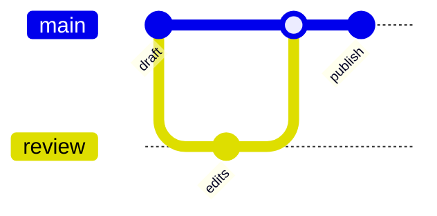

## kanban

An authored work-board snapshot. It is not a live task database; changes require source edits.

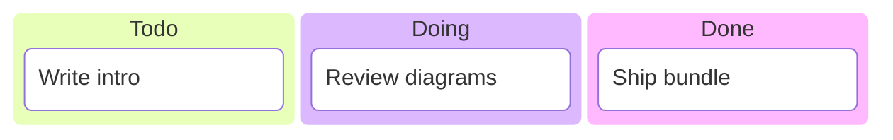

## eventmodeling

Commands, events and read models across a process. Keep order and system ownership explicit.

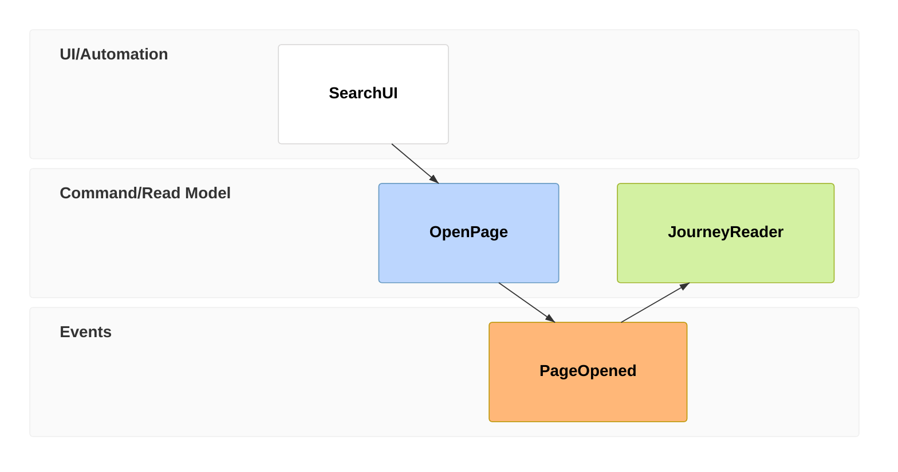

<!--pmd
id:"diagrams_data"
title:"Data and charts"
parent:"diagrams"
journey:"Content tour" "9"
updated:"2026-10-04"
-->
# Data and charts

How much and how many: shares, positions, flows, series, comparisons and overlaps.

## pie

A small number of nonnegative parts of one whole. Use a table/bar chart when precise comparison matters.

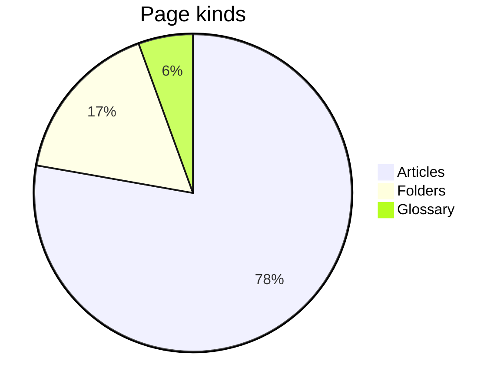

## quadrantChart

Items positioned on two meaningful dimensions. Explain axes and the basis for placements.

```mermaid
quadrantChart
  title Effort and value
  x-axis Low effort --> High effort
  y-axis Low value --> High value
  Rewrite intro: [0.3, 0.8]
  Fix typos: [0.2, 0.3]
  New diagrams: [0.7, 0.7]
```

## sankey-beta

Quantities flowing between stages. Verify units and conservation assumptions; not a generic dependency graph.

```mermaid
sankey-beta

Search,Article,40
Search,Glossary,10
Article,Journey,25
```

## xychart-beta

Numeric comparisons or trends with labeled axes/units. Preserve measured data and avoid fabricated points.

```mermaid
xychart-beta
  title "Pages per month"
  x-axis [jan, feb, mar, apr]
  y-axis "Pages" 0 --> 60
  bar [12, 24, 38, 55]
  line [12, 24, 38, 55]
```

## radar-beta

Several comparable metrics on the same scale. Explain normalization; a table is clearer for exact values.

```mermaid
radar-beta
  title Page quality
  axis clarity["Clarity"], depth["Depth"], links["Links"], media["Media"]
  curve now["Now"]{3, 4, 2, 5}
```

## treemap-beta

Nested quantitative composition. Use meaningful nonnegative sizes and a stable hierarchy.

```mermaid
treemap-beta
"Bundle"
  "Articles": 42
  "Folders": 9
  "Glossary": 3
```

## packet

Bit fields in a packet/header. Validate offsets, widths and total size against the real format.

```mermaid
packet
  title Page record
  0-15: "Page id"
  16-31: "Flags"
  32-63: "Updated"
  64-127: "Title"
```

## venn-beta

Set membership and overlap. Do not imply measured overlap sizes without supporting data.

```mermaid
venn-beta
  title "Page kinds"
  set Tagged
  set Journey
  union Tagged,Journey["Both"]
```

<!--pmd
id:"diagrams_maps"
title:"Maps and strategy"
parent:"diagrams"
journey:"Content tour" "10"
updated:"2026-10-04"
-->
# Maps and strategy

How ideas are arranged: hierarchies, causes, landscapes and grammars.

## mindmap

A concept hierarchy for exploration. Use page hierarchy or a list for straightforward navigation.

```mermaid
mindmap
  root((portable.md))
    Pages
      Tags
      Journeys
    Rendering
      Markdown
      Diagrams
```

## ishikawa-beta

Candidate causes grouped around a problem. Label hypotheses rather than presenting them as verified causes.

```mermaid
ishikawa-beta
  Page went stale
    People
      No owner
    Process
      No review date
```

## wardley-beta

A strategy map of user needs, dependencies and evolution. Explain positioning assumptions.

```mermaid
wardley-beta
  title Publishing chain
  anchor Reader [0.9, 0.7]
  component Page [0.75, 0.6]
  component Bundle [0.6, 0.4]
  Reader -> Page
  Page -> Bundle
```

## cynefin-beta

Situations classified by decision context. Explain the classification rather than implying scientific measurement.

```mermaid
cynefin-beta
  clear "Fix a typo"
  complicated "Restructure journeys"
  complex "Rewrite the manual"
  chaotic "Recover a lost bundle"
```

## treeView-beta

A file or structural tree. For a navigable knowledge space, actual PMD pages still carry the content.

```mermaid
treeView-beta
    pmd-project/
        index.html
        content/
            pmd.json
            portable.md
            assets/
                example-image.png
```

## railroad-abnf-beta

A grammar supplied in ABNF. Verify alternatives and repetitions against the real grammar.

```mermaid
railroad-abnf-beta
    title Page route

    route = "#" page-id *( "#" page-id ) ;
    page-id = 1*( ALPHA / DIGIT / "_" ) ;
```

## railroad-ebnf-beta

A grammar supplied in EBNF. Keep terminal/nonterminal distinctions explicit.

```mermaid
railroad-ebnf-beta
    title Query option

    query = "{{pages" option* "}}" ;
    option = name "=" value ;
    name = letter+ ;
    letter = "a" | "b" | "c" ;
```

## railroad-beta

A railroad diagram written as Mermaid’s intermediate representation. Use when that source form is supplied.

```mermaid
railroad-beta
    title Page route

    route = sequence(terminal("#"), nonterminal("id"), zeroOrMore(sequence(terminal("#"), nonterminal("id")))) ;
    id = oneOrMore(nonterminal("letter")) ;
    letter = choice(terminal("a"), terminal("b")) ;
```

## railroad-peg-beta

A parsing-expression grammar. Ordered alternatives are not interchangeable with ABNF/EBNF choices.

```mermaid
railroad-peg-beta
    title Tag filter

    Filter <- Tag ("," Tag)* ;
    Tag <- Letter+ ;
    Letter <- "a" / "b" / "c" ;
```

<!--pmd
id:"media"
title:"Media"
parent:"content"
tags:"gallery"
journey:"Content tour" "11"
updated:"2026-10-04"
-->
# Media

Images, video, audio and documents share one Markdown shape: an image-style link to a file. The reader chooses the player or viewer from the file type.

| File | Becomes |
| --- | --- |
| `.png` `.jpg` `.svg` `.webp` `.gif` | An image with a lightbox |
| `.mp4` `.webm` | A video player |
| `.mp3` `.wav` `.flac` | An audio player |
| `.pdf` | A page-by-page PDF viewer |
| `.csv` `.tsv` | A searchable table viewer |
| `.md` | The rendered Markdown file |
| `.txt` `.json` `.log` | A plain text viewer |
| Anything else | A download link |

{{pages parent="media" view="cards"}}

<!--pmd
id:"images"
title:"Images and emoji"
parent:"media"
journey:"Content tour" "12"
updated:"2026-10-04"
-->
# Images and emoji

Raster and vector images, a chosen width, and emoji of both kinds.

## An image and its lightbox


Click an image to open it in the lightbox. Zoom with the buttons, the mouse wheel or a two-finger pinch, and drag to move.

## A chosen width


## A vector image

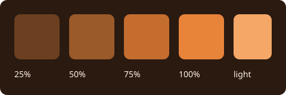

## Images side by side

::::columns 2

::::column

::::

## Emoji

Built-in artwork :joy: :book: :sparkles: and the project's own :demo: come from the same shortcode syntax.

<!--pmd
id:"video_audio"
title:"Video and audio"
parent:"media"
journey:"Content tour" "13"
updated:"2026-10-04"
-->
# Video and audio

Players for local files, with captions and a silent loop.

## A video player


## With captions

<video class="pmd-media pmd-video" controls preload="metadata" width="640"><source src="assets/clip.webm" type="video/webm"><track kind="captions" src="assets/clip.vtt" srclang="en" label="English" default></video>

## A silent loop


Click the loop to open it in the lightbox.

## Audio


Three short ascending tones, C–E–G, over three seconds. No speech.

<!--pmd
id:"documents"
title:"Documents and data"
parent:"media"
journey:"Content tour" "14"
updated:"2026-10-04"
-->
# Documents and data

PDF, tables, Markdown and text files, each shown in place.

## A PDF


## A CSV table


## The same data as TSV


## A Markdown file


## The same file as raw text


## Plain text and JSON


## Downloads

[Download the PDF](assets/guide.pdf "download") · [Download the CSV](assets/surfaces.csv "download")

Image syntax with the title `"download"` gives the same kind of link: 

<!--pmd
id:"queries"
title:"Page queries"
parent:"content"
tags:"gallery, interactive"
journey:"Content tour" "15"
updated:"2026-10-03"
-->
# Page queries

A page query selects real pages by their metadata and draws the result. Every view below is one line of source and updates when the pages change.

## List

{{pages tag="gallery" limit="5" view="list"}}

## Cards

{{pages tag="gallery" limit="6" view="cards"}}

## Table

{{pages tag="gallery" sort="title" limit="6" view="table"}}

## Timeline

{{pages tag="gallery" sort="updated" limit="6" view="timeline"}}

## Graph

{{pages tag="gallery" view="graph"}}

## Other filters

The children of one page:

{{pages parent="diagrams" sort="title" view="list"}}

The steps of a journey:

{{pages journey="Look and feel tour" view="list"}}

Pages that mention a word, without this one:

{{pages text="lightbox" current="false" limit="4" view="list"}}

An empty result with a message of your own:

{{pages text="zzzz-no-such-text" empty="No page contains that text."}}

<!--pmd
id:"canvas"
title:"Canvas"
parent:"content"
tags:"gallery, interactive"
journey:"Content tour" "16"
updated:"2026-10-03"
-->
# Canvas

A board of cards and connections, placed by hand. Pan, zoom and open the cards.

```canvas
{
  "nodes": [
    { "id": "g-content", "type": "group", "x": -40, "y": -40, "width": 540, "height": 440, "label": "Content", "color": "2" },
    { "id": "g-look", "type": "group", "x": 580, "y": -40, "width": 540, "height": 440, "label": "Look and navigation", "color": "5" },
    { "id": "t-text", "type": "text", "text": "## Text\n\nMarks, lists, tasks, emoji.", "x": 0, "y": 20, "width": 230, "height": 130 },
    { "id": "t-media", "type": "text", "text": "## Media\n\nImages, video, audio, documents.", "x": 260, "y": 20, "width": 230, "height": 130, "color": "4" },
    { "id": "t-diagrams", "type": "text", "text": "## Diagrams\n\n35 types, drawn live.", "x": 0, "y": 190, "width": 230, "height": 130 },
    { "id": "f-image", "type": "file", "file": "assets/sample-image.png", "x": 260, "y": 180, "width": 230, "height": 170 },
    { "id": "t-theme", "type": "text", "text": "## Theme\n\nAccent, skins and CSS.", "x": 620, "y": 20, "width": 230, "height": 130, "color": "6" },
    { "id": "l-graph", "type": "link", "url": "#/look/graph", "label": "Page graph", "x": 880, "y": 20, "width": 220, "height": 130 },
    { "id": "l-tree", "type": "link", "url": "#/look/tree", "label": "Tree shapes", "x": 620, "y": 190, "width": 230, "height": 130 },
    { "id": "t-reading", "type": "text", "text": "## Reading surface\n\nWidth, panels, previews.", "x": 880, "y": 190, "width": 220, "height": 130 }
  ],
  "edges": [
    { "id": "e-text-media", "fromNode": "t-text", "toNode": "t-media", "fromSide": "right", "toSide": "left", "label": "same Markdown", "color": "3" },
    { "id": "e-media-image", "fromNode": "t-media", "toNode": "f-image", "fromSide": "bottom", "toSide": "top", "label": "files" },
    { "id": "e-diagrams-text", "fromNode": "t-diagrams", "toNode": "t-text", "fromSide": "top", "toSide": "bottom", "label": "text becomes drawing" },
    { "id": "e-media-theme", "fromNode": "t-media", "toNode": "t-theme", "fromSide": "right", "toSide": "left", "label": "colors follow the theme", "color": "5" },
    { "id": "e-theme-graph", "fromNode": "t-theme", "toNode": "l-graph", "fromSide": "right", "toSide": "left", "label": "accent" },
    { "id": "e-tree-reading", "fromNode": "l-tree", "toNode": "t-reading", "fromSide": "right", "toSide": "left", "label": "reading" }
  ]
}
```

| Card | Holds |
| --- | --- |
| Text | Markdown |
| Link | A page route or an address |
| File | An image or document from the project |
| Group | A labeled region that contains other cards |

<!--pmd
id:"notes"
title:"Footnotes, citations and glossary terms"
parent:"content"
tags:"gallery"
journey:"Content tour" "17"
updated:"2026-10-02"
-->
# Footnotes, citations and glossary terms

Three kinds of note, each revealed in place: hover or focus them.

## A page-local footnote

The reader keeps small asides beside the sentence that needs them.[^notes-aside]

[^notes-aside]: This footnote belongs only to this page and appears in a popover.

## A citation

Good graphics respect their readers' attention.[@tufte-2001] Typography asks for the same discipline.[@bringhurst-2004]

The sources are entries on the [References page](#/demo_references), and the pocket guide is cited the same way.[@demo-guide]

## Glossary terms

Terms defined on the glossary page show their definition on hover. This paragraph uses a **bundle**, a **simple folder**, a **journey**, a **page query** and a **transclusion**, and it mentions the **table of contents** and the **page graph**.

<!--pmd
id:"transclusion"
title:"Transclusion"
parent:"content"
tags:"gallery"
journey:"Content tour" "18"
updated:"2026-10-01"
-->
# Transclusion

Write once, include elsewhere. The block below lives on another page and is shown here with its source named.

![[transclusion_source#A reusable block]]

A whole page can be included too:

![[transclusion_source]]

<!--pmd
id:"transclusion_source"
title:"A reusable source"
parent:"transclusion"
updated:"2026-10-01"
showUpdated:"false"
-->
# One maintained source

## A reusable block

:::info
Keep the original observation, label your interpretation, and link the evidence.
:::

## A section not included by name

The page that includes only the block above leaves this sentence behind.

<!--pmd
id:"presentation"
title:"Presentation"
presentation:"h2"
parent:"content"
tags:"gallery, interactive"
journey:"Content tour" "19"
updated:"2026-09-30"
-->
# Presentation

The reader turns the sections of a page into slides. Press **Present**, then use the arrow keys, Page Up and Page Down, or the slide controls. <kbd>Esc</kbd> returns to the article.

## 01 · One idea per slide

**A slide is a section.** Everything a page can hold fits on one: text, columns, media, diagrams and tables.

- [?] Try the arrow keys
- [?] Try fullscreen

## 02 · Side by side

::::columns 2
### Write
Ordinary Markdown, as in any page.
::::column
### Present
The same page, one section at a time.
::::

## 03 · A diagram

```mermaid
flowchart LR
  Page[A page] --> Sections[Sections] --> Slides[Slides]
```

## 04 · A table

| Split at | Slides are |
| --- | --- |
| `h1` | Top-level sections |
| `h2` | This page's choice |
| `h3` | The finest split |
| `---` | Everything between rules |

<!--pmd
id:"html"
title:"HTML and embedded pages"
parent:"content"
tags:"gallery, interactive"
journey:"Content tour" "20"
updated:"2026-09-28"
-->
# HTML and embedded pages

Plain HTML is kept exactly as written. It is trusted content, so write only what you have reviewed.

## Styled with the reader's own variables

<div style="padding:1rem;border:1px solid var(--color-main-25percent-contrast);border-radius:var(--r-md);background:var(--color-accent-25percent)">A block colored with the reader's accent ramp, so it follows the theme.</div>

## Semantic elements

<figure>

<figcaption>A figure with a caption.</figcaption>
</figure>

<dl>
<dt>Term</dt>
<dd>A definition list, in plain HTML.</dd>
<dt><abbr title="portable.md">pmd</abbr></dt>
<dd>An abbreviation with its expansion on hover.</dd>
</dl>

## An embedded page

<iframe src="assets/embed.html" title="A local HTML page" width="640" height="320" loading="lazy"></iframe>

Remote embeds, such as a video from another site, need the network and the other site's permission. This one is a local file and works offline.

<!--pmd
id:"look"
title:"Look and navigation"
parent:"home"
updated:"2026-10-05"
showUpdated:"false"
description:"Every way to change how the portable.md reader looks and moves: theme, table of contents, tree, page graph and the reading surface."
-->
# What you can change

The tree, the graph and the table of contents are drawn from the project's own shape, so this demo is built to show them. Follow the [Look and feel tour](journey:Look%20and%20feel%20tour) or choose a card.

{{pages parent="look" view="cards"}}

<!--pmd
id:"theme"
title:"Theme, accent and custom CSS"
parent:"look"
tags:"visual"
journey:"Look and feel tour" "1"
updated:"2026-10-04"
-->
# Theme, accent and custom CSS

A few settings in the project's `pmd.json` change the whole reader. A few reader controls change it for one visitor.

## The visitor's choice

Press <kbd>T</kbd> to cycle light and dark. A project picks the first theme with `DEFAULT_THEME`; a visitor keeps their own choice afterwards.

## The accent

This project's accent is `#e8833a`. The reader mixes it into the canvas to make a ramp, and every link, tint and highlight draws from it:

<div class="demo-ramp">
<span style="background:var(--color-accent-25percent)">25%</span>
<span style="background:var(--color-accent-50percent)">50%</span>
<span style="background:var(--color-accent-75percent)">75%</span>
<span style="background:var(--color-accent);color:var(--color-main)">100%</span>
</div>


## Skins from one stylesheet

`CUSTOM_CSS` can override any variable below. These panels are scoped copies of the reader's tokens, so four palettes sit side by side on one page.

<div class="demo-skins">
<div class="demo-skin">
<strong>This project</strong>
<p>Body text with an <span class="demo-link">accent link</span> and <code>code</code>.</p>
<span class="demo-chip">gallery</span> <span class="demo-chip">visual</span>
</div>
<div class="demo-skin midnight">
<strong>Midnight</strong>
<p>Body text with an <span class="demo-link">accent link</span> and <code>code</code>.</p>
<span class="demo-chip">gallery</span> <span class="demo-chip">visual</span>
</div>
<div class="demo-skin paper">
<strong>Paper</strong>
<p>Body text with an <span class="demo-link">accent link</span> and <code>code</code>.</p>
<span class="demo-chip">gallery</span> <span class="demo-chip">visual</span>
</div>
<div class="demo-skin terminal">
<strong>Terminal</strong>
<p>Body text with an <span class="demo-link">accent link</span> and <code>code</code>.</p>
<span class="demo-chip">gallery</span> <span class="demo-chip">visual</span>
</div>
</div>

```css
:root {
  --color-main-dark: #17131f;  /* the dark canvas */
  --color-accent: #e8833a;     /* links, tints, highlights */
  --r-md: 12px;                /* corner radius */
}
```

## The variables

| Variable | What it changes |
| --- | --- |
| `--color-main-dark`, `--color-main-light` | The dark and light canvas |
| `--color-text` | Text and, mixed in, every neutral surface and edge |
| `--color-accent` | Links, tints, the page graph and highlights |
| `--color-note`, `--color-important`, `--color-success`, `--color-warning`, `--color-danger` | The callout colors |
| `--font-ui`, `--font-code` | Interface and code typefaces |
| `--r-sm`, `--r-md` | Corner radii |
| `--w-sidebar`, `--w-util` | The width of the two side panels |
| `--h-header` | The height of the header |

## Text direction

Text direction follows the language. A whole project sets it with `SITE.DIR`; a single block can carry its own.

<div dir="rtl" lang="ar">النص يتدفق من اليمين إلى اليسار، والصفحة تتبع اتجاه اللغة.</div>

<div dir="rtl" lang="he">הטקסט זורם מימין לשמאל.</div>

## Logo, favicon and emoji

`ICON` with `SHOW_LOGO` puts an image in the header, and `SHOW_FAVICON` uses it as the tab icon. `CUSTOM_EMOJI` adds project emoji such as :demo:. Both come from files in the project.

## On paper

Print the page, or save it as a PDF, and the reader switches to ink on white with a black accent.

<!--pmd
id:"toc"
title:"Table of contents"
parent:"look"
tags:"visual"
journey:"Look and feel tour" "2"
updated:"2026-10-03"
-->
# Table of contents

The utility panel lists the headings of the page you are reading, nested by level. The entry for the section on screen is highlighted as you scroll, and a click jumps to a heading.

## Levels

Every heading from level one to level six appears, indented under the nearest heading above it.

### A third-level heading

Third-level headings nest under their second-level parent.

#### A fourth-level heading

And fourth-level headings under that.

##### A fifth-level heading

The outline keeps going.

###### A sixth-level heading

Six is the deepest level. [Jump back to the top of the page](#/look/toc).

## Skipped levels

A page does not have to descend one level at a time.

#### Straight from level two to level four

The outline needs no empty wrapper for the skipped level.

## Why headings matter

Headings feed the table of contents, the sections shown in search results and the links you can copy. Hover a heading and use its link icon to copy an address that opens the page at that point.

## A long section

A table of contents earns its place on a long page. This section and the ones below are here to give the page enough length to scroll, so the highlighted entry has somewhere to go.

Readers rarely read a long page top to bottom. They scan headings, jump to the part they need, and come back. A good outline is therefore a promise: the headings say what is under them, in the order a reader would look for it.

## Another long section

Keep headings short and specific. "Skipped levels" tells a reader more than "More details", and it survives being read out of context in a search result.

When a section grows past a screen, split it with a lower-level heading rather than a longer title. The outline then shows the shape of the argument as well as its parts.

## A last section

The panel also works on a phone, where it sits behind the utility panel button and closes itself after a jump.

## Notes on this page

These headings are the exhibit: three levels of nesting, a skipped level, and enough sections to scroll.

<!--pmd
id:"tree"
title:"Tree shapes"
parent:"look"
journey:"Look and feel tour" "3"
updated:"2026-10-02"
-->
# Tree shapes

The tree in the sidebar is the project's hierarchy. Each page names its parent, and the order of the bundle sets the order of siblings. This project gives it three shapes.

| Shape | Where to look |
| --- | --- |
| **Wide**: many siblings | [Content](#/content) has thirteen children |
| **Nested**: groups inside groups | Diagrams, Media and Transclusion each hold their own pages |
| **Deep**: a long chain | [Seven levels down](#/look/tree/depth1/depth2/depth3/depth4/depth5/depth6/depth7) |

Levels one to six of the chain are **simple folders**: navigation-only nodes with no page of their own. They appear in the tree, the breadcrumbs and the graph, and a link to one points at its children.

**Try:** fold and unfold a branch with the arrow beside its title, click a parent's title to open it, then follow the deep chain and watch the breadcrumbs grow.

<!--pmd
id:"depth1"
title:"Level 1"
kind:"simple"
parent:"tree"
updated:"2026-10-02"
-->

<!--pmd
id:"depth2"
title:"Level 2"
kind:"simple"
parent:"depth1"
updated:"2026-10-02"
-->

<!--pmd
id:"depth3"
title:"Level 3"
kind:"simple"
parent:"depth2"
updated:"2026-10-02"
-->

<!--pmd
id:"depth4"
title:"Level 4"
kind:"simple"
parent:"depth3"
updated:"2026-10-02"
-->

<!--pmd
id:"depth5"
title:"Level 5"
kind:"simple"
parent:"depth4"
updated:"2026-10-02"
-->

<!--pmd
id:"depth6"
title:"Level 6"
kind:"simple"
parent:"depth5"
updated:"2026-10-02"
-->

<!--pmd
id:"depth7"
title:"The bottom"
parent:"depth6"
updated:"2026-10-02"
-->
# The bottom

You are seven levels below Tree shapes. The breadcrumbs above show the whole chain, and the graph keeps this branch folded until you open it.

[Back to the top of the chain](#/look/tree)

<!--pmd
id:"graph"
title:"Page graph"
parent:"look"
tags:"visual"
journey:"Look and feel tour" "4"
updated:"2026-10-05"
-->
# Page graph

The graph draws the relationships between pages: hierarchy, tags, journeys and links. It changes whenever the project changes shape, which is why this demo has so many shapes.

## Open it

Use the graph in the utility panel, or press <kbd>G</kbd> for the fullscreen graph. Drag a node, pan and zoom, then open a page from it. None of that rewrites the Markdown.

## What you are looking at

| You see | Because |
| --- | --- |
| A grey outlined node | A [simple folder](#/look/tree) |
| A node tinted with the accent color | A page with nothing below it |
| A diamond labeled `#gallery (13)` | A tag shared by more than five pages becomes a hub |
| Lines between the pages tagged `visual` | A tag with five pages or fewer links them directly |
| Dashed gray lines when you hover a page | Markdown links between pages |
| Directed lines | The steps of a journey |
| A house, an **a** and an arrow | The Home, [Glossary](#/demo_glossary) and [References](#/demo_references) pages |

## Fullscreen controls

Under **Graph display** in the fullscreen view:

- **Expand all** opens every folded branch.
- **Fern** arranges the whole graph as a fern, so the size of every branch is visible at a glance.
- **GPU / CPU** chooses where the layout is computed.
- **Label size** enlarges the text from 100% to 200%.
- The checkboxes show or hide tag links, Markdown page links and journey links.

## Smaller graphs inside a page

A page query can draw a graph of just the pages it selects. This one shows the pages of the Content tour:

{{pages journey="Content tour" view="graph"}}

And this one the children of Content:

{{pages parent="content" view="graph"}}

<!--pmd
id:"reading"
title:"Reading surface"
parent:"look"
tags:"visual, interactive"
journey:"Look and feel tour" "5"
updated:"2026-10-05"
-->
# Reading surface

Everything a visitor can change without touching the project. None of it is saved in the Markdown.

| Control | What it does |
| --- | --- |
| <kbd>T</kbd> | Cycles the theme |
| The reading-width button | Switches between page width and full width on wide screens |
| <kbd>A</kbd> or <kbd>Q</kbd> | Shows or hides the sidebar |
| <kbd>D</kbd> | Shows or hides the utility panel, with the graph and the table of contents |
| <kbd>W</kbd> or <kbd>Z</kbd> | Shows or hides the header with the breadcrumbs |
| <kbd>G</kbd> | Opens the fullscreen graph |
| <kbd>Ctrl</kbd>/<kbd>Cmd</kbd>+<kbd>K</kbd>, <kbd>/</kbd> or <kbd>S</kbd> | Focuses the search |
| <kbd>?</kbd> | Lists every shortcut |
| <kbd>Esc</kbd> | Closes panels and overlays |

## Floating previews

Hover or focus a link such as [Page graph](#/look/graph) to preview the page beside the one you are reading. Pin the preview to keep it, move and resize it, follow a link inside it, and open a pop-out note where one is offered. Glossary terms such as **page query** and citations such as the pocket guide[@demo-guide] open the same kind of popover.

## Images and the lightbox

Click any image, GIF-mode loop or Canvas card to open it in the lightbox, and zoom and drag inside it. See [Images and emoji](#/content/media/images).

## Journeys

When a page belongs to a journey, its footer offers to follow the path. **From this page** and **From the start** choose where to begin, and **Leave journey** returns to ordinary navigation. Try the [Look and feel tour](journey:Look%20and%20feel%20tour).

## Slides

A page with a presentation setting offers **Present**. See [Presentation](#/content/presentation).

## On a phone

Swipe right for the sidebar and left for the utility panel, then swipe back to close. Wide tables, code blocks, the graph, the breadcrumbs and the image view keep their own drags.

<!--pmd
id:"page_options"
title:"Per-page options"
parent:"look"
journey:"Look and feel tour" "6"
updated:"2026-10-05" "Added the table of header options"
-->
# Per-page options

A few lines in a page's header change how that page behaves. This project uses each one somewhere.

| Header | Effect | See it here |
| --- | --- | --- |
| `kind:"simple"` | A navigation-only folder with no body | [The deep chain](#/look/tree) |
| `kind:"glossary"`, `kind:"references"` | Shared terms and sources, with their own graph symbols | [Glossary](#/demo_glossary), [References](#/demo_references) |
| `presentation:"h2"` | Offers **Present**, which turns sections into slides | [Presentation](#/content/presentation) |
| `showUpdated:"false"` | Hides the "Last updated" line | Every hub page |
| `updated:"date" "comment"` | Shows the date and a short note | The foot of this page |
| `noindex:"true"` | Asks search engines to skip the page | [Everything, back to back](#/stress) |
| `tags`, `journey` | Group pages for queries, the graph and tours | The pages of both tours |

## A header, as source

````md
<!--\pmd
id:"example"
title:"An example page"
parent:"home"
tags:"gallery, visual"
journey:"Look and feel tour" "6"
updated:"2026-10-05" "Added the example"
showUpdated:"true"
-->
# An example page
````

<!--pmd
id:"demo_glossary"
title:"Glossary"
kind:"glossary"
parent:"home"
updated:"2026-10-05"
showUpdated:"false"
-->
# Glossary

H2 headings define terms. An `Aliases:` line adds other names that are recognized in page text.

## Bundle

Aliases: Markdown bundle

The single Markdown file that holds every page header and body.

## Simple folder

A navigation-only page with no body of its own. It shows in the tree, the breadcrumbs and the graph.

## Journey

A named reading sequence across pages, independent of the tree.

## Page query

A directive that selects pages by their metadata and draws a live list, cards, table, timeline or graph.

## Transclusion

Reusing a page or section from its original source, shown with an attribution.

## Table of contents

Aliases: TOC

The outline of the current page's headings, in the utility panel.

## Page graph

The drawing of relationships between pages: hierarchy, tags, journeys and links.

<!--pmd
id:"demo_references"
title:"References"
kind:"references"
parent:"home"
updated:"2026-10-05"
showUpdated:"false"
-->
# References

Reusable entries have H2 IDs. Cite one with its ID in brackets, such as `[@tufte-2001]`.

## tufte-2001

<!-- pmd-reference: {"id":"tufte-2001","type":"book","title":"The Visual Display of Quantitative Information","author":[{"family":"Tufte","given":"Edward R."}],"issued":{"date-parts":[[2001]]},"edition":"2","publisher":"Graphics Press","publisher-place":"Cheshire, CT"} -->

The second edition of a book first published in 1983.

## bringhurst-2004

<!-- pmd-reference: {"id":"bringhurst-2004","type":"book","title":"The Elements of Typographic Style","author":[{"family":"Bringhurst","given":"Robert"}],"issued":{"date-parts":[[2004]]},"edition":"3","publisher":"Hartley & Marks","publisher-place":"Point Roberts, WA"} -->

Version 3.0 of a book on the craft of setting type.

## demo-guide

<!-- pmd-reference: {"id":"demo-guide","type":"document","title":"Pocket field guide","author":[{"literal":"portable.md"}],"issued":{"date-parts":[[2026]]},"note":"A one-page synthetic PDF included with this project"} -->

A one-page document included with this project. [Open the PDF](assets/guide.pdf).

<!--pmd
id:"stress"
title:"Everything, back to back"
parent:"home"
updated:"2026-10-05"
showUpdated:"false"
description:"Every page of the project on a single page: a feature list and a performance probe."
noindex:"true"
-->
# Everything, back to back

Every page of this project, one after another, on a single page. It is two things at once:

- **A feature list.** The table of contents lists every kind of content and every look-and-navigation topic, in the order of the tours.
- **A performance probe.** One page that holds every diagram, table, viewer, formula and code block of the project is the heaviest page the reader is asked to draw here. Time how long it takes to open, scroll and search.

<!-- Generated between the markers from the other pages. Edit those pages, not this block. -->
<!-- stress:begin -->

# Text and typography

Inline marks, paragraph flow, lists, tasks and emoji.

## Inline marks

**Bold** · *italic* · ***both*** · ++underline++ · ~~retired~~ · ==highlight== · ||spoiler|| · H~2~O · x^2^ · `code` · <kbd>Ctrl</kbd>+<kbd>K</kbd>

-# Subtext sits quietly beneath a main idea.

The marks nest: ==**bold inside a highlight**==, ++underline with `code` inside++, **bold with ==a highlight== and H~2~O**, and ||a spoiler hiding **bold**, `code` and [a link](#/content)||.

## Paragraph flow

A soft break keeps the line in the same paragraph.  
This line follows two trailing spaces.

> A quotation keeps its own voice, and can run to a second paragraph.
>
> That second paragraph stays inside the quotation.

<left>Left aligned</left>

<center>Centered</center>

<right>Right aligned</right>

---

## Lists and tasks

- An unordered item
  - A nested item
    - A third level
- Another item

1. A first step
2. A second step
   1. A sub-step
3. A third step

- [x] A completed task, saved in the source
- [ ] An open task, saved in the source
- [?] A reader checkbox: click it, it is not saved

## Emoji

Built-in :rocket: :sparkles: :books: :tada: and a project emoji :demo: from `CUSTOM_EMOJI`. Raw unicode passes through: 🚀 🎉 and joined sequences such as 👩‍🚀 and 👨‍👩‍👧‍👦.

## Edge cases that stay quiet

Escaped markup stays literal: \*not italic\*, \==not highlighted\==, \`not code\`.

Delimiters around nothing are not marks: `== ==` stays == ==, `^ ^` stays ^ ^, `++ ++` stays ++ ++.

Strikethrough keeps its tildes: ~~struck~~ next to H~2~O.

A very long unbroken string wraps inside the column instead of widening the page: Pneumonoultramicroscopicsilicovolcanoconiosis_and_then_some_more_characters_without_any_spaces_to_break_on.

## Reading measure

Good typography is mostly a matter of line length and rhythm. The reader sets text in a column of about seventy characters, because eyes lose their place on lines much longer than that. On a wide screen, the reading-width button lets the column use the whole window; on a phone, the column simply fills the screen.

Headings, quotes and lists keep their own spacing, so a page that mixes them still reads as one voice. Try the width button, then come back to this paragraph.

# Callouts and spoilers

Asides with the right weight, and content that waits to be asked for.

## Alerts

> [!NOTE]
> Background worth keeping nearby.

> [!TIP]
> A practical improvement.

> [!IMPORTANT]
> A prerequisite or a key constraint.

> [!WARNING]
> A consequential problem to avoid.

> [!CAUTION]
> A risk that needs attention before acting.

## Callout blocks

:::info
A callout holds **Markdown** and several blocks:

- a list
- with `code`

| And | a table |
| --- | --- |
| inside | the callout |
:::

:::success
A verified outcome.
:::

:::warning
A longer warning, with normal Markdown inside.
:::

:::danger
A concrete danger, not decorative red.
:::

## Spoilers

:::spoiler Click to reveal
Spoiler blocks are disclosure controls, not privacy controls.

```js
const answer = 6 * 7
```
:::

:::spoiler A spoiler holding a callout
:::success
A callout inside a spoiler.
:::
Text after the inner callout stays in the spoiler.
:::

Inline spoilers hide a word: the answer is ||forty-two||.

## Raw HTML disclosure

<details>
<summary>A plain details element</summary>
<p>The browser's own <code>details</code> and <code>summary</code> elements work as well.</p>
</details>

## Quotations

> The reader keeps quotations visually quiet.
>
> > A nested quotation sits one level deeper.

# Columns, tables and alignment

Side-by-side blocks and tables that behave on every screen.

## Columns

::::columns 2
### Before
The original approach, in ordinary Markdown.
::::column
### After
The revised approach, next to it.
::::

::::columns 3
### One
A column can hold a list:

- first
- second
::::column
### Two
Or a callout:

> [!TIP]
> Columns scroll sideways on a narrow screen.
::::column
### Three
Or an image:


::::

::::columns 4
Four
::::column
short
::::column
columns
::::column
wide
::::

## Tables

| Facet | Purpose | Sample pages |
| :--- | :---: | ---: |
| **Left aligned** | Centered | Right aligned |
| `code` in a cell | ==highlight== | [a link](#/content) |
| A pipe, escaped | A \| B | 2 |

### A wide table scrolls instead of breaking the page

| Surface | Where | Changes with | Shown by | Kept in | Reset by | Example | Note |
| --- | --- | --- | --- | --- | --- | --- | --- |
| Theme | Whole reader | Toggle or config | Colors | Browser | Clearing site data | Dark | One per reader |
| Width | Content | Toggle | Column | Browser | Clearing site data | Full | Wide screens |
| Panels | Sides | Buttons, swipes | Layout | Session | Reload | Hidden | Phones swipe |

### A ragged table and a long cell

| Short | A long cell | Missing |
| --- | --- | --- |
| a | https://example.com/a/very/long/address/that/has/no/spaces/to/wrap/on/and/keeps/going/and/going |
| b | A sentence that wraps at word boundaries inside its column | c | extra |

## Rules

---

***

# Code

Fenced blocks are highlighted by language, never run, and have a copy button.

## A dozen languages

```js
const pages = ["text", "code", "math"]
console.log(pages.map(title => title.toUpperCase()).join(" / "))
```

```python
def tour(stops):
    for number, stop in enumerate(stops, start=1):
        print(f"{number}. {stop}")
```

```ts
interface Page { id: string; tags: string[] }
const home: Page = { id: "home", tags: [] }
```

```bash
for file in assets/*.png; do
  echo "$file: $(wc -c < "$file") bytes"
done
```

```json
{ "TITLE": "Everything", "ACCENT": "#e8833a" }
```

```yaml
reader:
  theme: dark
  accent: "#e8833a"
```

```html
<figure>
  
  <figcaption>Raw HTML in a code block stays text.</figcaption>
</figure>
```

```css
.demo-skin { --color-accent: #e8833a; border-radius: var(--r-md); }
```

```sql
SELECT title, updated FROM pages WHERE tags LIKE '%gallery%' ORDER BY updated DESC;
```

```rust
fn main() {
    let tags = ["gallery", "visual"];
    println!("{}", tags.join(", "));
}
```

```go
package main

import "fmt"

func main() { fmt.Println("hello, reader") }
```

```diff
- ACCENT: "#3fabd1"
+ ACCENT: "#e8833a"
```

## Aliases and plain text

`py` and `sh` are aliases for Python and Bash. A fence with no language stays plain:

```
No language: no highlighting, same spacing,
    and   the   whitespace   is   kept.
```

## A fence that contains a fence

````md
```js
console.log("a fence inside a fence")
```
````

## A wide block scrolls

```text
This line is deliberately far wider than the reading column so the block scrolls sideways instead of stretching the page or wrapping: 0123456789 0123456789 0123456789 0123456789 0123456789 0123456789 0123456789 0123456789
```

## Inline code

Use `inline code` for names, `a` `b` `c` side by side, and ``a `backtick` inside`` with a longer run.

# Math

KaTeX formulas, inline and display, with prices left alone.

## Inline

The mass–energy relation $E=mc^2$ stays in the sentence, and so does a braced number ${2+3}$. Prices such as $5 to $10 remain text.

## Display

$$
x = \frac{-b \pm \sqrt{b^2 - 4ac}}{2a}
$$

$$
\begin{aligned}
f(x) &= x^2 + 1 \\
f'(x) &= 2x \\
\int_0^1 f(x)\,dx &= \tfrac{4}{3}
\end{aligned}
$$

## Matrices, sums and cases

$$
A = \begin{pmatrix} 1 & 2 \\ 3 & 4 \end{pmatrix}, \qquad
\sum_{n=1}^{\infty} \frac{1}{n^2} = \frac{\pi^2}{6}
$$

$$
|x| = \begin{cases} x & \text{if } x \ge 0 \\ -x & \text{otherwise} \end{cases}
$$

## Sets and symbols

$\mathbb{R} \subset \mathbb{C}$, $\forall \epsilon > 0\ \exists \delta > 0$, $\binom{n}{k}$, $\sqrt[3]{27} = 3$, $\vec{v} \cdot \vec{w}$.

## Math stays out of code

Inside code `$not math$` is literal, and so is a fence:

```text
$$ not math $$
```

# Diagrams

Thirty-five diagram types from Mermaid, drawn by the reader in the project's colors. They are grouped here by what they describe.

{{pages parent="diagrams" view="cards"}}

```mermaid
flowchart LR
  Text[Text in the page] --> Draw[The reader draws it]
  Draw --> Theme[In the current theme]
```

# Flows and structure

How things connect: steps, roles, messages, classes, states, records, requirements, systems and blocks.

## flowchart

A process, decision tree or dependency path. Label decisions and outcomes; split an unreadable tangle.

```mermaid
flowchart TD
  A[Start] --> B{Choice}
  B -->|yes| C[Do the thing]
  B -->|no| D[Stop]
```

## swimlane-beta

A process divided by responsibility. Keep lanes consistent and label handoffs between teams or systems.

```mermaid
swimlane-beta LR
  subgraph Author
    Draft[Write draft]
    Revise[Revise page]
  end
  subgraph Reviewer
    Check{Ready to publish?}
  end
  subgraph Publisher
    Publish[Publish page]
  end
  Draft -->|Request review| Check
  Check -->|Changes needed| Revise
  Revise --> Check
  Check -->|Approved| Publish
```

## usecase-beta

Actors and the goals a system supports. Show system boundaries and distinguish required included behavior from optional extensions.

```mermaid
usecase-beta
  direction LR
  actor Reader
  actor Author
  systemBoundary Wiki[Knowledge space]
    Browse(Browse pages)
    Search(Search notes)
    Edit(Edit a page)
  end
  Reader --> Browse
  Reader --> Search
  Author --> Edit
```

## sequenceDiagram

Messages between actors over time. Keep participants stable and distinguish alternatives from parallel work.

```mermaid
sequenceDiagram
  participant Reader
  participant PMD as portable.md
  Reader->>PMD: Open page
  PMD-->>Reader: Rendered Markdown
```

## classDiagram

Software types and their relationships. Use only attributes and methods supported by the source.

```mermaid
classDiagram
  class Page {
    +String id
    +String title
    +render()
  }
  Page <|-- Folder
  Page <|-- Glossary
```

## stateDiagram-v2

States and allowed transitions. Show a state machine, not a chronological task list.

```mermaid
stateDiagram-v2
  [*] --> Draft
  Draft --> Review: submit
  Review --> Published: approve
  Review --> Draft: changes
  Published --> [*]
```

## erDiagram

Data entities, keys and cardinality. Do not invent a relationship because two records share a word.

```mermaid
erDiagram
  PAGE ||--o{ TAG : carries
  PAGE {
    string id
    string title
  }
  TAG {
    string name
  }
```

## requirementDiagram

Trace requirements to verification and dependent elements. Preserve IDs and source evidence.

```mermaid
requirementDiagram

  requirement search {
    id: 1
    text: Pages must be findable
    risk: medium
    verifymethod: test
  }

  element index {
    type: index
  }

  index - satisfies -> search
```

## C4Context

People and systems, or containers within a system. Choose the right abstraction level and name boundaries.

```mermaid
C4Context
  title Reader and portable.md
  Person(reader, "Reader", "Reads the wiki")
  System(pmd, "portable.md", "Static wiki")
  System_Ext(host, "Static host", "Serves the files")
  Rel(reader, pmd, "Opens pages")
  Rel(pmd, host, "Fetches Markdown", "HTTPS")
```

## block-beta

A deliberate block arrangement or layered structure. Prefer flowchart when layout is secondary to connections.

```mermaid
block-beta
  columns 3
  reader(("Reader")):3
  space:3
  shell["Shell"] render["Renderer"] store[("Bundle")]

  reader --> shell
  shell --> render
  render --> store
```

## architecture-beta

Services, infrastructure groups and links. Diagram actual components rather than decorative cloud boxes.

```mermaid
architecture-beta
  group site(cloud)[Static site]
  service pages(server)[Pages] in site
  service assets(disk)[Assets] in site
  pages:R -- L:assets
```

## zenuml

A sequence diagram in ZenUML notation. PMD loads its pinned registration; do not relabel arbitrary Java-like code as a diagram.

```mermaid
zenuml
  title Page request
  @Actor Reader
  @Boundary Shell
  Reader->Shell.openPage(id) {
    Renderer.render(page)
  }
```

# Time, plans and journeys

How things unfold: schedules, histories, boards and the order of events.

## journey

A person’s experience across stages and actors. Scores must be supplied or explicitly labeled illustrative; this is distinct from a PMD reading journey.

```mermaid
journey
  title Reading a page
  section Arrive
    Open link: 5: Reader
    Skim headings: 3: Reader
  section Read
    Follow journey: 4: Reader
```

## gantt

A schedule with actual dates/durations/dependencies. Proposed plans must be labeled; do not convert update dates into commitments.

```mermaid
gantt
  title Release plan
  dateFormat YYYY-MM-DD
  section Writing
  Draft :a1, 2026-08-01, 7d
  Review :after a1, 3d
```

## timeline

Named historical periods/events. Keep dates factual and distinguish this authored diagram from a page-update timeline.

```mermaid
timeline
  title Bundle history
  2026-07 : First draft
  2026-08 : Review : Published
```

## gitGraph

Branch/merge history or a proposed workflow. A diagram does not create Git commits.

```mermaid
gitGraph
  commit id: "draft"
  branch review
  commit id: "edits"
  checkout main
  merge review
  commit id: "publish"
```

## kanban

An authored work-board snapshot. It is not a live task database; changes require source edits.

```mermaid
kanban
  Todo
    [Write intro]
  Doing
    [Review diagrams]
  Done
    [Ship bundle]
```

## eventmodeling

Commands, events and read models across a process. Keep order and system ownership explicit.

```mermaid
eventmodeling

tf 01 ui SearchUI
tf 02 cmd OpenPage
tf 03 evt PageOpened
tf 04 rmo JourneyReader ->> 03
```

# Data and charts

How much and how many: shares, positions, flows, series, comparisons and overlaps.

## pie

A small number of nonnegative parts of one whole. Use a table/bar chart when precise comparison matters.

```mermaid
pie title Page kinds
  "Articles" : 42
  "Folders" : 9
  "Glossary" : 3
```

## quadrantChart

Items positioned on two meaningful dimensions. Explain axes and the basis for placements.

```mermaid
quadrantChart
  title Effort and value
  x-axis Low effort --> High effort
  y-axis Low value --> High value
  Rewrite intro: [0.3, 0.8]
  Fix typos: [0.2, 0.3]
  New diagrams: [0.7, 0.7]
```

## sankey-beta

Quantities flowing between stages. Verify units and conservation assumptions; not a generic dependency graph.

```mermaid
sankey-beta

Search,Article,40
Search,Glossary,10
Article,Journey,25
```

## xychart-beta

Numeric comparisons or trends with labeled axes/units. Preserve measured data and avoid fabricated points.

```mermaid
xychart-beta
  title "Pages per month"
  x-axis [jan, feb, mar, apr]
  y-axis "Pages" 0 --> 60
  bar [12, 24, 38, 55]
  line [12, 24, 38, 55]
```

## radar-beta

Several comparable metrics on the same scale. Explain normalization; a table is clearer for exact values.

```mermaid
radar-beta
  title Page quality
  axis clarity["Clarity"], depth["Depth"], links["Links"], media["Media"]
  curve now["Now"]{3, 4, 2, 5}
```

## treemap-beta

Nested quantitative composition. Use meaningful nonnegative sizes and a stable hierarchy.

```mermaid
treemap-beta
"Bundle"
  "Articles": 42
  "Folders": 9
  "Glossary": 3
```

## packet

Bit fields in a packet/header. Validate offsets, widths and total size against the real format.

```mermaid
packet
  title Page record
  0-15: "Page id"
  16-31: "Flags"
  32-63: "Updated"
  64-127: "Title"
```

## venn-beta

Set membership and overlap. Do not imply measured overlap sizes without supporting data.

```mermaid
venn-beta
  title "Page kinds"
  set Tagged
  set Journey
  union Tagged,Journey["Both"]
```

# Maps and strategy

How ideas are arranged: hierarchies, causes, landscapes and grammars.

## mindmap

A concept hierarchy for exploration. Use page hierarchy or a list for straightforward navigation.

```mermaid
mindmap
  root((portable.md))
    Pages
      Tags
      Journeys
    Rendering
      Markdown
      Diagrams
```

## ishikawa-beta

Candidate causes grouped around a problem. Label hypotheses rather than presenting them as verified causes.

```mermaid
ishikawa-beta
  Page went stale
    People
      No owner
    Process
      No review date
```

## wardley-beta

A strategy map of user needs, dependencies and evolution. Explain positioning assumptions.

```mermaid
wardley-beta
  title Publishing chain
  anchor Reader [0.9, 0.7]
  component Page [0.75, 0.6]
  component Bundle [0.6, 0.4]
  Reader -> Page
  Page -> Bundle
```

## cynefin-beta

Situations classified by decision context. Explain the classification rather than implying scientific measurement.

```mermaid
cynefin-beta
  clear "Fix a typo"
  complicated "Restructure journeys"
  complex "Rewrite the manual"
  chaotic "Recover a lost bundle"
```

## treeView-beta

A file or structural tree. For a navigable knowledge space, actual PMD pages still carry the content.

```mermaid
treeView-beta
    pmd-project/
        index.html
        content/
            pmd.json
            portable.md
            assets/
                example-image.png
```

## railroad-abnf-beta

A grammar supplied in ABNF. Verify alternatives and repetitions against the real grammar.

```mermaid
railroad-abnf-beta
    title Page route

    route = "#" page-id *( "#" page-id ) ;
    page-id = 1*( ALPHA / DIGIT / "_" ) ;
```

## railroad-ebnf-beta

A grammar supplied in EBNF. Keep terminal/nonterminal distinctions explicit.

```mermaid
railroad-ebnf-beta
    title Query option

    query = "{{pages" option* "}}" ;
    option = name "=" value ;
    name = letter+ ;
    letter = "a" | "b" | "c" ;
```

## railroad-beta

A railroad diagram written as Mermaid’s intermediate representation. Use when that source form is supplied.

```mermaid
railroad-beta
    title Page route

    route = sequence(terminal("#"), nonterminal("id"), zeroOrMore(sequence(terminal("#"), nonterminal("id")))) ;
    id = oneOrMore(nonterminal("letter")) ;
    letter = choice(terminal("a"), terminal("b")) ;
```

## railroad-peg-beta

A parsing-expression grammar. Ordered alternatives are not interchangeable with ABNF/EBNF choices.

```mermaid
railroad-peg-beta
    title Tag filter

    Filter <- Tag ("," Tag)* ;
    Tag <- Letter+ ;
    Letter <- "a" / "b" / "c" ;
```

# Media

Images, video, audio and documents share one Markdown shape: an image-style link to a file. The reader chooses the player or viewer from the file type.

| File | Becomes |
| --- | --- |
| `.png` `.jpg` `.svg` `.webp` `.gif` | An image with a lightbox |
| `.mp4` `.webm` | A video player |
| `.mp3` `.wav` `.flac` | An audio player |
| `.pdf` | A page-by-page PDF viewer |
| `.csv` `.tsv` | A searchable table viewer |
| `.md` | The rendered Markdown file |
| `.txt` `.json` `.log` | A plain text viewer |
| Anything else | A download link |

{{pages parent="media" view="cards"}}

# Images and emoji

Raster and vector images, a chosen width, and emoji of both kinds.

## An image and its lightbox


Click an image to open it in the lightbox. Zoom with the buttons, the mouse wheel or a two-finger pinch, and drag to move.

## A chosen width


## A vector image


## Images side by side

::::columns 2

::::column

::::

## Emoji

Built-in artwork :joy: :book: :sparkles: and the project's own :demo: come from the same shortcode syntax.

# Video and audio

Players for local files, with captions and a silent loop.

## A video player


## With captions

<video class="pmd-media pmd-video" controls preload="metadata" width="640"><source src="assets/clip.webm" type="video/webm"><track kind="captions" src="assets/clip.vtt" srclang="en" label="English" default></video>

## A silent loop


Click the loop to open it in the lightbox.

## Audio


Three short ascending tones, C–E–G, over three seconds. No speech.

# Documents and data

PDF, tables, Markdown and text files, each shown in place.

## A PDF


## A CSV table


## The same data as TSV


## A Markdown file


## The same file as raw text


## Plain text and JSON


## Downloads

[Download the PDF](assets/guide.pdf "download") · [Download the CSV](assets/surfaces.csv "download")

Image syntax with the title `"download"` gives the same kind of link: 

# Page queries

A page query selects real pages by their metadata and draws the result. Every view below is one line of source and updates when the pages change.

## List

{{pages tag="gallery" limit="5" view="list"}}

## Cards

{{pages tag="gallery" limit="6" view="cards"}}

## Table

{{pages tag="gallery" sort="title" limit="6" view="table"}}

## Timeline

{{pages tag="gallery" sort="updated" limit="6" view="timeline"}}

## Graph

{{pages tag="gallery" view="graph"}}

## Other filters

The children of one page:

{{pages parent="diagrams" sort="title" view="list"}}

The steps of a journey:

{{pages journey="Look and feel tour" view="list"}}

Pages that mention a word, without this one:

{{pages text="lightbox" current="false" limit="4" view="list"}}

An empty result with a message of your own:

{{pages text="zzzz-no-such-text" empty="No page contains that text."}}

# Canvas

A board of cards and connections, placed by hand. Pan, zoom and open the cards.

```canvas
{
  "nodes": [
    { "id": "g-content", "type": "group", "x": -40, "y": -40, "width": 540, "height": 440, "label": "Content", "color": "2" },
    { "id": "g-look", "type": "group", "x": 580, "y": -40, "width": 540, "height": 440, "label": "Look and navigation", "color": "5" },
    { "id": "t-text", "type": "text", "text": "## Text\n\nMarks, lists, tasks, emoji.", "x": 0, "y": 20, "width": 230, "height": 130 },
    { "id": "t-media", "type": "text", "text": "## Media\n\nImages, video, audio, documents.", "x": 260, "y": 20, "width": 230, "height": 130, "color": "4" },
    { "id": "t-diagrams", "type": "text", "text": "## Diagrams\n\n35 types, drawn live.", "x": 0, "y": 190, "width": 230, "height": 130 },
    { "id": "f-image", "type": "file", "file": "assets/sample-image.png", "x": 260, "y": 180, "width": 230, "height": 170 },
    { "id": "t-theme", "type": "text", "text": "## Theme\n\nAccent, skins and CSS.", "x": 620, "y": 20, "width": 230, "height": 130, "color": "6" },
    { "id": "l-graph", "type": "link", "url": "#/look/graph", "label": "Page graph", "x": 880, "y": 20, "width": 220, "height": 130 },
    { "id": "l-tree", "type": "link", "url": "#/look/tree", "label": "Tree shapes", "x": 620, "y": 190, "width": 230, "height": 130 },
    { "id": "t-reading", "type": "text", "text": "## Reading surface\n\nWidth, panels, previews.", "x": 880, "y": 190, "width": 220, "height": 130 }
  ],
  "edges": [
    { "id": "e-text-media", "fromNode": "t-text", "toNode": "t-media", "fromSide": "right", "toSide": "left", "label": "same Markdown", "color": "3" },
    { "id": "e-media-image", "fromNode": "t-media", "toNode": "f-image", "fromSide": "bottom", "toSide": "top", "label": "files" },
    { "id": "e-diagrams-text", "fromNode": "t-diagrams", "toNode": "t-text", "fromSide": "top", "toSide": "bottom", "label": "text becomes drawing" },
    { "id": "e-media-theme", "fromNode": "t-media", "toNode": "t-theme", "fromSide": "right", "toSide": "left", "label": "colors follow the theme", "color": "5" },
    { "id": "e-theme-graph", "fromNode": "t-theme", "toNode": "l-graph", "fromSide": "right", "toSide": "left", "label": "accent" },
    { "id": "e-tree-reading", "fromNode": "l-tree", "toNode": "t-reading", "fromSide": "right", "toSide": "left", "label": "reading" }
  ]
}
```

| Card | Holds |
| --- | --- |
| Text | Markdown |
| Link | A page route or an address |
| File | An image or document from the project |
| Group | A labeled region that contains other cards |

# Footnotes, citations and glossary terms

Three kinds of note, each revealed in place: hover or focus them.

## A page-local footnote

The reader keeps small asides beside the sentence that needs them.[^notes-aside]

[^notes-aside]: This footnote belongs only to this page and appears in a popover.

## A citation

Good graphics respect their readers' attention.[@tufte-2001] Typography asks for the same discipline.[@bringhurst-2004]

The sources are entries on the [References page](#/demo_references), and the pocket guide is cited the same way.[@demo-guide]

## Glossary terms

Terms defined on the glossary page show their definition on hover. This paragraph uses a **bundle**, a **simple folder**, a **journey**, a **page query** and a **transclusion**, and it mentions the **table of contents** and the **page graph**.

# Transclusion

Write once, include elsewhere. The block below lives on another page and is shown here with its source named.

![[transclusion_source#A reusable block]]

A whole page can be included too:

![[transclusion_source]]

# Presentation

The reader turns the sections of a page into slides. Press **Present**, then use the arrow keys, Page Up and Page Down, or the slide controls. <kbd>Esc</kbd> returns to the article.

## 01 · One idea per slide

**A slide is a section.** Everything a page can hold fits on one: text, columns, media, diagrams and tables.

- [?] Try the arrow keys
- [?] Try fullscreen

## 02 · Side by side

::::columns 2
### Write
Ordinary Markdown, as in any page.
::::column
### Present
The same page, one section at a time.
::::

## 03 · A diagram

```mermaid
flowchart LR
  Page[A page] --> Sections[Sections] --> Slides[Slides]
```

## 04 · A table

| Split at | Slides are |
| --- | --- |
| `h1` | Top-level sections |
| `h2` | This page's choice |
| `h3` | The finest split |
| `---` | Everything between rules |

# HTML and embedded pages

Plain HTML is kept exactly as written. It is trusted content, so write only what you have reviewed.

## Styled with the reader's own variables

<div style="padding:1rem;border:1px solid var(--color-main-25percent-contrast);border-radius:var(--r-md);background:var(--color-accent-25percent)">A block colored with the reader's accent ramp, so it follows the theme.</div>

## Semantic elements

<figure>

<figcaption>A figure with a caption.</figcaption>
</figure>

<dl>
<dt>Term</dt>
<dd>A definition list, in plain HTML.</dd>
<dt><abbr title="portable.md">pmd</abbr></dt>
<dd>An abbreviation with its expansion on hover.</dd>
</dl>

## An embedded page

<iframe src="assets/embed.html" title="A local HTML page" width="640" height="320" loading="lazy"></iframe>

Remote embeds, such as a video from another site, need the network and the other site's permission. This one is a local file and works offline.

# Theme, accent and custom CSS

A few settings in the project's `pmd.json` change the whole reader. A few reader controls change it for one visitor.

## The visitor's choice

Press <kbd>T</kbd> to cycle light and dark. A project picks the first theme with `DEFAULT_THEME`; a visitor keeps their own choice afterwards.

## The accent

This project's accent is `#e8833a`. The reader mixes it into the canvas to make a ramp, and every link, tint and highlight draws from it:

<div class="demo-ramp">
<span style="background:var(--color-accent-25percent)">25%</span>
<span style="background:var(--color-accent-50percent)">50%</span>
<span style="background:var(--color-accent-75percent)">75%</span>
<span style="background:var(--color-accent);color:var(--color-main)">100%</span>
</div>


## Skins from one stylesheet

`CUSTOM_CSS` can override any variable below. These panels are scoped copies of the reader's tokens, so four palettes sit side by side on one page.

<div class="demo-skins">
<div class="demo-skin">
<strong>This project</strong>
<p>Body text with an <span class="demo-link">accent link</span> and <code>code</code>.</p>
<span class="demo-chip">gallery</span> <span class="demo-chip">visual</span>
</div>
<div class="demo-skin midnight">
<strong>Midnight</strong>
<p>Body text with an <span class="demo-link">accent link</span> and <code>code</code>.</p>
<span class="demo-chip">gallery</span> <span class="demo-chip">visual</span>
</div>
<div class="demo-skin paper">
<strong>Paper</strong>
<p>Body text with an <span class="demo-link">accent link</span> and <code>code</code>.</p>
<span class="demo-chip">gallery</span> <span class="demo-chip">visual</span>
</div>
<div class="demo-skin terminal">
<strong>Terminal</strong>
<p>Body text with an <span class="demo-link">accent link</span> and <code>code</code>.</p>
<span class="demo-chip">gallery</span> <span class="demo-chip">visual</span>
</div>
</div>

```css
:root {
  --color-main-dark: #17131f;  /* the dark canvas */
  --color-accent: #e8833a;     /* links, tints, highlights */
  --r-md: 12px;                /* corner radius */
}
```

## The variables

| Variable | What it changes |
| --- | --- |
| `--color-main-dark`, `--color-main-light` | The dark and light canvas |
| `--color-text` | Text and, mixed in, every neutral surface and edge |
| `--color-accent` | Links, tints, the page graph and highlights |
| `--color-note`, `--color-important`, `--color-success`, `--color-warning`, `--color-danger` | The callout colors |
| `--font-ui`, `--font-code` | Interface and code typefaces |
| `--r-sm`, `--r-md` | Corner radii |
| `--w-sidebar`, `--w-util` | The width of the two side panels |
| `--h-header` | The height of the header |

## Text direction

Text direction follows the language. A whole project sets it with `SITE.DIR`; a single block can carry its own.

<div dir="rtl" lang="ar">النص يتدفق من اليمين إلى اليسار، والصفحة تتبع اتجاه اللغة.</div>

<div dir="rtl" lang="he">הטקסט זורם מימין לשמאל.</div>

## Logo, favicon and emoji

`ICON` with `SHOW_LOGO` puts an image in the header, and `SHOW_FAVICON` uses it as the tab icon. `CUSTOM_EMOJI` adds project emoji such as :demo:. Both come from files in the project.

## On paper

Print the page, or save it as a PDF, and the reader switches to ink on white with a black accent.

# Table of contents

The utility panel lists the headings of the page you are reading, nested by level. The entry for the section on screen is highlighted as you scroll, and a click jumps to a heading.

## Levels

Every heading from level one to level six appears, indented under the nearest heading above it.

### A third-level heading

Third-level headings nest under their second-level parent.

#### A fourth-level heading

And fourth-level headings under that.

##### A fifth-level heading

The outline keeps going.

###### A sixth-level heading

Six is the deepest level. [Jump back to the top of the page](#/look/toc).

## Skipped levels

A page does not have to descend one level at a time.

#### Straight from level two to level four

The outline needs no empty wrapper for the skipped level.

## Why headings matter

Headings feed the table of contents, the sections shown in search results and the links you can copy. Hover a heading and use its link icon to copy an address that opens the page at that point.

## A long section

A table of contents earns its place on a long page. This section and the ones below are here to give the page enough length to scroll, so the highlighted entry has somewhere to go.

Readers rarely read a long page top to bottom. They scan headings, jump to the part they need, and come back. A good outline is therefore a promise: the headings say what is under them, in the order a reader would look for it.

## Another long section

Keep headings short and specific. "Skipped levels" tells a reader more than "More details", and it survives being read out of context in a search result.

When a section grows past a screen, split it with a lower-level heading rather than a longer title. The outline then shows the shape of the argument as well as its parts.

## A last section

The panel also works on a phone, where it sits behind the utility panel button and closes itself after a jump.

## Notes on this page

These headings are the exhibit: three levels of nesting, a skipped level, and enough sections to scroll.

# Tree shapes

The tree in the sidebar is the project's hierarchy. Each page names its parent, and the order of the bundle sets the order of siblings. This project gives it three shapes.

| Shape | Where to look |
| --- | --- |
| **Wide**: many siblings | [Content](#/content) has thirteen children |
| **Nested**: groups inside groups | Diagrams, Media and Transclusion each hold their own pages |
| **Deep**: a long chain | [Seven levels down](#/look/tree/depth1/depth2/depth3/depth4/depth5/depth6/depth7) |

Levels one to six of the chain are **simple folders**: navigation-only nodes with no page of their own. They appear in the tree, the breadcrumbs and the graph, and a link to one points at its children.

**Try:** fold and unfold a branch with the arrow beside its title, click a parent's title to open it, then follow the deep chain and watch the breadcrumbs grow.

# Page graph

The graph draws the relationships between pages: hierarchy, tags, journeys and links. It changes whenever the project changes shape, which is why this demo has so many shapes.

## Open it

Use the graph in the utility panel, or press <kbd>G</kbd> for the fullscreen graph. Drag a node, pan and zoom, then open a page from it. None of that rewrites the Markdown.

## What you are looking at

| You see | Because |
| --- | --- |
| A grey outlined node | A [simple folder](#/look/tree) |
| A node tinted with the accent color | A page with nothing below it |
| A diamond labeled `#gallery (13)` | A tag shared by more than five pages becomes a hub |
| Lines between the pages tagged `visual` | A tag with five pages or fewer links them directly |
| Dashed gray lines when you hover a page | Markdown links between pages |
| Directed lines | The steps of a journey |
| A house, an **a** and an arrow | The Home, [Glossary](#/demo_glossary) and [References](#/demo_references) pages |

## Fullscreen controls

Under **Graph display** in the fullscreen view:

- **Expand all** opens every folded branch.
- **Fern** arranges the whole graph as a fern, so the size of every branch is visible at a glance.
- **GPU / CPU** chooses where the layout is computed.
- **Label size** enlarges the text from 100% to 200%.
- The checkboxes show or hide tag links, Markdown page links and journey links.

## Smaller graphs inside a page

A page query can draw a graph of just the pages it selects. This one shows the pages of the Content tour:

{{pages journey="Content tour" view="graph"}}

And this one the children of Content:

{{pages parent="content" view="graph"}}

# Reading surface

Everything a visitor can change without touching the project. None of it is saved in the Markdown.

| Control | What it does |
| --- | --- |
| <kbd>T</kbd> | Cycles the theme |
| The reading-width button | Switches between page width and full width on wide screens |
| <kbd>A</kbd> or <kbd>Q</kbd> | Shows or hides the sidebar |
| <kbd>D</kbd> | Shows or hides the utility panel, with the graph and the table of contents |
| <kbd>W</kbd> or <kbd>Z</kbd> | Shows or hides the header with the breadcrumbs |
| <kbd>G</kbd> | Opens the fullscreen graph |
| <kbd>Ctrl</kbd>/<kbd>Cmd</kbd>+<kbd>K</kbd>, <kbd>/</kbd> or <kbd>S</kbd> | Focuses the search |
| <kbd>?</kbd> | Lists every shortcut |
| <kbd>Esc</kbd> | Closes panels and overlays |

## Floating previews

Hover or focus a link such as [Page graph](#/look/graph) to preview the page beside the one you are reading. Pin the preview to keep it, move and resize it, follow a link inside it, and open a pop-out note where one is offered. Glossary terms such as **page query** and citations such as the pocket guide[@demo-guide] open the same kind of popover.

## Images and the lightbox

Click any image, GIF-mode loop or Canvas card to open it in the lightbox, and zoom and drag inside it. See [Images and emoji](#/content/media/images).

## Journeys

When a page belongs to a journey, its footer offers to follow the path. **From this page** and **From the start** choose where to begin, and **Leave journey** returns to ordinary navigation. Try the [Look and feel tour](journey:Look%20and%20feel%20tour).

## Slides

A page with a presentation setting offers **Present**. See [Presentation](#/content/presentation).

## On a phone

Swipe right for the sidebar and left for the utility panel, then swipe back to close. Wide tables, code blocks, the graph, the breadcrumbs and the image view keep their own drags.

# Per-page options

A few lines in a page's header change how that page behaves. This project uses each one somewhere.

| Header | Effect | See it here |
| --- | --- | --- |
| `kind:"simple"` | A navigation-only folder with no body | [The deep chain](#/look/tree) |
| `kind:"glossary"`, `kind:"references"` | Shared terms and sources, with their own graph symbols | [Glossary](#/demo_glossary), [References](#/demo_references) |
| `presentation:"h2"` | Offers **Present**, which turns sections into slides | [Presentation](#/content/presentation) |
| `showUpdated:"false"` | Hides the "Last updated" line | Every hub page |
| `updated:"date" "comment"` | Shows the date and a short note | The foot of this page |
| `noindex:"true"` | Asks search engines to skip the page | [Everything, back to back](#/stress) |
| `tags`, `journey` | Group pages for queries, the graph and tours | The pages of both tours |

## A header, as source

````md
<!--\pmd
id:"example"
title:"An example page"
parent:"home"
tags:"gallery, visual"
journey:"Look and feel tour" "6"
updated:"2026-10-05" "Added the example"
showUpdated:"true"
-->
# An example page
````

<!-- stress:end -->
