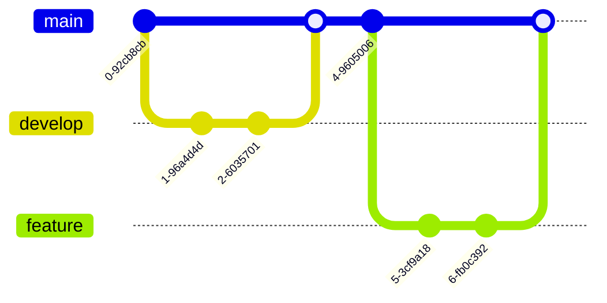

# km Sandbox DEMO

<!--km 
    id:"home"
    title:"Home"
    tags:"home,intro,info"
 -->


1. a1-a3 alphatango > [PDF de prep ](https://www.ecologie.gouv.fr/sites/default/files/documents/Guide_categorie_Ouverte.pdf)
2. https://prepa-drone.fr/ A2 et CATS


<!--km
    id:"stresstest"
    title:"Syntax & stresstest"
    parent:"home"
    tags:"test"
-->

# Stress Testing & Syntax guide

> **Goal** – Put km through its paces.

---


## Delimiting pages for km

> [!TIP]
> You delimit and setup pages for km with standardized comment blocks, that have up to 4 parameters for configuration.

<font color="#96999A">Grey</font>
<font color="#AC19C9">Purple</font>
<font color="#1936C9">Blue</font>

H<font color="#f00">e</font>llo, World
Welcome to this <font color="#F7A004">Orange</font> world!


> *example:*
> ```md
> <!--km
>    id: "stresstest"
>    title: "Syntax & stresstest"
>    parent: "home"
>    tags: "test"
> -->
> 
> Content of the "stresstest" page goes here
> 
> <!--km
>    id:"stresstest2"
>    title:"Test"
>    parent:"stresstest"
>    tags:"test"
> -->
>
> Content of the "stresstest2" page goes here
> "stresstest2" is  hierachical relationships
> 
> ```

-  ==Required== - `id:"id_of_the_page"`
    - Used by URLs, so keep it plain text and underscores only
    - Used by `parent` in child pages

-  ==Important== - `title:"Title of the page"`
   - Used by tree, breadcrumb, graph, ToC title, search results, tab title

- Optional - `parent:"id of parent page"`
    - Any page can be a parent
    - Pick "home" to link the page to root
    - Remove this line to make a stray page
    - Used by graph, tree and breadcrumbs for hierachical relationships
    - Used by "prev/next" buttons at the bottom of sibling pages

- Optional - `tags:"tags,separated,by,commas"`
    - Used by search
    - Used by graph for semantic relationships
    - Used by "See also" links at the bottom of same-tag pages

Pages that have the same parents are sibling.  
Tags are used to link pages that aren't linked by `parent`

[Relationships](#relationships)

## Headings 

h1 (big) to h6 (small) levels supported.  
Headings will be found in the table of content (ToC) in the right pane, they can be clicked there to scroll to them in the content.  
Heading are also the lowest level of search results, so use them often to keep your content easely navigated.  
Clicking the little icon at the right will copy the direct link to the page, that will scroll to that specific heading.


# 1. First‑level heading
## 1.1 Second‑level heading
### 1.1.1 Third‑level heading
#### 1.1.1.1 Fourth‑level heading
##### 1.1.1.1 Fifth‑level heading
###### 1.1.1.1.1 Sixth‑level headin

> *example:*
> ```md
># 1. First‑level heading    
>## 1.1 Second‑level heading  
>### 1.1.1 Third‑level heading  
>#### 1.1.1.1 Fourth‑level heading  
>##### 1.1.1.1 Fifth‑level heading
>###### 1.1.1.1.1 Sixth‑level heading  
> ```


## 2. Emphasis

*Italic* **Bold** ***Bold‑Italic*** ~~Strikethrough~~

## 3. Links

* External: <https://example.com>
* Internal (sidebar route): [Home](#)
* Anchor in this page: [Jump to tables](#stresstest#2_5)

## 4. Lists

### 4.1 Nested Unordered

* Level 1  
  * Level 2  
    * Level 3

### 4.2 Nested Ordered

1. Alpha
2. Alpha bis
3. Alpha bis bis    
   1. Beta
   2. Beta bis
   3. Beta bis bis
      1. Gamma
      2. Gamma bis
      3. Gamma bis bis

### 4.3 Task List

- [x] **Render** ticked items  
- [ ] Highlight unticked items  

## 5. Tables

| Feature       | Supported? |                      Notes |
|:------------- |:----------:| --------------------------:|
| Alignment     |     ✅     | `:---`, `---:` and `:---:` |
| Inline `code` |     ✅     |          Looks like `this` |
| Emoji         |     ✅     |                         🎉 |

[random link to a random page](#stresstest#stresstest_page1#stresstest_page3)

## 6. Code Blocks


Inline `code, epic code`

Block:

```python
# Python
def fib(n): 
    return n if n < 2 else fib(n-1) + fib(n-2)
```

<details>
<summary><strong>Click to expand code samples</strong></summary>

Inline `code, epic code`
    
```js
// JavaScript
function fib(n) {
  return n < 2 ? n : fib(n-1) + fib(n-2);
}
```
              
---

```bash
# Shell
curl -s https://api.example.com/ping
```

</details>

## 7. Math

Inline: $e^{i\\pi} + 1 = 0$

Block:

$$
\\frac{d}{dx} \\left( \\int_{a}^{x} f(t)\\,dt \\right) = f(x)
$$

## 8. Blockquote with nested list

> “We choose to go to the Moon…”
>
> * Items to remember
>
>   * Courage
>   * Innovation

## 9. Images


## 10. Raw HTML (sanitizer test)

<div style="padding:8px;border:1px dashed var(--accent)">
  This div should survive because inline styles are removed, but
  harmless <strong>markup</strong> remains.
</div>

## 11. Details/Summary

<details>
<summary>Click to toggle hidden insights 🧐</summary>

*Hidden text appears here…*
A video?
<iframe allow="fullscreen;" src="https://www.youtube.com/embed/KSdvZ1uKRfE"></iframe>
    
https://tenor.com/view/cat-overweight-belly-gif-4496235569375649201    

</details>
    


## 12. Embedded iframe (YouTube)

<iframe allow="fullscreen;" src="https://www.youtube.com/embed/8DBxafTthrM"></iframe>

## 13. Footnotes

[^1]: This is a footnote content.

Here is a simple footnote[^1]. With some additional text after it[^@#$%] and without disrupting the blocks[^bignote].

[^bignote]: The first paragraph of the definition.

    Paragraph two of the definition.

    > A blockquote with
    > multiple lines.

    ```
    a code block
    ```

    | Header 1 | Header 2 |
    | -------- | -------- |
    | Cell 1   | Cell 2   |

    A `final` paragraph before list.

    - Item 1
    - Item 2
      - Subitem 1
      - Subitem 2

[^@#$%]: A footnote on the label: "@#$%".

## 14. Alerts

> [!NOTE]
> Highlights information that users should take into account, even when skimming.

> [!TIP]
> Optional information to help a user be more successful.

> [!IMPORTANT]
> Crucial information necessary for users to succeed.

> [!WARNING]
> Critical content demanding immediate user attention due to potential risks.

> [!CAUTION]
> Negative potential consequences of an action.

---

### Wall of text
Lorem ipsum dolor sit amet, consectetur adipiscing elit. In at odio quam. Sed sit amet turpis nec lacus porttitor suscipit sed sit amet quam. Sed eleifend bibendum nulla, id ornare purus accumsan et. In quis enim magna. Pellentesque consequat vulputate ipsum, eget semper ligula vulputate sit amet. Aenean aliquet mauris sit amet elit fermentum, sed sagittis libero semper. Proin commodo lobortis porttitor. In eget vestibulum lacus. Mauris finibus nisi ut neque posuere suscipit. Integer ut rhoncus sem. Integer blandit eros sed tempor consequat.

Duis id ligula vel neque aliquam rutrum. Phasellus vel elit sed ante scelerisque facilisis nec ut ipsum. Nullam at metus vulputate, facilisis lorem quis, cursus eros. Phasellus ac elementum est, in fringilla nibh. In nec nunc sit amet metus placerat eleifend eu eget justo. Suspendisse potenti. Suspendisse augue lacus, congue fringilla pharetra nec, dapibus vel lacus.


# DEV TODO LIST

[Edit link](https://hackmd.io/ldrMecsOQSeYk9XmuikYmg?edit)

[Stress test page](#stresstest) :+1: 

*   Abacus
    * answer
*   Bubbles
    1.  bunk
    2.  bupkis
        * BELITTLER
    3. burper
*   Cunning


> Email-style angle brackets
> are used for blockquotes.
> > And, they can be nested.
> > > Yeah
> > > > right

> #### Headers in blockquotes
> 
> * You can quote a list.
> * Etc.

Manual backspace:

Roses are red,   
Violets are blue.


### graph LR
    


### flowchart TD 
    


### classDiagram
    


### sequenceDiagram               
                


### erDiagram    
    


### stateDiagram    
    

    
### mindmap
    


### architecture    
    


### block    
    


### C4Context    
    


### gantt    
    


### gitGraph
    


### kanban    
    
    


### packet    
    

    
    
    
    
    
    
    
### pie
    


    
    
    
    
    
    
### quadrantChart    
    


### radar    
    


### requirementDiagram    
    


### sankey    
    

### timeline
    

### treemap
    
```mermaid
treemap-beta
"Section 1"
    "Leaf 1.1": 12
    "Section 1.2"
      "Leaf 1.2.1": 12
"Section 2"
    "Leaf 2.1": 20
    "Leaf 2.2": 25
```
### journey
    
```mermaid
journey
    title My working day
    section Go to work
      Make tea: 5: Me
      Go upstairs: 3: Me
      Do work: 1: Me, Cat
    section Go home
      Go downstairs: 5: Me
      Sit down: 5: Me
```
### xychart
    
```mermaid
xychart-beta
    title "Sales Revenue"
    x-axis [jan, feb, mar, apr, may, jun, jul, aug, sep, oct, nov, dec]
    y-axis "Revenue (in $)" 4000 --> 11000
    bar [5000, 6000, 7500, 8200, 9500, 10500, 11000, 10200, 9200, 8500, 7000, 6000]
    line [5000, 6000, 7500, 8200, 9500, 10500, 11000, 10200, 9200, 8500, 7000, 6000]
```

zenuml not supported    
 
    

### Inline JS and CSS scripts
<form onsubmit="this.o.value='= '+((+this.a.value||0)+(+this.b.value||0));return false">
  <input name="a" type="number"> + 
  <input name="b" type="number">
  <button>Add</button>
  <output style="font-weight: bolder" name="o">= 0</output>
</form>

> (enable this at your own risk in the config)

```xml
<form onsubmit="this.o.value='= '+((+this.a.value||0)+(+this.b.value||0));return false">
  <input name="a" type="number"> + 
  <input name="b" type="number">
  <button>Add</button>
  <output style="font-weight: bolder" name="o">= 0</output>
</form>
```

# Learning Markdown
If you're new to Markdown and just starting to explore its capabilities, this guide is for you. Here you'll learn the basics, from simple text formatting to creating lists and more. By the end, you'll have the skills you need to write clean and structured documents with ease.  
The Markdown syntax will be written in the `code blocks` and an example of how it will appear is shown underneath.

With that, let's get started!

## What we'll cover
- [Markdown syntax](#Markdown-syntax)
- [Text style](#Text-style)
- [Tables](#Tables)
- [Table of contents](#Table-of-contents)
- [Edit vs View pages](#Edit-vs-View-pages)
- [Further learning](#Further-learning)

## Markdown syntax
### Unordered list
Syntax: `- unordered list`
- unordered list


### Ordered list
Syntax: `1. ordered list`
1. ordered list


### Task
Syntax: `- [ ] task`
- [ ] task

### Alert blocks
:::success
lol
:::

:::info
lol
:::

:::warning
lol
:::

:::danger
lol
:::

:::spoiler spoiler!
lol
:::

Yup

> [!TIP]
> Pressing  <kbd>Tab</kbd>  within a line will achieve the effect of a sublist.


1. order list
    - unorder list
2. order list
    - [ ] task

### Quote
Syntax: `> quote`
> quote


### Hyperlink
Syntax: `[Display name](URL)`
[Display name](URL)


## Text style
### Headers

Put `#` at the beginning of a line and it becomes a header. Two `#`s create a level 2 header, and so on.

```
# text

## text

### text

#### text

##### text

###### text
```

### Bold
Syntax: `**bold**`
**bold**

### Italic
Syntax: `_italics_`
_italics_

### Literals
Syntax: Wrap the text with \` \` before and after.
`  Literal example  `
### Strikethrough
Syntax: `~~strikethrough~~`
~~strikethrough~~

### Highlight
Syntax: `==highlight==`
==highlight==

### Superscripts
Syntax: `21^th^ Century`
21^th^ Century

### Subscripts
Syntax: `H~2~O`
H~2~O  

### Underline / inserted text
Syntax: `++Inserted text++`: ++Inserted text++

### Key
Syntax: `<kbd>K</kbd>`: <kbd>K</kbd>

### Latex
Syntax: `$L^aT\_eX$`: $L^aT\_eX$


## Tables
Creating tables with Markdown can be messy, so we created a tool to make it easier. Simply click the Table icon in the toolbar at the top of the text editor.


| Column 1 | Column 2 | Column 3 |
|:-------- |:--------:| --------:|
| Some     |  thing   |     nice |
| Text     |   Text   |     Text |

Then, if you click on any cell within the table, the Table Editing Mode appears within the toolbar at the top of the page. 

[ → Learn more about creating a table here](https://hackmd.io/c/tutorials/%2Fs%2Fhow-to-create-table?utm_source=prepopulatednote&utm_medium=editor&utm_campaign=markdownsyntaxtutorial&utm_content=tutorial)

### Paste a table from Excel
You can also paste a table directly from Excel.

Simply select "Enable smart paste" in the text editor settings and you're set.


## Table of contents

You can type `[toc]` to add a table of contents of your note as below:

[toc]

:::info
:bulb: **Navigating Menu**

If it's not already shown, you can bring up the table of contents by clicking the `☰` icon at the bottom-left of the View pane:


:::

## We value your feedback!
Did you find this guide helpful? Answer one question in [this survey](https://tally.so/r/mV16qN) and let us know.

## Edit vs View pages
#### Edit page
The Edit page of the HackMD editor is where all the magic happens -- it's your place for writing and formatting content with Markdown. 


#### View page
The View page of the HackMD editor displays how your note will be rendered; a display of the formatted text, including headings, links, and images. It's a great way to ensure your content appears exactly as you intend before sharing or publishing.

You can jump back into editing at any time by clicking the `🖌️ Edit` button at the top right-hand corner of the page.


:::success
:bulb: **Three modes in your editor**

Please locate these three icons at the top of HackMD. Here you can toggle between Edit/Both/View mode (from left to right).


We like to set it to Both mode so that you can take notes in Markdown in the left pane and see how it renders in the right pane.
:::

## Further learning
Want to learn more ways you can use HackMD? Check out the Beginner and Expert Guides in your workspace. 

The Beginner Guide covers:
- Workspace & sidebar
- Personal workspace
- Create a note
- Start with a template
- Insert images & gifs
- Comments
- Suggest edit
- Share & set permissions
- Publishing

The Expert Guide covers:
- Team workspace
- Sync with GitHub
- API calls
- Book mode
- Custom templates
- Embed notes
- LaTeX & MathJax
- UML diagrams

Before you go, HackMD has an official user manual with instructions for all its features!

In our tutorial book, you'll find detailed guides to all the main features of HackMD that boost your productivity.

### :point_right: [HackMD Tutorial Book](https://hackmd.io/c/tutorials/%2Fs%2Ftutorials?utm_source=prepopulatednote&utm_medium=editor&utm_campaign=markdownsyntaxtutorial&utm_content=tutorial) :point_left:

Don't want to miss the latest news and feature updates from HackMD? Be sure to follow our social channels or join us on Discord.

- :mailbox: support@hackmd.io
- <i class="fa fa-file-text"></i> [X (Twitter)](https://x.com/hackmdio)
- <i class="fa fa-file-text"></i> [Facebook](https://www.facebook.com/hackmdio)
- <i class="fa fa-file-text"></i> [LinkedIn](https://www.linkedin.com/company/hackmd)
- <i class="fa fa-file-text"></i> [Discord](https://discord.gg/rAkfPd5Z)


## We value your feedback!
Did you find this guide helpful? Answer one question in [this survey](https://tally.so/r/mV16qN) and let us know.


[^auto-wrap]:The system will automatically line-break 'Code block text that exceeds the width of the document' so that the content of the code block can be displayed in its entirety without the need to roll the scroll wheel to view it.


Pushing the update once **everything** bellow is ticked:

> ### General
> 1. [ ] Make 3 builds :
>     - Online with SEO for google referencing
>     - Online no SEO
>     - Offline
> 1. [x] Reach 100/100/100/100 lighthouse report


> ### CSS
> 1. [x] Increase the clip path inset height of the header to support longer dropdowns
> 1. [x] make header search results lower contrast
> 1. [x] Pointer on nodes and headers


    
    
    
    
<!--km
    id:"hierarchy"
    title:"Deep hierarchy test"
    tags:"test"
-->

yo

<!--km
    parent:"hierarchy"
    id:"1"
    title:"1"
    tags:"test"
-->

yo


<!--km
    parent:"1"
    id:"2"
    title:"2"
    tags:"test"
-->

yo


<!--km
    parent:"2"
    id:"3"
    title:"3"
    tags:"test"
-->

yo

<!--km
    parent:"3"
    id:"4"
    title:"4"
    tags:"test"
-->

yo

<!--km
    parent:"4"
    id:"5"
    title:"5"
    tags:"test"
-->

yo

<!--km
    parent:"5"
    id:"6"
    title:"6"
    tags:"test"
-->

yo

<!--km
    parent:"6"
    id:"7"
    title:"7"
    tags:"test"
-->

yo 

<!--km
    parent:"7"
    id:"8"
    title:"8"
    tags:"test"
-->

yo

<!--km
    parent:"8"
    id:"9"
    title:"9"
    tags:"test"
-->

yo

<!--km
    parent:"9"
    id:"10"
    title:"10"
    tags:"test"
-->

yo

<!--km
    parent:"10"
    id:"11"
    title:"11"
    tags:"test"
-->

yo

<!--km
    parent:"11"
    id:"12"
    title:"12"
    tags:"test"
-->

yo

<!--km
    parent:"12"
    id:"13"
    title:"13"
    tags:"test"
-->

yo

