# portable.md field guide

An editable encyclopedia and working feature atlas.
<!--pmd
id:"home"
title:"portable.md field guide"
kind:"home"
updated:"2026-09-26"
showUpdated:"false"
-->
# Learn it by using it

A living encyclopedia of the **editor**, **portable.md**, and **skills**. Every diagram, player, query and reading path here is made with the features it explains.

{{pages parent="home" view="cards"}}

## Find your next move

- **Start:** [Make your first project](#/editor/quick_start).
- **See what fits on a page:** [Formatting](#/pmd_features/writing), [media](#/pmd_features/media), [diagrams](#/pmd_features/diagrams).
- **Connect ideas:** [Links](#/pmd_features/pages_and_links), [queries](#/pmd_features/live_queries), [Canvas](#/pmd_features/canvas).
- **Work with AI:** [pmd-create](#/skills/skill_create) or [pmd-edit](#/skills/skill_edit).
- **Share offline:** [Choose a delivery](#/editor/publishing/assets_builds).
- **Look it up:** [Page fields](#/pmd_features/bundle_format), [configuration](#/editor/publishing/pmd_config), [keyboard](#/editor/shortcuts).

**Try:** open a link preview, follow the [first-project journey](journey:First%20project), or search for “audio”. In the editor, choose **Compare** to see a page and its source together.

:::info
This manual is an editable project. Its local demo files travel with a saved content folder, full project ZIP, or offline export. The [recording list](#/editor/recording_todos) marks screen demonstrations still to be filmed.
:::

<!--pmd
id:"editor"
title:"01 · Editor"
parent:"home"
updated:"2026-09-26"
showUpdated:"false"
-->
# Make and maintain your project

Write in **Raw MD**, learn in **Compare**, and try the complete reader in **Preview**.

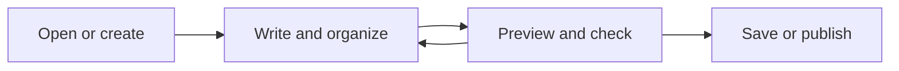

{{pages parent="editor" view="cards"}}

**Start here:** [Five-minute start](#/editor/quick_start). **Already working?** [Find / Replace](#/editor/find_replace), [Files](#/editor/files), or [Issues](#/editor/problems_history).

<!--pmd
id:"quick_start"
title:"Five-minute start"
parent:"editor"
tags:"query-demo"
journey:"First project" "1"
updated:"2026-09-26"
showUpdated:"false"
-->
# Your first connected page

1. Choose **Open > New project**, then a workspace. **Browser draft** is convenient for trying things; choose a Local folder or download a copy to keep the work.
2. Add a page in **Explorer**. Give it a useful title.
3. Choose **Compare** and paste the example below. Change the heading and watch the result.
4. Use **Insert > Link** to connect another page. Open **Preview** and follow it.
5. Open **Issues**, then **Save**.

## A tiny field note

==Keep the observation.== Add an explanation beneath it.

- [x] Create a page
- [ ] Add one useful link
- [?] Try this reader checkbox

> [!TIP]
> Start small; split an idea into a new page when it needs its own link.

:::spoiler See the source

````md
## A tiny field note

==Keep the observation.== Add an explanation beneath it.

- [x] Create a page
- [ ] Add one useful link
- [?] Try this reader checkbox

> [!TIP]
> Start small; split an idea into a new page when it needs its own link.
````

:::


> [!NOTE]
> **Video TODO · editor-first-project.webm**
> Record a new project, a page, Compare, a link, Issues and a saved full project ZIP in 60–90 seconds. See the [recording list](#/editor/recording_todos).

<!--pmd
id:"workspace"
title:"Workspace and panels"
parent:"editor"
updated:"2026-09-26"
showUpdated:"false"
-->
# Find your way around

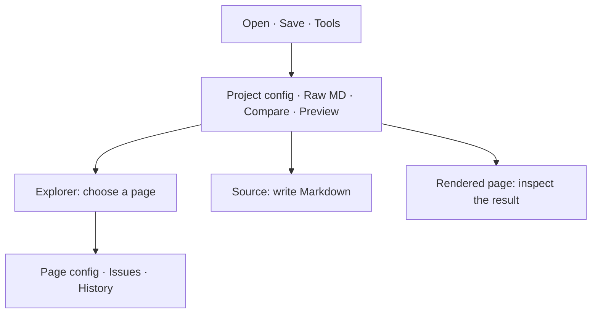

| Surface | Use it for |
| --- | --- |
| Open / Save / Tools | Projects, delivery, managers, Agent and utilities |
| Command bar | Text, Structure and Insert tools; pin frequent commands |
| Explorer | Pages and simple folders; search, move, rename and reorder |
| Page config | The selected page's identity, memberships and presentation |
| Issues | Findings and supported repairs |
| History | Saved local checkpoints |

**Try:** resize a dock separator, move a panel, and pin a tool. Press <kbd>F6</kbd> to move between regions; use arrows within menus and <kbd>Shift</kbd>+<kbd>F10</kbd> for a page's menu.

The workspace is the save destination: **Browser draft**, **Local folder**, or **GitHub**. It is separate from the selected view and personal [Editor settings](#/editor/editor_settings).


> [!NOTE]
> **Video TODO · editor-panels.webm**
> Record docking, resizing, pinning a command and keyboard navigation. See the [recording list](#/editor/recording_todos).

<!--pmd
id:"source_editing"
title:"Source, Compare and Bundle source"
parent:"editor"
updated:"2026-09-26"
showUpdated:"false"
-->
# Edit at the right scale

| View | What you change |
| --- | --- |
| Raw MD | One page body, with optional highlighting, wrapping and line numbers |
| Compare | Page source beside the same renderer used by the reader |
| Bundle source | Every page header and body, in a draft that needs **Apply** |
| Project config | Project appearance and publication settings |

**Try:** select text and press <kbd>Ctrl</kbd>+<kbd>B</kbd> twice to add and remove bold. Type a list item and press Enter; an empty item ends the list. Tab indents source; Escape then Tab leaves it.

Autocomplete helps with links, media, emoji, notes and supported syntax. Table tools edit rows/columns; math, diagram and Canvas builders create ordinary source. Use [Find / Replace](#/editor/find_replace) for text edits across pages.

:::info
Page edits change the current project. **Bundle source**, library editors and Canvas can hold unapplied drafts. Apply commits that draft; Save writes the project to its workspace.
:::

Inspect the literal [page-header example](#/pmd_features/bundle_format) before changing Bundle source. **Discard** abandons only that unapplied draft.

<!--pmd
id:"find_replace"
title:"Find / Replace"
parent:"editor"
updated:"2026-09-26"
showUpdated:"false"
-->
# Find a word or find a page

| Need | Command |
| --- | --- |
| Jump to a page | Search every page: Ctrl/Cmd+K or Ctrl/Cmd+Shift+F |
| Find source text | Ctrl/Cmd+F |
| Replace source text | Ctrl/Cmd+H |
| Next / previous match | F3 / Shift+F3; Ctrl+G / Ctrl+Shift+G |

Choose **Page** or **All pages** in Find / Replace. Review the matches and scope before Replace all; Undo restores the edit.

**Try:** find “reader checkbox” in this manual, open the [first page](#/editor/quick_start), and inspect its source. Page search takes you to content; source search lets you change exact text.


> [!NOTE]
> **Video TODO · editor-find-replace.webm**
> Record Page versus All pages, next/previous match, a replacement and Undo. See the [recording list](#/editor/recording_todos).

<!--pmd
id:"organize_pages"
title:"Organize pages"
parent:"editor"
updated:"2026-09-26"
showUpdated:"false"
-->
# Give each idea a home

| Kind | Body? | Role |
| --- | --- | --- |
| Ordinary page | Yes | An article; it can also have children |
| Simple folder | No | Navigation container |
| Home | Yes | The entry page; one per project |
| Glossary | Yes | Shared terms and aliases; one per project |
| References | Yes | Reusable sources; one per project |

**Try:** expand **Simple-folder example** below in Explorer and open its child. Compare is unavailable for a simple folder. **Turn into page** gives it a body; **Make simple folder** requires removing that body deliberately.

Create children or siblings from the page menu. Rename the title to keep the ID; changing an ID affects links. Duplicate makes a new page. Move/reorder with the tree; Delete needs a check for children and incoming links.

Use [tags](#/editor/page_config) for cross-cutting membership and [journeys](#/pmd_features/journeys) for a reading sequence. They do not replace hierarchy.

[Read the folder's child](#/editor/organize_pages/simple_folder_example/simple_folder_child) · [Link recipes](#/pmd_features/pages_and_links)


> [!NOTE]
> **Video TODO · editor-page-tree.webm**
> Record creating a child and sibling, drag/reorder, a title rename, a simple-folder conversion and Undo. See the [recording list](#/editor/recording_todos).

<!--pmd
id:"simple_folder_example"
title:"Simple-folder example"
kind:"simple"
parent:"organize_pages"
updated:"2026-09-26"
showUpdated:"false"
-->

<!--pmd
id:"simple_folder_child"
title:"Reachable child page"
parent:"simple_folder_example"
updated:"2026-09-26"
showUpdated:"false"
-->
# An article inside a simple folder

The parent appears in Explorer but has no article body. This page is a normal link target. Open Page config to see `parent:"simple_folder_example"`.

[Back to organizing pages](#/editor/organize_pages)

<!--pmd
id:"page_config"
title:"Page config"
parent:"editor"
updated:"2026-09-26"
showUpdated:"false"
-->
# Identity, membership and presentation

| Set | Result |
| --- | --- |
| Title | Display label; independent of the stable ID |
| ID / parent | Link identity and position in Explorer |
| Kind | Article, simple folder, Home, glossary or references |
| Tags | Comma-separated cross-cutting memberships |
| Journey / order | A reading path and this page's position |
| Updated / comment | Date and explanation; Show updated controls visibility |
| Presentation | Split slides at H1, H2, H3 or horizontal rules |
| SEO fields | Page title, description, sharing image/alt and indexing override |

**Try:** inspect [Five-minute start](#/editor/quick_start). It belongs to the **First project** journey and the **query-demo** tag. The [live query](#/pmd_features/live_queries) finds it from that metadata.

Tags should connect pages across folders. **No filter** imposes no restriction, including pages without memberships. Tag and Journey managers can rename or remove memberships across the project.

Exact fields: [page-header reference](#/pmd_features/bundle_format). Presentation in action: [three-slide tour](#/pmd_features/presentations).

<!--pmd
id:"preview"
title:"Preview and navigation"
parent:"editor"
journey:"First project" "2"
updated:"2026-09-26"
showUpdated:"false"
-->
# Inspect what your reader will see

1. Choose **Compare** for fast source/render feedback.
2. Choose **Preview** for the full reader: Explorer, search, page graph, journeys and floating previews.
3. Toggle phone preview to inspect a narrow layout.
4. Return to Raw MD, Compare or Project config from the view switcher. The editor selects the page you last browsed; opening Preview starts from your current editor page.

**Try:** preview [the media lab](#/pmd_features/media), [a Canvas](#/pmd_features/canvas) and [the presentation](#/pmd_features/presentations). Follow a link and return to edit that page.

Detached preview opens a snapshot. Refresh it after edits; its temporary URL is not a public share link. [Publish a reader](#/editor/publishing) to share durable content.

For reader gestures and layout, see [Navigation](#/pmd_features/reader_navigation) and [Floating previews](#/pmd_features/floating_previews).


> [!NOTE]
> **Video TODO · editor-preview.webm**
> Record Compare, full Preview, phone preview, detached preview refresh and returning to the same editing position. See the [recording list](#/editor/recording_todos).

<!--pmd
id:"files"
title:"Files and remote assets"
parent:"editor"
updated:"2026-09-26"
showUpdated:"false"
-->
# Attach a real file

Open **Insert > Files**, upload or drop a file, then insert it. Pasting an image also creates a project asset.

Over the source text, any dropped file lands where you point. A line shows the spot while you hold the file: it is always between two lines, never inside one or inside a code block, and the file gets its own paragraph.

Dropping a Markdown file (`.md`) onto the editor asks what it is for: a **New page** under the current page, or **Embed the file** in the current page, attached as a project file. Dropped outside the source text, it can also **Open as a project**, which replaces the open one after the usual checks. A Markdown file that carries portable.md page headers is a bundle and still opens as a project.

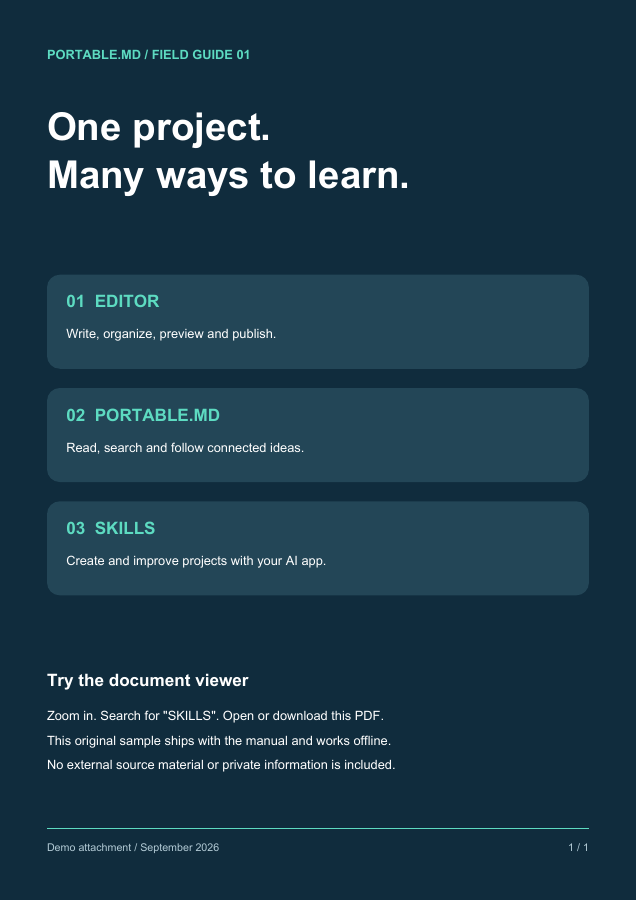

**Try:** find `example-image.png` in Files, inspect it and insert a reference on a new page. See [image syntax](#/pmd_features/media/images) for sizing and [all media players](#/pmd_features/media) for other file types.

| Action | Check |
| --- | --- |
| Upload / paste / drop | A real asset and a source reference are both present |
| Rename / replace | Review usages in pages, Canvas, emoji and sharing images |
| Delete | “No references found” is not proof a file is unused |
| Collect remote assets | Only downloadable permitted resources become local files |

Remote collection can fail because of CORS, authentication or an unavailable URL. A URL in Markdown alone does not make the project offline. Save/export the actual bytes.


> [!NOTE]
> **Video TODO · editor-files.webm**
> Record image paste, file upload, insertion, usage inspection and a missing-file repair. See the [recording list](#/editor/recording_todos).

<!--pmd
id:"problems_history"
title:"Issues"
parent:"editor"
updated:"2026-09-26"
showUpdated:"false"
-->
# Check the project before sharing

Open **Issues** and use **Go to issue** to reach the affected page, field, Canvas card or file. **Fix** applies a known repair; **Remove** removes the faulty portion, preserving link captions. **Edit…** opens the relevant link dialog, builder, library manager or source editor. File edits stay staged until Save. Repairs use Undo and reject stale source positions.

| Finding family | Examples and next step |
| --- | --- |
| Structure | Missing/duplicate ID, title, parent cycle, duplicate role: inspect Page config |
| Navigation | Broken page/heading link; Broken journey start link; Broken portable.md route in a Canvas link card: repair the target |
| Metadata | Invalid date, membership or journey index: inspect the stored value |
| Reuse | Missing/circular transclusion, missing section, invalid query: open the builder |
| Layout | Malformed fences, callouts and columns; unsupported code languages: inspect or repair the block |
| Renderers | Invalid math, Mermaid, Canvas cards and page-wide limits; failures observed in the preview |
| Files | Missing local files, HTTP/decoding failures, unreadable remote assets, table parse errors and nested Markdown documents |
| Notes | Missing reference/footnote, duplicate glossary term/alias: use the managers |
| Configuration | Invalid site URLs, colors or structured data: inspect Project config |
| Imports | Conversion and normalization notices retain the original source/target details; acknowledge after review |

Use **Filters and checks** to search or filter by severity, category, current page or import notices. Group by page, type or target to expand individual occurrences. A chosen destination can repair matching body links together. Active forms and expanded groups stay in place as asynchronous results arrive.

The status distinguishes **Checking**, **Checks complete**, **Checks incomplete** and paused work. Ordinary scans have independent limits for findings, source blocks and unique assets/diagrams. **Run full check** includes the remaining work without removing rendering safety limits. **Show more** reveals the next 100 findings. Checks run while the Issues panel is closed: its badge shows a grey spinner during analysis, then updates to the count automatically. A green **0** means the selected checks finished without findings; **+** marks incomplete coverage. Work pauses while the browser tab is hidden and resumes when you return.

Preview reports retain the first 100 distinct failures per revision. Further failures mark coverage incomplete; repair the reported problems, then use **Recheck** to retry the visible preview.

Enable optional accessibility, content and size advice to review descriptions, duplicate IDs, empty notes, reference metadata, emoji aliases, empty query filters, presentations and heavy/unused files. Advice is not a declaration that intentional content is invalid. Dismiss it for this check, or acknowledge historical import notices; new edits and occurrences are checked again.

Choose an export profile for Markdown, project, offline or publication preflight. It checks known source/file/format constraints; dependency delivery and actual writes are still checked by the exporter. Save/publish failures remain operational messages in those workflows. **Recheck** retries probes and the visible preview. **Copy report** and **Download report** include locations, counts, limits, revision and scope. An unapplied Raw MD bundle draft is excluded until applied. Import notices persist in browser recovery and Undo, rather than adding files to the exported project.

You can save a project that still has content errors. Markdown, content-folder saves and portable-editor copies retain the faulty source. If an offline HTML build cannot include assets, choose **Export with errors** to keep all available files and the original references. If website generation fails, this choice exports a reader index and project files without individual HTML pages or generated static content. The same fallback covers full-project ZIPs, website folders and manual GitHub saves. **Cancel** produces no output; the override applies to this build only. Automatic saves do not accept it silently. File access, conflicts, path checks, required templates and allocation limits still apply.

:::info
Check after editing, then open representative pages in Preview. Only observed rendering failures are reported for preview-only features; Issues does not render every PDF or graph to inspect it. A clean list does not verify factual claims, remote playback or complete accessibility. Pending, unavailable and limited checks are never reported as complete.
:::

This manual uses real local files and valid examples. To practice a repair, break a link in a copy, fix it, then Undo.

<!--pmd
id:"undo_history"
title:"Undo, redo, and history"
parent:"editor"
updated:"2026-09-26"
showUpdated:"false"
-->
# Return to a known state

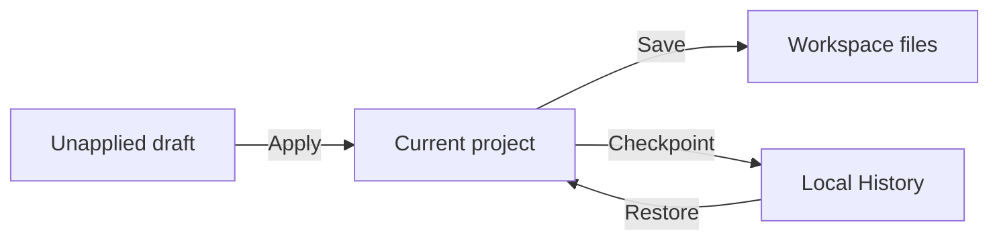

| Tool | Recovers |
| --- | --- |
| Undo and redo | Recent logical edits in the current session |
| History checkpoint | Ordered pages, metadata, bundle source and project configuration |
| Saved project / export | Files you actually saved, including attachments |
| Discard | Abandons an unapplied Bundle, Canvas or library draft |

**Try:** edit a sentence, Undo, then Redo. Inspect a checkpoint before restoring it. **Clear history** deletes local checkpoints.

History does not back up attachment bytes, credentials or unapplied drafts. Binary Undo is bounded and lasts in the tab; a closed-tab checkpoint cannot recover old media. Keep a saved content folder or ZIP.

<!--pmd
id:"editor_settings"
title:"Editor settings"
parent:"editor"
updated:"2026-09-26"
showUpdated:"false"
-->
# Make the editor comfortable

Open the **Command palette** with **Ctrl+Shift+P**, from **Tools**, or from the
**Editor cheat sheet**. Search by command name; press Enter to run the selected
command and use the arrow keys to change the selection. Source commands keep
the current selection and return to the same editor pane.

Click a shortcut in a tool dropdown, the cheat sheet (including its pop-out), or
the palette to change it. Press the new combination, then **Save**. If it is
already assigned, **Reassign** moves it from the named command. **Remove shortcut**
leaves the command available in menus and the palette; **Reset to default**
restores its default. Assignments persist in editor settings, including settings
JSON and portable exports that include settings. Standard text entry, Tab and
F6 focus navigation remain available. Uncommon tools have no default shortcut.

| Action | Default shortcut (Windows/Linux) |
| --- | --- |
| Insert link | Ctrl+K |
| Search all pages | Ctrl+Shift+F |
| New child / sibling page | Alt+Enter / Alt+Shift+Enter |
| Editor settings | Ctrl+, |
| Switch Raw MD / Compare | Ctrl+E |
| Open / close full preview | Ctrl+Alt+P |
| Markdown hard break | Shift+Enter; Ctrl+Enter also works |
| Insert table | Ctrl+Alt+T |
| Toggle task completion | Ctrl+Shift+Enter |
| Move lines up / down | Alt+Up / Alt+Down |
| Duplicate lines above / below | Alt+Shift+Up / Alt+Shift+Down |
| Delete current or selected lines | Ctrl+Shift+K |
| Clear inline formatting | Ctrl+\ |
| Return selected lines to normal paragraphs | Ctrl+Alt+0 |

On macOS the interface shows Cmd and Option equivalents; Replace uses
Cmd+Option+F. Formatting commands apply in Raw MD and Compare. Page creation
uses the active page, or the focused Explorer page. Rename, duplicate page and
delete page shortcuts apply outside text fields. Task completion toggles `[ ]`
and `[x]` while preserving interactive `[?]` tasks and literal code. Clear
formatting removes inline wrappers, preserving literal code, math, URLs and
HTML attributes and bodies; Normal paragraph removes heading, list and quote prefixes.
These source changes and page creation use the editor's Undo history.


| Preference | Affects |
| --- | --- |
| Editor theme / language | This editor's interface |
| Font size, wrap, line numbers, highlighting | Source readability |
| Dock placement and size | Workspace layout |
| Pinned tools, shortcuts and the command palette | Command access |
| Editor resource limits | Bounded rendering/inspection work; inspect current values |
| Transfer editor settings | Optional version-1 JSON presentation profile |

**Try:** change the editor theme, then inspect the reader theme in **Project config**. They are separate settings. The editor interface can be English or French; authored pages keep their own language.

Export/load a settings file when moving browsers, or include settings in a portable-editor export. Loading a profile is explicit. It carries presentation preferences, not credentials, project files, Undo or History.

Use **Tools > Editor cheat sheet** for current shortcuts, and **Credits** for contributor and dependency acknowledgments.

<!--pmd
id:"shortcuts"
title:"Keyboard shortcuts"
parent:"editor"
updated:"2026-09-26"
showUpdated:"false"
-->
# Keyboard shortcuts

These shortcuts work across the editor. Press <kbd>F6</kbd> to move through the top bar, command bar, left docks, active editor, and right docks; use <kbd>Shift</kbd>+<kbd>F6</kbd> to move backward. Arrow keys move within menus, grouped controls, and History checkpoints, while <kbd>Home</kbd> and <kbd>End</kbd> jump to their edges; the same keys resize a focused dock separator. In Explorer, <kbd>Shift</kbd>+<kbd>F10</kbd> opens the focused page's menu.

| Action | Shortcut |
| --- | --- |
| Cycle editor regions forward or backward | `F6` or `Shift+F6` |
| Open Editor cheat sheet at Keyboard navigation | `F1` anywhere, or `?` outside a field |
| Undo an editor change | `Ctrl+Z` or `Cmd+Z`, in page source or outside a field |
| Redo an editor change | `Ctrl+Y`, `Ctrl+Shift+Z`, or the matching Cmd shortcut, in page source or outside a field |
| Save to the current workspace, or choose one from a Browser draft | `Ctrl+S` or `Cmd+S` |
| Open the Open or start project center | `Ctrl+O` or `Cmd+O` |
| Search every page | `Ctrl+Shift+F` or `Cmd+Shift+F` |
| Find / Replace (Page or All pages) | `Ctrl+F` / `Ctrl+H`; on macOS, `Cmd+F` / `Cmd+Option+F` |
| Next / previous text match | `F3` / `Shift+F3`, or `Ctrl+G` / `Ctrl+Shift+G` |
| Indent / outdent source | `Tab` / `Shift+Tab`; `Ctrl+]` / `Ctrl+[` for whole lines |
| Leave source with Tab | `Escape`, then `Tab`; `F6` also changes editor region |
| Open Agent directly | `F8` |
| Rename the active page | `F2` |
| Duplicate the active page | `Ctrl+D` or `Cmd+D`, outside a field |
| Delete the active page | `Delete`, outside a field |
| Close or clear the active modal, menu, preview, or search | `Escape` |

Formatting shortcuts work while a source textarea has focus. Letter shortcuts follow the letter produced by the active keyboard layout: on AZERTY, Ctrl+Alt+Q opens Page query, even though that key has a different physical position from Q on QWERTY. Open Text, Structure, Insert, or the Editor cheat sheet to see each shortcut, pin, and shortcut checkbox. Click a shortcut to rebind it, or **Assign shortcut** for a tool without a default. The pin keeps a tool on the toolbar. Uncheck the muted box to disable only that binding; the tool and its pinned button still work. Choices are remembered in this browser by default and can travel through the optional editor-settings file or portable export. Global navigation shortcuts such as F6 remain separate. The **Command palette** button in Tools and the cheat sheet also opens every command and its editable binding; press **Ctrl+Shift+P** to open it directly.

Common examples:

| Action | Shortcut |
| --- | --- |
| Bold | `Ctrl+B` |
| Italic | `Ctrl+I` |
| Underline | `Ctrl+U` |
| Inline spoiler | Assign a shortcut in the menu or palette |
| Link | `Ctrl+K` |
| Heading 2 | `Ctrl+Alt+2` |
| Code block | `Ctrl+Alt+C` |

On macOS, use Cmd where the menu displays Ctrl.

<!--pmd
id:"libraries"
title:"Glossary and reference managers"
parent:"editor"
updated:"2026-09-26"
showUpdated:"false"
-->
# Reuse terms and evidence

| Manager in Tools | Make once, use across pages |
| --- | --- |
| Glossary manager | A term, its definition and aliases; inspect where it is used |
| Reference manager | A source ID, bibliographic fields and formatted details |
| Tag manager | A cross-cutting membership and its selected pages |
| Journey manager | A reading sequence with selected pages and step order |

**Try:** open Reference manager and inspect **manual-example**, then hover its citation here.[@manual-example] Open Glossary manager and inspect **Bundle** and its alias **Markdown bundle**.

## Import a small reference library

All three sample files describe the same local demonstration document:

- [BibTeX](assets/example-references.bib "download")
- [RIS](assets/example-references.ris "download")
- [CSL JSON](assets/example-references.json "download")

Import one in a copy of this manual, review duplicate matching and the selected changes, then **Stage import**. **Apply changes** commits the library draft to the project. **Apply and insert citation** also inserts the chosen citation. Save separately.

**Citation style** switches between **Numbers** and **Author and year**. The choice is saved with the reference library. Use a page-local footnote for a precise page/section locator.

Source fields can include title, authors, year, journal/publisher, pages, DOI, URL and notes. Use actual supplied metadata; a formatted citation does not verify its source. Renaming a reference repairs its uses; deletion is blocked while it is cited.

[See the note syntax](#/pmd_features/notes_and_references).

> [!NOTE]
> **Video TODO · editor-libraries.webm**
> Record glossary aliases, a reference import, duplicate review, Stage import, Apply and a citation popover. See the [recording list](#/editor/recording_todos).

<!--pmd
id:"url_helper"
title:"URL helper and shared launch links"
parent:"editor"
updated:"2026-10-03"
showUpdated:"false"
-->
# Open the right source and workspace

Use **Tools > URL helper** to build a link that starts the editor with your choices. Choose a source, its workspace options, an optional page/heading and the view it opens in. Preview the generated URL, copy it to share, or open it here through the normal import flow.

| View (`view=`) | The link opens |
| --- | --- |
| Default | As the project opens |
| **Raw MD** (`raw`), **Compare** (`compare`) | That editor view |
| **Preview** (`preview`) | Preview, at the chosen page |
| **Reader** (`reader`) | The project full-window, read-only, at the chosen page, with an **Edit** button |

**Reader** is for sharing work in progress: send a link with a source and a page, such as a GitHub repository, and the person reads it as the published site would show it. It reads the source as it is when they open the link. For a stable address, publish the project instead. **Edit** returns to the editor at the page being read; leaving Preview or Reader removes the view from the address, so reloading stays in the editor.

To open a project from a link you already have, use **Open > From URL** and paste it: a Markdown or text file, a HackMD note, a GitHub repository or content folder, a published pmd site, or an editor link made with the helper.

| Source choice | Meaning |
| --- | --- |
| None / New / Continue | Show the start flow, start fresh, or continue a recoverable draft |
| Markdown / HackMD | Read reachable source material |
| Published site | Import the actual served project |
| GitHub | Select repository, branch and content path |

A **Browser draft**, **Local folder** or **GitHub** choice describes where the opened project will live. Folder access and credentials still require the browser's normal choices. Shared URLs do not carry passwords or grant agent permission.

**Try:** build a link for a disposable published project and open it in another tab. Verify the source and target workspace before replacing work. A temporary detached preview URL cannot serve as a durable project source.

<!--pmd
id:"publishing"
title:"Save and publish"
parent:"editor"
updated:"2026-09-26"
showUpdated:"false"
-->
# Choose what you want to hand over

| Result | Route |
| --- | --- |
| Keep editing | [Workspace save](#/editor/publishing/open_save_publish) |
| Send editable content | [Editable content](#/editor/publishing/assets_builds) |
| Publish a website | [Full project or website folder](#/editor/publishing/assets_builds) |
| Read without a network | [One-file offline HTML](#/editor/publishing/assets_builds) |
| Edit without a network | [Portable editor](#/editor/publishing/assets_builds) |
| Give each article a public URL | [Individual pages](#/editor/publishing/page_publishing) |

{{pages parent="publishing" view="cards"}}

<!--pmd
id:"open_save_publish"
title:"Open, save, and GitHub"
parent:"publishing"
updated:"2026-09-26"
showUpdated:"false"
-->
# From input to a saved project

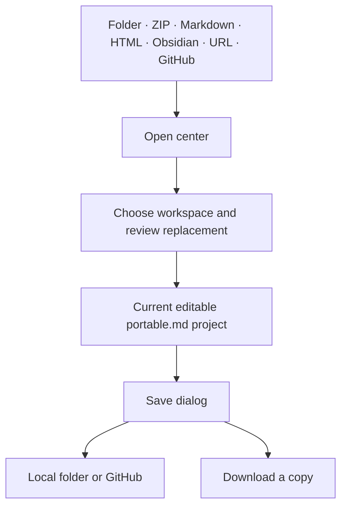

| Input | What opens |
| --- | --- |
| Content folder | pmd.json, portable.md and local assets |
| Project ZIP / supported single-file HTML | Editable project or imported source |
| Markdown/text / Paste Markdown | Imported pages; separately attach missing files |
| Obsidian vault ZIP/folder | Converted notes, links, Canvas and assets; a folder's index note (`Name/Name.md`, `Index.md` or `_Index - Name.md`) becomes the folder's own page; inspect plugin syntax |
| From URL / From GitHub | The actual reachable project; network/access may be required |
| New project / pmd Editor manual | A starter or this example project |

[URL helper](#/editor/url_helper) creates a reusable editor launch link with source and workspace choices.

**Ctrl/Cmd+S** or **Auto save** writes to the current workspace. A Browser draft needs a durable destination or download before closing. Folder uploads in browsers without writable-directory access are snapshots, not a live save connection.

**Save > Save now** shows the current **Workspace** and a **Switch** button.
Its **Auto save** checkbox turns automatic saving on or off; enabling it first
saves to an authorized folder or GitHub destination.

GitHub needs your selected repository, branch, content path and credentials. Review conflicts if the branch changed. A successful commit does not prove the website deployed.

Saving uses one ordered lane and a captured project version; changing projects or editing during a save must not let an older result replace newer work. Downloading a copy leaves the workspace unchanged.


> [!NOTE]
> **Video TODO · editor-save-workspace.webm**
> Record Browser draft to Local folder, Auto save state, a full project ZIP, then a GitHub save using a disposable repository without revealing credentials. See the [recording list](#/editor/recording_todos).

<!--pmd
id:"assets_builds"
title:"Exports and offline delivery"
parent:"publishing"
journey:"First project" "3"
updated:"2026-09-26"
showUpdated:"false"
-->
# A copy for every use

| Save / Tools option | Includes | Good for |
| --- | --- | --- |
| Markdown bundle | Page headers and bodies | Source review; attachments/config travel separately |
| Full project | content/pmd.json, Markdown and every local project file; ZIP or Folder | Continued editing, backup or skill input |
| Full project with Publishable checked | Editable content plus website HTML, reader and chosen publication files; ZIP or Folder | Static hosting and editable delivery |
| One-file offline HTML | Reader, dependencies and embedded local assets | A smaller read-only handout |
| Portable editor, in Tools | Editor and optional manual, current project and settings | Authoring offline |

**Full project** defaults to a content-only **ZIP**. Check **Publishable** to add
`index.html` and the other website files: a small page (about 20 KB), the reader's own
files named by content, and your `content/` folder. Nothing heavy is embedded; math, code,
diagrams and emoji load on demand from jsDelivr, and a visitor's browser can keep the reader
files until they change, so a published site opens in a fraction of a second. Visitors' browsers
contact jsDelivr for those libraries, so a privacy policy may need to mention it and the site needs
jsDelivr to be reachable; **One-file offline HTML** has no such dependency. Choose **Folder** to write directly to
a selected parent folder, with review of collisions and obsolete managed files.
Folder is disabled when the browser cannot write to directories.

**Markdown bundle** is useful for source review and projects whose asset links
are all remote. It omits `pmd.json` and local files, including unused attachments.
A warning appears when local assets are present or referenced, or cannot be
verified. Use **Full project** to keep those files with the source.

**Tools > Portable offline editor** has independent **Include current project**,
**Include current editor settings**, and **Include manual** checkboxes. The
manual is included by default. Uncheck **Include manual** for a smaller editor
file; its manual entry is then unavailable, including on offline re-export.

**Try:** choose **Save > Full project** for this manual. It includes the [demo pack](#/pmd_features/media/demo_files). Reopen the copy and play its audio/video before handing it over.

Local media, math, diagrams, code highlighting and built-in emoji can travel offline. Remote embeds, external CSS/scripts and uncollected URLs still need a network.

For large archives use folder/ZIP delivery; base64 and browser memory make single-file exports less suitable. See [budgets](#/skills/large-projects).

Publishing reviews owned files and collisions. Extracting a ZIP onto an old deployment does not remove obsolete files. Open the actual output to check it.

## Your content and the software license

Your Markdown, project settings and assets remain separate from the reader and
editor. You may choose your content's license and sell genuine content
publications, including bundles with the reader embedded, subject to rights you
hold. State those terms in a content page or accompanying document; exports do
not choose or apply a content license for you. Imported third-party material
keeps its own terms.

The software uses the **portable.md Source-Available License 1.0**. Business use
is allowed; software resale and paid access to its hosted functionality are
restricted. Retain **Powered by portable.md**. The editor's terms are in
**About > Credits & contributors**; offline reader exports carry the full terms
without showing them in the reading interface. A content license does not
cover the embedded software. Content-only exports require no portable.md credit.
You are responsible for your content and its use; the software credit does not
imply approval by portable.md's authors.


> [!NOTE]
> **Video TODO · editor-offline-export.webm**
> Record exporting this manual, disabling the network, opening its one-file reader and portable editor, and playing the local media. See the [recording list](#/editor/recording_todos).

<!--pmd
id:"pmd_config"
title:"Project config"
parent:"publishing"
updated:"2026-09-26"
showUpdated:"false"
-->
# Configure the reader

```json
{
  "TITLE": "My field guide",
  "LANG": "en",
  "DEFAULT_THEME": "dark",
  "ACCENT": "#3fabd1",
  "CACHE_MD": 0,
  "ALLOW_JS_FROM_MD": false
}
```

| Field | What it changes |
| --- | --- |
| TITLE | Project identity |
| LANG | Reader controls: en / fr; not a translation of authored text |
| DEFAULT_THEME / ACCENT | Reader theme and accent color |
| CUSTOM_CSS | Reviewed reader styling; check both themes, mobile and print |
| CACHE_MD | Markdown cache duration in minutes; 0 disables reuse |
| SHOW_EDITOR_LINK | Reader's Open in editor link |
| ALLOW_JS_FROM_MD | Authored script execution; off for new projects |
| CUSTOM_EMOJI | Alias/source records for real image assets |
| SITE | [Site, sharing and publication fields](#/editor/publishing/site_seo) |

**Try:** change the accent in a copy and preview it. Use Copy config when you need the actual saved JSON. Code languages load from authored fences; there is no language list to configure.

The built-in manual enables its reviewed [power API examples](#/pmd_features/power_api). Native slides, math, media and diagrams do not need that script setting.

## A live custom style

<div class="manual-demo-swatch"><strong>This card uses CUSTOM_CSS.</strong><p>Its scoped class styles this example without changing other pages.</p></div>

```css
.manual-demo-swatch { padding: 1.25rem; border: 1px solid currentColor; border-radius: .75rem; background: linear-gradient(135deg, transparent, rgba(63,171,209,.18)); }
```

This rule is saved in the manual's pmd.json. The page supplies a div with class="manual-demo-swatch". Keep custom rules scoped and check both themes.

<!--pmd
id:"site_seo"
title:"Site, sharing and SEO"
parent:"publishing"
updated:"2026-09-26"
showUpdated:"false"
-->
# Give the published project an identity

Set a title, description, actual canonical URL and real sharing image. Preview the generated metadata before publication. Autofill uses project context; verify the result.

| Purpose | SITE fields |
| --- | --- |
| Language / description | DIR, DESCRIPTION, KEYWORDS |
| Public identity | CANONICAL, ROBOTS, GOOGLEBOT |
| Brand | THEME_COLOR, ICON, SHOW_LOGO, SHOW_FAVICON, ICON_TYPE, ICON_SIZES |
| Device icons | APPLE_TOUCH_ICON, MASK_ICON, MASK_COLOR |
| Social card | OG_TYPE, SHARE_TITLE, SHARE_DESCRIPTION, SHARE_IMAGE, SHARE_IMAGE_WIDTH, SHARE_IMAGE_HEIGHT, SHARE_IMAGE_ALT |
| X/Twitter | TWITTER_CARD, TWITTER_SITE |
| Existing services | RSS, OEMBED_JSON, OEMBED_XML |
| Site ownership | GOOGLE_VERIFY, BING_VERIFY, YANDEX_VERIFY, PINTEREST_VERIFY |
| Alternate identities | HREFLANG (language URL per line), REL_ME (profile URL per line) |
| Structured data | JSON_LD: a serialized JSON string, not a JSON object |
| Crawlable pages | STATIC_FROM_BUNDLE, PUBLISH_PAGES, HIERARCHICAL_URLS |
| Advanced output | STATIC_HTML, NOSCRIPT, CSP, EXTRA_HEAD |

SHOW_LOGO, SHOW_FAVICON, STATIC_FROM_BUNDLE, PUBLISH_PAGES and HIERARCHICAL_URLS are booleans. Other SITE values are strings. Use only real identities, tokens and URLs.

A published site loads its reader from files beside `index.html` and its libraries from `https://cdn.jsdelivr.net`, so a **CSP** must allow both. Scripts need no `'unsafe-inline'` or `'unsafe-eval'`; styles need `'unsafe-inline'` because math and diagrams inject inline styles. This policy works with math, code, diagrams, the graph and emoji:

```text
default-src 'self'; script-src 'self' https://cdn.jsdelivr.net;
style-src 'self' 'unsafe-inline' https://cdn.jsdelivr.net; img-src 'self' data: blob: https://cdn.jsdelivr.net;
font-src 'self' data: https://cdn.jsdelivr.net; connect-src 'self' https://cdn.jsdelivr.net;
worker-src 'self' blob:; object-src 'none'; base-uri 'self'
```

Keep **Allow scripts from Markdown** off under a strict policy.

Publication can include `.nojekyll`, `robots.txt`, `sitemap.xml`, `site.webmanifest`, `opensearch.xml`. RSS/oEmbed fields point to existing services; they do not create them. **noindex** controls indexing, not access.

Use **Copy site head**, metadata preview and static preview to inspect output. [Page config](#/editor/page_config) provides per-page overrides.

<!--pmd
id:"page_publishing"
title:"Publishing individual pages"
parent:"publishing"
updated:"2026-09-26"
showUpdated:"false"
-->
# Give articles their own URLs

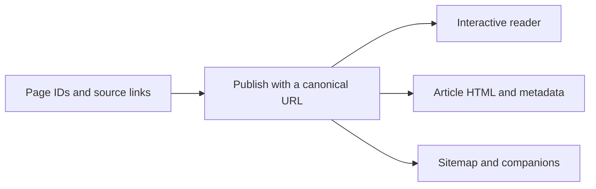

Enable **SITE.PUBLISH_PAGES** and set the real **SITE.CANONICAL**, then use a multi-file publication. Keep ordinary `#/page` links in your source; publication converts supported links.

| URL style | What changes it |
| --- | --- |
| Default article URLs | The page ID; title and parent changes preserve identity |
| HIERARCHICAL_URLS | Parent/folder moves can change paths; owned previous paths become redirects |

Use Page config for `seoTitle`, `description`, `image`, `imageAlt` and `noindex`. Empty overrides inherit site defaults. Simple folders organize routes; they are not articles.

**Check the output:** open an article directly, follow its links, inspect the sharing metadata, and review generated redirects/sitemap. A one-file reader uses fragment navigation and does not produce a directory of article files.

<!--pmd
id:"pmd_features"
title:"02 · portable.md"
parent:"home"
updated:"2026-09-26"
showUpdated:"false"
-->
# A reader made of connected pages

Read, search, explore relationships and learn by doing. These pages are the feature examples.

::::columns 3
### Read
[Navigation](#/pmd_features/reader_navigation) · [Previews](#/pmd_features/floating_previews) · [Journeys](#/pmd_features/journeys)
::::column
### Express
[Text](#/pmd_features/writing) · [Media](#/pmd_features/media) · [Diagrams](#/pmd_features/diagrams) · [Math](#/pmd_features/math)
::::column
### Connect
[Links](#/pmd_features/pages_and_links) · [Queries](#/pmd_features/live_queries) · [Canvas](#/pmd_features/canvas) · [Sources](#/pmd_features/notes_and_references)
::::

{{pages parent="pmd_features" view="list"}}

<!--pmd
id:"reader_navigation"
title:"Reader navigation"
parent:"pmd_features"
updated:"2026-09-26"
showUpdated:"false"
-->
# Find the answer from several directions

| Surface | Try it here |
| --- | --- |
| Explorer / breadcrumbs | Click a parent page's title to open it and reveal its children; use the arrow to fold the branch |
| Search | Search “Canvas”, then follow a result |
| Table of contents | Jump between headings in [Formatting](#/pmd_features/writing) |
| Page graph | Explore relationships between linked pages |
| Tags / related pages | Follow the small **query-demo** set |
| Journeys | Start the [first-project path](journey:First%20project) |
| Glossary / reference popovers | Hover or focus a term or citation |
| Theme / reading width / panels | Adjust the reading surface to your screen; on a phone, swipe right for the sidebar and left for the utility panel, then swipe back to close (wide tables, code, the graph, breadcrumbs and the image view keep their own drags) |
| Copy page/heading link | Share a location in the published project |
| Open in editor | Open the served project for editing when enabled |

The graph represents authored relationships. Drag a node, pan or zoom, then return to a page. Those camera/layout interactions do not rewrite the Markdown.

Large projects automatically fold distant branches while keeping the selected
page visible and zooming to it during navigation. Open the fullscreen graph and
choose **Expand all** to explore everything; automatic folding returns when you
close fullscreen. Branch labels take priority at overview scale, with note labels
appearing as you zoom or focus.
The **Label size** slider in fullscreen enlarges text from 100% to 200%. Label
spacing and collision priority adapt to the displayed size without moving nodes.
Simple folders have a grey outline, dark grey fill and grey name: they organize
child pages but have no content of their own. Pages with nothing below them are
tinted with the accent colour, so that they are not mistaken for folders.
The **Fern** button in the fullscreen controls arranges the whole graph as a fern:
the root at the middle, each folder a frond growing out of it, each page a leaf on
a pinna, and the longer the frond the more pages it carries. It shows the structure
and the size of every branch at a glance, without the tangle of a force layout;
tag and Markdown links turn faint until you hover a page. Nothing is simulated
while it lasts: pages glide to their places, the view turns to face the fern, you
can still rotate, zoom, fold branches, and pull a page aside (it goes back when
released). Press **Fern** again, or close fullscreen, to return to the arrangement
you had.
The **GPU / CPU** switch in the fullscreen controls chooses where the graph is
arranged. GPU is selected when your browser supports WebGPU; otherwise it is
disabled, with the reason, and the CPU arranges the graph. Switching keeps the
current arrangement. The two follow the same rules but do not produce identical
layouts: the GPU one is a little more spread out, more so as the graph grows. The
GitHub mark beside it links to d3-force-3d-webgpu, the project behind the GPU layout.
While a layout is being prepared, a small **Arranging graph…** badge shows that
work is in progress and disappears when the graph is ready.

Tag diamonds show their member count and up to five representative links. Hover
or tap a diamond to reveal links to its visible members. Fullscreen checkboxes
control **tag links**, **Markdown page links** and **journey links** in both graph
views. Tags and journeys start on; Markdown links start off and appear as dashed
gray lines when you hover a page. Closing the panel or switching browser tabs
suspends graph work.

**Try:** keep the table of contents visible while reading a long page; hide side panels for focused reading. A detached editor preview is temporary, while a published project URL is shareable.


> [!NOTE]
> **Video TODO · reader-navigation.webm**
> Record search, heading links, breadcrumbs, graph pan/zoom/drag, reading width and panel toggles. See the [recording list](#/editor/recording_todos).

<!--pmd
id:"floating_previews"
title:"Floating previews"
parent:"pmd_features"
updated:"2026-09-26"
showUpdated:"false"
-->
# Keep context beside the page

Follow this link normally, or preview [Canvas](#/pmd_features/canvas) first. Terms such as transclusion and checkpoint can show glossary definitions; citations reveal reusable sources.[@manual-example]

**Try in full Preview:** open a page preview, pin it, move/resize it, follow an internal link inside it, then close it. Open a pop-out note where offered. The main article stays available beside your reference.

| Surface | Content |
| --- | --- |
| Link preview | A linked page or heading |
| Glossary popover | A term and its aliases |
| Reference / footnote popover | Shared source or page-local note |
| Pinned preview / pop-out | A reading surface you can keep beside the article |

Floating views and their positions are reading state, not duplicated pages in your bundle.


> [!NOTE]
> **Video TODO · reader-floating-previews.webm**
> Record link and glossary previews, pinning, resizing, an internal preview link, pop-out and closing. See the [recording list](#/editor/recording_todos).

<!--pmd
id:"writing"
title:"Writing and formatting"
parent:"pmd_features"
updated:"2026-09-26"
showUpdated:"false"
-->
# A small type specimen

**Bold** · *italic* · ***both*** · ++underline++ · ~~retired~~ · ==highlight== · ||reveal||

H~2~O · x^2^ · `literal code` · <kbd>Ctrl</kbd>+<kbd>S</kbd>

-# Supporting text beneath a main idea.

First line  
second line, same paragraph.

> A quotation keeps its own voice.

<left>Left aligned</left>

<center>Centered caption</center>

<right>Right aligned</right>

:::spoiler See the source

````md
**Bold** · *italic* · ***both*** · ++underline++ · ~~retired~~ · ==highlight== · ||reveal||

H~2~O · x^2^ · `literal code` · <kbd>Ctrl</kbd>+<kbd>S</kbd>

-# Supporting text beneath a main idea.

First line  
second line, same paragraph.

> A quotation keeps its own voice.

<left>Left aligned</left>

<center>Centered caption</center>

<right>Right aligned</right>
````

:::

## Structure to copy

- One unordered item
  - A nested item
- Another item

1. First step
2. Next step

- [ ] Author's to-do
- [x] Author's completed item
- [?] Reader practice: click this

---

:::spoiler See the source

````md
- One unordered item
  - A nested item
- Another item

1. First step
2. Next step

- [ ] Author's to-do
- [x] Author's completed item
- [?] Reader practice: click this

---
````

:::

Headings run from `#` to `######`; Setext `===` / `---` underlines also work. `*` and `+` are alternate list markers, `1)` is an ordered marker. Escape markup with a backslash; use a longer backtick run when code itself contains backticks.

The `- [?]` checkbox is temporary reader state. `- [ ]` and `- [x]` are saved author states. Comments (`<!-- note -->`) hide in the view but remain public source.

[Callouts](#/pmd_features/callouts) · [Columns](#/pmd_features/columns) · [Tables](#/pmd_features/tables) · [Code](#/pmd_features/code)

<!--pmd
id:"callouts"
title:"Alerts, callouts and spoilers"
parent:"pmd_features"
updated:"2026-09-26"
showUpdated:"false"
-->
# Give an aside the right weight

> [!NOTE]
> Background worth keeping nearby.

> [!TIP]
> Open Compare to learn from any example.

> [!IMPORTANT]
> Save the attachments with the bundle.

> [!WARNING]
> A remote embed needs its host and the network.

> [!CAUTION]
> Deleting an asset can break references.

:::info
A callout can contain **Markdown** and multiple blocks.
:::

:::success
This local sample is included in the project.
:::

:::warning
Check the chosen destination before publishing.
:::

:::danger
Do not discard the only copy of your work.
:::

:::spoiler An optional answer
Spoilers are disclosure controls, not privacy controls.
:::

A callout or spoiler can hold another one. The first bare `:::` line that is not inside a code block and does not close an inner callout ends it, and `:::` inside a code block never ends anything, which is why the source below can show every example.

:::spoiler Nested callout
:::success
A callout inside a spoiler.
:::
Text after the inner callout stays in the spoiler.
:::

:::spoiler See the source

````md
> [!NOTE]
> Background worth keeping nearby.

> [!TIP]
> Open Compare to learn from any example.

> [!IMPORTANT]
> Save the attachments with the bundle.

> [!WARNING]
> A remote embed needs its host and the network.

> [!CAUTION]
> Deleting an asset can break references.

:::info
A callout can contain **Markdown** and multiple blocks.
:::

:::success
This local sample is included in the project.
:::

:::warning
Check the chosen destination before publishing.
:::

:::danger
Do not discard the only copy of your work.
:::

:::spoiler An optional answer
Spoilers are disclosure controls, not privacy controls.
:::
````

:::

<!--pmd
id:"columns"
title:"Columns"
parent:"pmd_features"
updated:"2026-09-26"
showUpdated:"false"
-->
# Compare side by side

::::columns 3
### Write
Keep the source in ordinary Markdown.
::::column
### Connect
Link the next useful idea.
::::column
### Share
Choose a reader or editable delivery.
::::

:::spoiler See the source

````md
::::columns 3
### Write
Keep the source in ordinary Markdown.
::::column
### Connect
Link the next useful idea.
::::column
### Share
Choose a reader or editable delivery.
::::
````

:::

Choose 2–1000 columns and use one `::::column` divider between neighbors. The floating **Column** controls add or remove one column at a time; removing a column merges its text into the last remaining column. Each column can contain ordinary Markdown, a callout or media. Do not nest column layouts. On a narrow screen, scroll sideways through the columns.

<!--pmd
id:"tables"
title:"Tables and data"
parent:"pmd_features"
updated:"2026-09-26"
showUpdated:"false"
-->
# Compare a few things, or explore a file

| Facet | Purpose | Sample pages |
| :--- | :---: | ---: |
| **Editor** | Authoring | 8 |
| portable.md | Reading | 12 |
| Skills | AI assistance | 4 |

:::spoiler See the source

````md
| Facet | Purpose | Sample pages |
| :--- | :---: | ---: |
| **Editor** | Authoring | 8 |
| portable.md | Reading | 12 |
| Skills | AI assistance | 4 |
````

:::

The numbers are illustrative. Use the table tools to insert, remove or align rows/columns. Escape a literal pipe as `\|`; cells contain inline content, without merged cells.

## A real CSV viewer


```md

```

Use the viewer controls to inspect the rows. TSV uses the same pattern:


[Download CSV](assets/example-data.csv "download") · [Download TSV](assets/example-data.tsv "download")

<!--pmd
id:"code"
title:"Code and language catalog"
parent:"pmd_features"
updated:"2026-09-26"
showUpdated:"false"
-->
# Source stays source

```js
const sections = ["Editor", "portable.md", "Skills"];
console.log(sections.join(" / "));
```

~~~python
print("Displayed code does not execute.")
~~~

:::spoiler See the source

````md
```js
const sections = ["Editor", "portable.md", "Skills"];
console.log(sections.join(" / "));
```

~~~python
print("Displayed code does not execute.")
~~~
````

:::

The language after a fence selects highlighting. Supported grammars load automatically. Unknown labels stay readable as plain text and can produce a warning. `mermaid` and `canvas` use their dedicated renderers.

Use the code block's copy control. Wrap a literal triple-backtick example in four backticks. A literal page header also needs bundle escaping: see [Bundle format](#/pmd_features/bundle_format).

:::spoiler All supported languages and aliases

Fences display code; they do not run it. Omit a label for plain text. Use a canonical name below or one of its aliases. Supported grammars load automatically from authored code fences. `mermaid` and `canvas` use separate renderers, not Highlight.js grammars. Unknown labels stay plain and may produce Issues. General programming-language semantics are outside the PMD syntax contract.

| Canonical language | Accepted aliases |
| --- | --- |
| `1c` | Canonical name only |
| `abnf` | Canonical name only |
| `accesslog` | Canonical name only |
| `actionscript` | `as` |
| `ada` | Canonical name only |
| `angelscript` | `asc` |
| `apache` | `apacheconf` |
| `applescript` | `osascript` |
| `arcade` | Canonical name only |
| `arduino` | `ino` |
| `armasm` | `arm` |
| `asciidoc` | `adoc` |
| `aspectj` | Canonical name only |
| `autohotkey` | `ahk` |
| `autoit` | Canonical name only |
| `avrasm` | Canonical name only |
| `awk` | Canonical name only |
| `axapta` | `x++` |
| `bash` | `sh`, `zsh` |
| `basic` | Canonical name only |
| `bnf` | Canonical name only |
| `brainfuck` | `bf` |
| `c` | `h` |
| `cal` | Canonical name only |
| `capnproto` | `capnp` |
| `ceylon` | Canonical name only |
| `clean` | `dcl`, `icl` |
| `clojure` | `clj`, `edn` |
| `clojure-repl` | Canonical name only |
| `cmake` | `cmake.in` |
| `coffeescript` | `coffee`, `cson`, `iced` |
| `coq` | Canonical name only |
| `cos` | `cls` |
| `cpp` | `c++`, `cc`, `cxx`, `h++`, `hh`, `hpp`, `hxx` |
| `crmsh` | `crm`, `pcmk` |
| `crystal` | `cr` |
| `csharp` | `c#`, `cs` |
| `csp` | Canonical name only |
| `css` | Canonical name only |
| `d` | Canonical name only |
| `dart` | Canonical name only |
| `delphi` | `dfm`, `dpr`, `pas`, `pascal` |
| `diff` | `patch` |
| `django` | `jinja` |
| `dns` | `bind`, `zone` |
| `dockerfile` | `docker` |
| `dos` | `bat`, `batch`, `cmd` |
| `dsconfig` | Canonical name only |
| `dts` | Canonical name only |
| `dust` | `dst` |
| `ebnf` | Canonical name only |
| `elixir` | `ex`, `exs` |
| `elm` | Canonical name only |
| `erb` | Canonical name only |
| `erlang` | `erl` |
| `erlang-repl` | Canonical name only |
| `excel` | `xls`, `xlsx` |
| `fix` | Canonical name only |
| `flix` | Canonical name only |
| `fortran` | `f90`, `f95` |
| `freedesktop` | `desktop`, `systemd` |
| `fsharp` | `f#`, `fs` |
| `gams` | `gms` |
| `gauss` | `gss` |
| `gcode` | `nc` |
| `gherkin` | `feature` |
| `glsl` | Canonical name only |
| `gml` | Canonical name only |
| `go` | `golang` |
| `golo` | Canonical name only |
| `gradle` | Canonical name only |
| `graphql` | `gql` |
| `groovy` | Canonical name only |
| `haml` | Canonical name only |
| `handlebars` | `hbs`, `html.handlebars`, `html.hbs`, `htmlbars` |
| `haskell` | `hs` |
| `haxe` | `hx` |
| `hsp` | Canonical name only |
| `http` | `https` |
| `hy` | `hylang` |
| `inform7` | `i7` |
| `ini` | `toml` |
| `irpf90` | Canonical name only |
| `isbl` | Canonical name only |
| `java` | `jsp` |
| `javascript` | `cjs`, `js`, `jsx`, `mjs` |
| `jboss-cli` | `wildfly-cli` |
| `json` | `json5`, `jsonc` |
| `julia` | Canonical name only |
| `julia-repl` | `jldoctest` |
| `kotlin` | `kt`, `ktm`, `kts`, `ktx` |
| `lasso` | `lassoscript` |
| `latex` | `tex` |
| `ldif` | Canonical name only |
| `leaf` | Canonical name only |
| `less` | Canonical name only |
| `lisp` | Canonical name only |
| `livecodeserver` | Canonical name only |
| `livescript` | `ls` |
| `llvm` | Canonical name only |
| `lsl` | Canonical name only |
| `lua` | `pluto` |
| `makefile` | `mak`, `make`, `mk` |
| `markdown` | `md`, `mkd`, `mkdown` |
| `mathematica` | `mma`, `wl` |
| `matlab` | Canonical name only |
| `maxima` | Canonical name only |
| `mel` | Canonical name only |
| `mercury` | `m`, `moo` |
| `mipsasm` | `mips` |
| `mizar` | Canonical name only |
| `mojolicious` | Canonical name only |
| `monkey` | Canonical name only |
| `moonscript` | `moon` |
| `n1ql` | Canonical name only |
| `nestedtext` | `nt` |
| `nginx` | `nginxconf` |
| `nim` | Canonical name only |
| `nix` | `nixos` |
| `node-repl` | Canonical name only |
| `nsis` | Canonical name only |
| `objectivec` | `mm`, `obj-c`, `obj-c++`, `objc`, `objective-c++` |
| `ocaml` | Canonical name only |
| `openscad` | `scad` |
| `oxygene` | Canonical name only |
| `parser3` | Canonical name only |
| `perl` | `pl`, `pm` |
| `pf` | `pf.conf` |
| `pgsql` | `postgres`, `postgresql` |
| `php` | Canonical name only |
| `php-template` | Canonical name only |
| `plaintext` | `text`, `txt` |
| `pony` | Canonical name only |
| `powershell` | `ps`, `ps1`, `pwsh` |
| `processing` | `pde` |
| `profile` | Canonical name only |
| `prolog` | Canonical name only |
| `properties` | Canonical name only |
| `protobuf` | `proto` |
| `puppet` | `pp` |
| `purebasic` | `pb`, `pbi` |
| `python` | `gyp`, `ipython`, `py` |
| `python-repl` | `pycon` |
| `q` | `k`, `kdb` |
| `qml` | `qt` |
| `r` | Canonical name only |
| `reasonml` | `re` |
| `rib` | Canonical name only |
| `roboconf` | `graph`, `instances` |
| `routeros` | `mikrotik` |
| `rsl` | Canonical name only |
| `ruby` | `gemspec`, `irb`, `podspec`, `rb`, `thor` |
| `ruleslanguage` | Canonical name only |
| `rust` | `rs` |
| `sas` | Canonical name only |
| `scala` | Canonical name only |
| `scheme` | `scm` |
| `scilab` | `sci` |
| `scss` | Canonical name only |
| `shell` | `console`, `shellsession` |
| `smali` | Canonical name only |
| `smalltalk` | `st` |
| `sml` | `ml` |
| `sqf` | Canonical name only |
| `sql` | Canonical name only |
| `stan` | `stanfuncs` |
| `stata` | `ado`, `do` |
| `step21` | `p21`, `step`, `stp` |
| `stylus` | `styl` |
| `subunit` | Canonical name only |
| `swift` | Canonical name only |
| `taggerscript` | Canonical name only |
| `tap` | Canonical name only |
| `tcl` | `tk` |
| `thrift` | Canonical name only |
| `tp` | Canonical name only |
| `twig` | `craftcms` |
| `typescript` | `cts`, `mts`, `ts`, `tsx` |
| `vala` | Canonical name only |
| `vbnet` | `vb` |
| `vbscript` | `vbs` |
| `vbscript-html` | Canonical name only |
| `verilog` | `sv`, `svh`, `v` |
| `vhdl` | Canonical name only |
| `vim` | Canonical name only |
| `wasm` | Canonical name only |
| `wren` | Canonical name only |
| `x86asm` | Canonical name only |
| `xl` | `tao` |
| `xml` | `atom`, `html`, `plist`, `rss`, `svg`, `wsf`, `xhtml`, `xjb`, `xsd`, `xsl` |
| `xquery` | `xpath`, `xq`, `xqm` |
| `yaml` | `yml` |
| `zephir` | `zep` |

:::

<!--pmd
id:"math"
title:"Math"
parent:"pmd_features"
updated:"2026-09-26"
showUpdated:"false"
-->
# Inline and display formulas

Inline $E=mc^2$ or ${2+3}$ stays in the sentence. Prices such as $5 to $10 remain text.

$$
\begin{aligned}
f(x) &= x^2 + 1 \\
f'(x) &= 2x
\end{aligned}
$$

:::spoiler See the source

````md
Inline $E=mc^2$ or ${2+3}$ stays in the sentence. Prices such as $5 to $10 remain text.

$$
\begin{aligned}
f(x) &= x^2 + 1 \\
f'(x) &= 2x
\end{aligned}
$$
````

:::

Use **Insert > Math** for symbols and templates. Inline math cannot begin with a digit or whitespace immediately after `$`; brace a numeric expression. Display `$$` fences go on separate lines.

Check the rendered formula and Issues. Successful TeX parsing is not a check of the mathematics.

<!--pmd
id:"media"
title:"Media lab"
parent:"pmd_features"
updated:"2026-09-26"
showUpdated:"false"
-->
# Files become part of the page

The same image-style Markdown selects the right player or viewer from the file type. These are real local attachments, included with this manual.

{{pages parent="media" view="cards"}}

[Browse and download the complete demo pack](#/pmd_features/media/demo_files) · [Manage Files](#/editor/files)

:::spoiler Supported media extensions

Use image-style Markdown for the image/player/viewer below, or a normal link for a download. Reference-style image syntax resolves identically. Classification uses the extension, ignoring query/fragment suffixes; codec support and network access remain browser-dependent. Unknown file extensions become downloads, while extensionless image-service URLs remain image candidates. Do not rename a file to claim conversion.

| Extension | Image-style result | MIME when known |
| --- | --- | --- |
| `avif` | image | image/avif |
| `bmp` | image | image/bmp |
| `gif` | image | image/gif |
| `ico` | image | image/x-icon |
| `jpeg` | image | image/jpeg |
| `jpg` | image | image/jpeg |
| `png` | image | image/png |
| `svg` | image | image/svg+xml |
| `webp` | image | image/webp |
| `mp4` | video | video/mp4 |
| `webm` | video | video/webm |
| `mov` | video | video/quicktime |
| `ogv` | video | Browser-detected |
| `m4v` | video | Browser-detected |
| `mp3` | audio | audio/mpeg |
| `m4a` | audio | audio/mp4 |
| `aac` | audio | Browser-detected |
| `oga` | audio | Browser-detected |
| `ogg` | audio | audio/ogg |
| `opus` | audio | audio/ogg |
| `wav` | audio | audio/wav |
| `flac` | audio | audio/flac |
| `pdf` | pdf | application/pdf |
| `csv` | csv | text/csv |
| `tsv` | tsv | text/tab-separated-values |
| `doc` | download | application/msword |
| `md` | markdown | text/markdown |
| `markdown` | markdown | text/markdown |
| `docx` | download | application/vnd.openxmlformats-officedocument.wordprocessingml.document |
| `odp` | download | application/vnd.oasis.opendocument.presentation |
| `ods` | download | application/vnd.oasis.opendocument.spreadsheet |
| `odt` | download | application/vnd.oasis.opendocument.text |
| `ppt` | download | application/vnd.ms-powerpoint |
| `pptx` | download | application/vnd.openxmlformats-officedocument.presentationml.presentation |
| `xls` | download | application/vnd.ms-excel |
| `xlsx` | download | application/vnd.openxmlformats-officedocument.spreadsheetml.sheet |
| `zip` | download | application/zip |

:::

<!--pmd
id:"images"
title:"Images and emoji"
parent:"media"
updated:"2026-09-26"
showUpdated:"false"
-->
# Look, zoom, reuse


```md

```

For a chosen width, use ``. Keep useful alternative text. Inspect the reader's image view and download controls. In the image view, zoom with the buttons, the mouse wheel or a two-finger pinch on a touch screen, and drag to move.

## Built-in and custom emoji

:joy: :book: :sparkles: :field:

```md
:joy: :book: :sparkles: :field:
```

The first three use built-in artwork; `field` is the real SVG in this project's emoji folder:

```json
{"CUSTOM_EMOJI":[{"alias":"field","src":"assets/emojis/field.svg"}]}
```

Use the emoji picker/custom-image manager to add your own. Aliases are case-sensitive, start with a letter/digit and can contain `_` or `-` (up to 64 characters). Built-in artwork is bundled in offline exports.

<!--pmd
id:"video"
title:"Video and silent loops"
parent:"media"
updated:"2026-09-26"
showUpdated:"false"
-->
# Play a local clip


```md

```

This synthetic clip demonstrates playback; it is not a recording of the interface. Use its playback, seek and fullscreen controls. It has no speech.

## Captioned video

<video class="pmd-media pmd-video" controls preload="metadata" width="640"><source src="assets/example-video.webm" type="video/webm"><track kind="captions" src="assets/example-captions.vtt" srclang="en" label="English" default></video>

## Silent looping animation


Add `"GIF mode"` after a video's source to autoplay it muted, looping and without controls. In Raw MD or Compare, place the caret in the video syntax and use the floating **GIF mode** checkbox to switch between animation and ordinary playback. Click the animation in the reader, or focus it and press Enter, to open the image-style lightbox. Zoom, drag and close it to return to the page.

:::spoiler Loop source

```md

```

:::

Use an ordinary player when users need control. [Download clip](assets/example-video.webm "download") · [Captions](assets/example-captions.vtt "download")


> [!NOTE]
> **Video TODO · reader-media.webm**
> Record video play/seek/fullscreen, captions, audio, PDF navigation and CSV controls. See the [recording list](#/editor/recording_todos).

<!--pmd
id:"audio"
title:"Audio"
parent:"media"
updated:"2026-09-26"
showUpdated:"false"
-->
# Hear the attachment


```md

```

**Audio description:** three short ascending tones, C–E–G, over three seconds. No speech. Start, pause and seek with the native controls.

For spoken material, place a transcript or useful summary beside the player. [Download the WAV](assets/example-audio.wav "download").

<!--pmd
id:"documents"
title:"PDF, Markdown and downloads"
parent:"media"
updated:"2026-09-26"
showUpdated:"false"
-->
# Read an attachment in place


```md

```

Editor previews and bundled attachments paint PDF pages directly; use the arrows for multi-page files. Hosted PDF URLs use the browser's own viewer when available. **Maximize** fills the reader's content area; fullscreen remains optional. The sample has one page. [Download the PDF](assets/example-document.pdf "download") to use your usual PDF tools.

## A separate Markdown file


**Pin preview** opens a movable, pinned copy. **Maximize** opens the same presentation view as other documents, without slide navigation; close it or press Escape to return.

The pinned copy has no **Access page** or **Copy link**, because the file is not a page of the project. Its **Pop out preview** button opens the rendered text in a separate read-only window. That window runs no scripts, and the editor's own Preview does not offer it.

```md

```

## A download button

[Download the sample readme](assets/example-download.txt "download")

```md
[Download the sample readme](assets/example-download.txt "download")
```

Office/OpenDocument and other binary attachments can be downloads; they are not full in-browser editors. Choose the right genuine file, rather than renaming text to an office extension.

<!--pmd
id:"embeds"
title:"HTML, iframe and remote video"
parent:"media"
updated:"2026-09-26"
showUpdated:"false"
-->
# Embed a small working surface

<iframe src="assets/example-embed.html" title="Local HTML disclosure demo" width="640" height="320" loading="lazy"></iframe>

[Download the local HTML demo](assets/example-embed.html "download")

```html
<iframe src="assets/example-embed.html" title="Local HTML disclosure demo"
  width="640" height="320" loading="lazy"></iframe>
```

The sample uses native HTML progress and disclosure controls without scripts. The HTML attachment travels with the manual.

## YouTube or another remote embed

Use **Insert > YouTube** with a real video URL; it creates a privacy-enhanced player. **Insert > Iframe** embeds another permitted page. Give either a descriptive title and a normal fallback link.

Remote hosts can refuse framing or playback, especially in an isolated editor preview. Verify the published reader too. Remote content is not offline content.

:::spoiler YouTube source pattern

```html
<iframe src="https://www.youtube-nocookie.com/embed/VIDEO_ID"
  title="Your verified video title" width="560" height="315"
  loading="lazy" allowfullscreen></iframe>
```

Replace VIDEO_ID with your actual video ID. This pattern intentionally does not load an unrelated external video.

:::

For reviewed custom scripts see the [power API playground](#/pmd_features/power_api). Active HTML and external resources deserve review even when script blocks are disabled.


> [!NOTE]
> **Video TODO · reader-remote-embed.webm**
> Record inserting your own published recording, showing its fallback link and verifying playback in the served reader. See the [recording list](#/editor/recording_todos).

<!--pmd
id:"demo_files"
title:"Demo files"
parent:"media"
updated:"2026-09-26"
showUpdated:"false"
-->
# A small offline demo pack

| File | Purpose |
| --- | --- |
| [Image](assets/example-image.png "download") | Raster cover made from the PDF |
| [Video](assets/example-video.webm "download") | Five-second synthetic playback sample |
| [Captions](assets/example-captions.vtt "download") | English WebVTT captions |
| [Audio](assets/example-audio.wav "download") | Three ascending tones, no speech |
| [PDF](assets/example-document.pdf "download") | One-page pocket field guide |
| [CSV](assets/example-data.csv "download") / [TSV](assets/example-data.tsv "download") | Illustrative counts, not a live inventory |
| [Markdown](assets/example-note.md "download") | A separately embedded note |
| [HTML](assets/example-embed.html "download") | Local iframe with native controls |
| [Custom emoji](assets/emojis/field.svg "download") | A local SVG alias |
| [BibTeX](assets/example-references.bib "download") / [RIS](assets/example-references.ris "download") / [CSL JSON](assets/example-references.json "download") | Import the same source in three library formats |
| [Readme](assets/example-download.txt "download") | Plain-text download and provenance |

These original synthetic samples are provided under the repository license. They contain no private documents, remote stock files or claimed screen recordings. Choose **Save > Full project** to download this manual and all its assets together. Keep its `content/` folder when you only need editable content.

Screen recordings still to make: [recording list](#/editor/recording_todos).

<!--pmd
id:"pages_and_links"
title:"Pages and links"
parent:"pmd_features"
tags:"query-demo"
updated:"2026-09-26"
showUpdated:"false"
-->
# A link is a relationship

[Home](#/) · [Canvas](#/pmd_features/canvas) · [Math heading](#/pmd_features/math#1)

[Follow the first-project journey](journey:First%20project)

[A named link][guide]

[guide]: #/editor/quick_start "Your first page"

:::spoiler See the source

````md
[Home](#/) · [Canvas](#/pmd_features/canvas) · [Math heading](#/pmd_features/math#inline-and-display-formulas)

[Follow the first-project journey](journey:First%20project)

[A named link][guide]

[guide]: #/editor/quick_start "Your first page"
````

:::

Use the link dialog to pick a page, heading or journey. Copy a rendered heading link instead of guessing its anchor. Page routes include ancestor IDs, with Home omitted. Heading anchors are numbered; use the link picker or heading-copy control.

Titles can change while IDs stay stable. Rename an ID or move a page through the editor so supported references are repaired. A simple folder is not an article target; link to its child.

External URLs and reference-style links use ordinary Markdown. Preview this link to [sources](#/pmd_features/notes_and_references) to keep context beside the page.

<!--pmd
id:"bundle_format"
title:"Bundle format and page fields"
parent:"pmd_features"
updated:"2026-09-26"
showUpdated:"false"
-->
# Many pages, one Markdown file

```text
content/
  pmd.json
  portable.md
  assets/
```

The bundle stores page headers and bodies. pmd.json stores project settings. Asset paths are relative to `content/`.

````md
<!--\pmd
id:"preparation"
title:"Preparation"
parent:"home"
journey:"Workshop" "1"
updated:"2026-09-26" "Checked the steps"
presentation:"h2"
-->
# Preparation

Bring your notes.
````

| Header | Meaning |
| --- | --- |
| id / title / parent | Stable identity, label and hierarchy |
| kind | page, simple, home, glossary, references |
| tags | Comma-separated memberships |
| journey | Names plus optional aligned order in a second quoted value |
| updated | Date plus optional comment in a second quoted value |
| showUpdated | `"false"` hides the date/comment display |
| presentation | h1, h2, h3 or --- |
| seoTitle / description | Publication metadata |
| image / imageAlt | Real sharing image and alternative text |
| noindex | `"true"` requests exclusion from indexing |

Each real header starts on its own line. These are not YAML headings. IDs must be unique and cannot contain `#`; parents must exist without cycles. Home, glossary and references are singleton roles.

:::info
A code fence alone does not protect a literal header inside a whole bundle. The canonical writer escapes it as `<!--\pmd`; the parser decodes one escape. Page-level editing takes normal unescaped Markdown. Use the editor or canonical serializer for full-bundle changes.
:::

<!--pmd
id:"live_queries"
title:"Live page queries"
parent:"pmd_features"
updated:"2026-09-26"
showUpdated:"false"
-->
# One selection, five views

These examples select the same two pages tagged **query-demo**. Change their metadata in a copy: the source and rendered result update together.

## List

{{pages tag="query-demo" view="list"}}

:::spoiler See the source

````md
{{pages tag="query-demo" view="list"}}
````

:::

## Cards

{{pages tag="query-demo" view="cards"}}

:::spoiler See the source

````md
{{pages tag="query-demo" view="cards"}}
````

:::

## Table

{{pages tag="query-demo" view="table"}}

:::spoiler See the source

````md
{{pages tag="query-demo" view="table"}}
````

:::

## Timeline

{{pages tag="query-demo" sort="updated" view="timeline"}}

:::spoiler See the source

````md
{{pages tag="query-demo" sort="updated" view="timeline"}}
````

:::

## Graph

{{pages tag="query-demo" view="graph"}}

:::spoiler See the source

````md
{{pages tag="query-demo" view="graph"}}
````

:::

:::spoiler Every query option

| Option | Value |
| --- | --- |
| tag | Exact case-insensitive membership |
| parent | Immediate children of this ID |
| journey | Actual reading-path name |
| text | Normalized text substring |
| current | `"false"` excludes this page; omit to include |
| sort | `"title"` or `"updated"`; omit for default order |
| limit | A positive integer string |
| empty | Your no-result message |
| view | list, cards, table, timeline or graph |

Filters combine with AND. Quote values. Unknown/duplicate options are errors. A timeline shows actual page update dates, not task deadlines.

:::

Use **Insert > Page query** to build a selection. [A journey query](#/pmd_features/journeys) orders pages without moving them in Explorer.

<!--pmd
id:"transclusion"
title:"Transclusion"
parent:"pmd_features"
updated:"2026-09-26"
showUpdated:"false"
-->
# Write once, include elsewhere

The paragraph below comes from the child page. Open it, change a word in a copy, and return.

![[transclusion_source#A reusable reminder]]

:::spoiler See the source

````md
![[transclusion_source#A reusable reminder]]
````

:::

Use `![[page-id]]` for a whole article or `![[page-id#Heading]]` for a section. Pick an existing heading with the builder. Do not include a page into itself or form a cycle.

An iframe embeds a separate document; a transclusion reuses authored portable.md content.

<!--pmd
id:"transclusion_source"
title:"Reusable source paragraph"
parent:"transclusion"
updated:"2026-09-26"
showUpdated:"false"
-->
# One maintained source

## A reusable reminder

:::info
Keep the original observation, label your interpretation, and link the evidence.
:::

## A section not included

The parent page includes only the reminder above. This sentence stays here.

<!--pmd
id:"journeys"
title:"Journeys"
parent:"pmd_features"
updated:"2026-09-26"
showUpdated:"false"
-->
# Read in an order that crosses folders

[Start the demo](journey:Journey%20demo)

{{pages journey="Journey demo" view="cards"}}

```md
journey:"Journey demo" "1"
```

Add that header membership to each step with its own order. The reading sequence is independent of Explorer hierarchy. A page can join several paths:

```md
journey:"Getting started, Quick tour" "2, 1"
```

Names and order values align by comma position. Omit order for bundle order; numbered steps come first. Reader progress is temporary reading state, not a saved completion tracker.

This manual also has a practical [First project](journey:First%20project) path.

**Try:** open [Five-minute start](#/editor/quick_start) normally. Its journey prompt offers **Yes / Dismiss**. Dismiss it, then reopen the page to see the offer again. On a later step, choose **From this page** or **From the start**.


> [!NOTE]
> **Video TODO · reader-journey.webm**
> Record starting a journey, stepping forward/back, opening the index and returning to normal navigation. See the [recording list](#/editor/recording_todos).

<!--pmd
id:"journey_start"
title:"Journey 1: Start"
parent:"journeys"
journey:"Journey demo" "1"
updated:"2026-09-26"
showUpdated:"false"
-->
# Journey 1: Start

Open a source page and identify its main idea. [Next: build](#/pmd_features/journeys/journey_build).

<!--pmd
id:"journey_build"
title:"Journey 2: Build"
parent:"journeys"
journey:"Journey demo" "2"
updated:"2026-09-26"
showUpdated:"false"
-->
# Journey 2: Build

Connect a related page and preview the link. [Next: publish](#/pmd_features/journeys/journey_publish).

<!--pmd
id:"journey_publish"
title:"Journey 3: Publish"
parent:"journeys"
journey:"Journey demo" "3"
updated:"2026-09-26"
showUpdated:"false"
-->
# Journey 3: Publish

Choose a delivery and inspect the actual output. [Explore exports](#/editor/publishing/assets_builds).

<!--pmd
id:"notes_and_references"
title:"Footnotes and references"
presentation:"h2"
parent:"pmd_features"
updated:"2026-09-26"
showUpdated:"false"
-->
# A small note, a reusable source

## Local footnote

A local detail belongs beside the sentence.[^detail]

[^detail]: This footnote belongs only to this page.

:::spoiler See the source

````md
A local detail belongs beside the sentence.[^detail]

[^detail]: This footnote belongs only to this page.
````

:::

## Reusable reference

The sample field guide travels with this manual.[@manual-example]

:::spoiler See the source

````md
The sample field guide travels with this manual.[@manual-example]
````

:::

The reference ID points to an H2 entry on the [References page](#/pmd_features/manual_references). Reuse it on several pages; keep footnote IDs local.

## Manage the library

Use the [reference and glossary managers](#/editor/libraries) to stage entries/imports, then **Apply changes**. Inspect imported citation fields and source cues. A staged entry is not yet a saved project change. Renaming/deleting an in-use reference needs repairs to its citations.

This page has `presentation:"h2"`: use **Present** to turn these same three sections into slides.

<!--pmd
id:"manual_references"
title:"References"
kind:"references"
parent:"pmd_features"
updated:"2026-09-26"
showUpdated:"false"
-->
# References

Reusable entries have H2 IDs. Cite this one as `[@manual-example]`.

## manual-example

<!-- pmd-reference: {"id":"manual-example","type":"document","title":"Pocket field guide","author":[{"literal":"portable.md manual"}],"issued":{"date-parts":[[2026]]},"note":"Original demonstration document included in the manual"} -->

Original demonstration document, included in this project. [Open the PDF](assets/example-document.pdf).


<!--pmd
id:"pmd_glossary"
title:"Glossary"
kind:"glossary"
parent:"pmd_features"
updated:"2026-09-26"
showUpdated:"false"
-->
# Glossary

H2 headings define terms. An `Aliases:` line adds alternate names recognized in page content.

## Bundle

Aliases: Markdown bundle

The single Markdown file containing all page headers and bodies. Configuration and attachment bytes are separate.

## Checkpoint

A local History copy of ordered pages and project configuration; not a media backup.

## portable.md

The suite and format for connected Markdown projects.

## Reader

Aliases: published reader

The application that displays the project. Runtime is the implementation name.

## portable.md Editor

The browser application for authoring, previewing and publishing a project.

## Page id

A stable identity separate from the displayed title.

## Page query

A directive that selects real pages and displays a maintained view.

## Journey

A named reading sequence independent of page hierarchy.

## Simple folder

A navigation-only page with an empty body.

## Transclusion

Reusing a page or section from its maintained source.

## Proposal

Pending agent work awaiting application; separate from accepted project content.

<!--pmd
id:"canvas"
title:"Canvas"
parent:"pmd_features"
updated:"2026-09-26"
showUpdated:"false"
-->
# Arrange ideas in space

```canvas
{"nodes":[{"id":"group","type":"group","x":-30,"y":-40,"width":960,"height":340,"label":"One project, three facets","color":"5"},{"id":"note","type":"text","text":"## Editor\n\nWrite, connect and preview.","x":0,"y":20,"width":240,"height":190},{"id":"reader","type":"link","url":"#/pmd_features","label":"portable.md","x":340,"y":20,"width":240,"height":190},{"id":"file","type":"file","file":"assets/example-image.png","x":680,"y":0,"width":190,"height":260}],"edges":[{"id":"a-b","fromNode":"note","toNode":"reader","label":"publish","fromSide":"right","toSide":"left"},{"id":"b-c","fromNode":"reader","toNode":"file","label":"carry files","fromSide":"right","toSide":"left"}]}
```

**Try in the editor:** open Canvas, double-click a text card, Shift-click two cards, and Connect them. Drag the background to select; right-drag to pan. Apply commits the draft and new referenced files together. Cancel abandons that draft.

| Element | Source fields |
| --- | --- |
| Every card | id, type, x, y, width, height; optional color |
| Text | text (Markdown) |
| Link | url, optional label |
| File | file, optional subpath |
| Group | label, optional background/backgroundStyle |
| Connection | id, fromNode, toNode; optional fromSide/toSide, fromEnd/toEnd, color, label |

Use actual page routes/files. Grouping is geometric: moving a group moves contained cards in the builder. A reader's pan/zoom is temporary. Text, link, file and group cards all appear in this example; inspect **Raw MD** for the JSON.


> [!NOTE]
> **Video TODO · editor-canvas.webm**
> Record adding text/link/file cards, multi-select, grouping, connecting, color, pan/zoom, Apply and Undo. See the [recording list](#/editor/recording_todos).

<!--pmd
id:"presentations"
title:"Presentations"
presentation:"h2"
parent:"pmd_features"
updated:"2026-09-26"
showUpdated:"false"
-->
# Three facets in three slides

Use **Present** in Page config or the reader. Arrow keys and the slide controls move between H2 sections; Escape returns to the article. This page uses `presentation:"h2"`, with no custom script.

## 01 · Write

**One idea per page.** Use the editor to organize, connect and preview.

- [?] Try Compare
- [?] Add a useful link

## 02 · Read

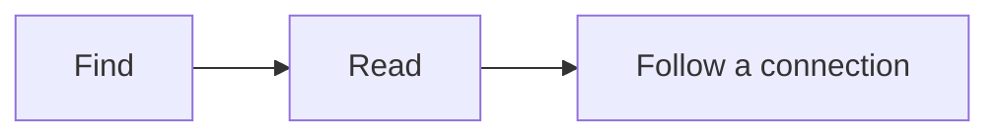

## 03 · Share

| Need | Delivery |
| --- | --- |
| Continue editing | The content/ folder from a project ZIP |
| Read offline | One-file HTML |
| Host a site | Full project |

Native slides reuse the page body. They are not a PowerPoint or PDF export. Split at H1, H2, H3 or `---`; headings inside code/quotes do not become slides.


> [!NOTE]
> **Video TODO · reader-presentations.webm**
> Record Present, next/previous slide, fullscreen and returning to the article. See the [recording list](#/editor/recording_todos).

<!--pmd
id:"power_api"
title:"Inline JavaScript power API"
parent:"pmd_features"
updated:"2026-09-26"
showUpdated:"false"
-->
# Inline JavaScript power API

Trusted Markdown scripts can use `window.PMD` to transform runtime-aware content and layout. The built-in manual enables scripts so these six experiments work here; new projects still keep **Allow scripts from Markdown** off by default. Every target must be inside the current page, and dynamically rendered Markdown never executes scripts of its own.

## Fill the content workspace

`PMD.fillContent(target, { closeButton: true })` gives one element the complete article workspace and adds an optional close button in its top-right corner. Escape, the returned function, or navigating to another page restores the page.

<button id="pmd-api-fill-open" type="button">Fill the content workspace</button>

<div id="pmd-api-fill-target" style="min-height:14rem; padding:1.2rem; border:1px solid var(--color-low-contrast); border-radius:.6rem; background:linear-gradient(135deg,var(--color-lowest-contrast),var(--color-main)); place-content:center; text-align:center;">
  <h2 style="border:0">Content takeover</h2>
  <p>This could be an iframe, canvas, dashboard, map, terminal, or generated application.</p>
</div>

<script>
(() => {
  const open = document.querySelector("#pmd-api-fill-open");
  const target = document.querySelector("#pmd-api-fill-target");
  open.addEventListener("click", () => {
    PMD.fillContent(target, { closeButton: true });
  });
})();
</script>

```js
const restore = PMD.fillContent("#dashboard", { closeButton: true });
// restore();
```

## Render dynamic Markdown

`PMD.renderMarkdown(markdown, { target })` uses the normal portable.md pipeline, including internal links, queries, math, diagrams, media, code tools, and glossary annotation.

<button id="pmd-api-render-run" type="button">Render generated Markdown</button>
<div id="pmd-api-render-target" style="min-height:8rem; margin-top:.6rem; padding:1rem; border:1px dashed var(--color-low-contrast); border-radius:.4rem;">The generated result will replace this text.</div>

<script>
(() => {
  const button = document.querySelector("#pmd-api-render-run");
  const target = document.querySelector("#pmd-api-render-target");
  button.addEventListener("click", () => PMD.renderMarkdown(`
## Generated by a script

:::info
This content passed through portable.md's renderer. Inline math works too: $E=mc^2$.
:::

${'{{pages parent="pmd_features" sort="title" limit="3" view="cards"}}'}
`, { target }));
})();
</script>

```js
await PMD.renderMarkdown(markdown, { target: "#result" });
```

## Float arbitrary content

`PMD.floatContent(target, options)` moves an element into a draggable, resizable portable.md panel. Closing the panel restores the element to its original position.

<button id="pmd-api-float-open" type="button">Float the card</button>
<div id="pmd-api-float-target" style="margin-top:.6rem; padding:1rem; border:1px solid var(--color-low-contrast); border-radius:.4rem;">
  <strong>Portable interactive surface</strong>
  <p>Drag the panel header, resize its corner, then close it.</p>
  <label>Local value <input type="range" min="0" max="100" value="40"></label>
</div>

<script>
(() => {
  const button = document.querySelector("#pmd-api-float-open");
  button.addEventListener("click", () => PMD.floatContent("#pmd-api-float-target", {
    anchor: button,
    title: "Manual API demo"
  }));
})();
</script>

```js
const close = PMD.floatContent("#calculator", {
  anchor: "#price",
  title: "Calculator"
});
```

## Apply a page-query lens

`PMD.lens(query)` temporarily scopes the Explorer, search, sibling/related navigation, and mini graph with the same grammar as `{{pages ...}}`. The current page and required ancestors stay reachable. The returned function or the next page navigation restores the complete wiki.

<button id="pmd-api-lens-open" type="button">Show a portable.md features lens</button>
<button id="pmd-api-lens-exit" type="button" disabled>Restore all pages</button>
<span id="pmd-api-lens-status" role="status"></span>

<script>
(() => {
  const open = document.querySelector("#pmd-api-lens-open");
  const exit = document.querySelector("#pmd-api-lens-exit");
  const status = document.querySelector("#pmd-api-lens-status");
  let restore = null;
  open.addEventListener("click", () => {
    restore?.();
    restore = PMD.lens('parent="pmd_features" sort="title" limit="4"');
    exit.disabled = false;
    status.textContent = " Lens active.";
  });
  exit.addEventListener("click", () => {
    restore?.();
    restore = null;
    exit.disabled = true;
    status.textContent = " Full wiki restored.";
  });
})();
</script>

```js
const restore = PMD.lens('tag="project-x"');
```

## Present heading sections as slides

`PMD.present(options)` promotes the page's highest-level matching heading sections into a presentation. Arrow keys, Page Up/Down, Home/End, and the generated controls move between slides; the URL follows the current heading. Its fullscreen control hides the Explorer and breadcrumbs before requesting browser fullscreen. Escape or the returned function restores the article and its previous shell layout.

<button id="pmd-api-present-open" type="button">Present this API page</button>

<script>
document.querySelector("#pmd-api-present-open").addEventListener("click", () => {
  PMD.present({ sections: "h2", start: 4 });
});
</script>

```js
const exit = PMD.present({ sections: "h2", start: 0 });
```

## Add a temporary native page

`PMD.addVirtualPage(page)` adds browser-local Markdown to portable.md's live page model. It immediately participates in routing, Explorer, search, graph, previews, and later page queries. Its Markdown is fully enhanced but never executes embedded scripts. The returned function removes the page again.

<button id="pmd-api-virtual-add" type="button">Add a live status page</button>
<button id="pmd-api-virtual-remove" type="button" disabled>Remove it</button>
<span id="pmd-api-virtual-status" role="status"></span>

<script>
(() => {
  const add = document.querySelector("#pmd-api-virtual-add");
  const removeButton = document.querySelector("#pmd-api-virtual-remove");
  const status = document.querySelector("#pmd-api-virtual-status");
  add.addEventListener("click", () => {
    globalThis.__pmdManualVirtualPage?.();
    globalThis.__pmdManualVirtualPage = PMD.addVirtualPage({
      id: "pmd_live_status",
      title: "Live status (temporary)",
      parent: "power_api",
      tags: "live, generated",
      markdown: `# Live status

:::info
This is a native portable.md page generated in the browser at ${new Date().toLocaleTimeString()}.
:::

It appears in navigation, search, previews, queries, and the graph until removed.`
    });
    removeButton.disabled = false;
    status.replaceChildren(" Added. ", Object.assign(document.createElement("a"), {
      href: "#/pmd_features/power_api/pmd_live_status",
      textContent: "Open the temporary page"
    }));
  });
  removeButton.addEventListener("click", () => {
    globalThis.__pmdManualVirtualPage?.();
    globalThis.__pmdManualVirtualPage = null;
    removeButton.disabled = true;
    status.textContent = " Temporary page removed.";
  });
})();
</script>

```js
const remove = await PMD.addVirtualPage({
  id: "live_status",
  title: "Live status",
  parent: "power_api",
  markdown
});
```

<!--pmd
id:"diagrams"
title:"Diagram atlas"
parent:"pmd_features"
updated:"2026-09-26"
showUpdated:"false"
-->
# Choose the relationship, then see it

Each entry below contains a live Mermaid example from the editor's installed template catalog and its copyable source. Values and labels are illustrative. Use **Insert > Mermaid** for the builder and template variants.

{{pages parent="diagrams" sort="title" view="list"}}

**Try:** open a diagram, inspect its source, and change one label in a copy. Math and diagram checks validate syntax; you still decide whether the relationships are true and the result is readable.


> [!NOTE]
> **Video TODO · editor-diagrams.webm**
> Record choosing a template, editing labels, previewing it, fixing an invalid diagram and inserting the result. See the [recording list](#/editor/recording_todos).

<!--pmd
id:"diagram_flowchart"
title:"flowchart"
parent:"diagrams"
updated:"2026-09-26"
showUpdated:"false"
-->
# flowchart

A process, decision tree or dependency path. Label decisions and outcomes; split an unreadable tangle.

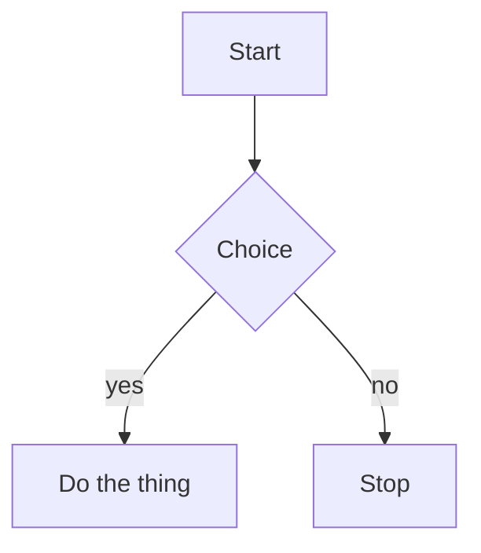

:::spoiler See the source

````md

````

:::

Open the Mermaid builder for the other templates in this family.

<!--pmd
id:"diagram_swimlane_beta"
title:"swimlane-beta"
parent:"diagrams"
updated:"2026-09-26"
showUpdated:"false"
-->
# swimlane-beta

A process divided by responsibility. Keep lanes consistent and label handoffs between teams or systems.

```mermaid
swimlane-beta LR
  subgraph Author
    Draft[Write draft]
    Revise[Revise page]
  end
  subgraph Reviewer
    Check{Ready to publish?}
  end
  subgraph Publisher
    Publish[Publish page]
  end
  Draft -->|Request review| Check
  Check -->|Changes needed| Revise
  Revise --> Check
  Check -->|Approved| Publish
```

:::spoiler See the source

````md
```mermaid
swimlane-beta LR
  subgraph Author
    Draft[Write draft]
    Revise[Revise page]
  end
  subgraph Reviewer
    Check{Ready to publish?}
  end
  subgraph Publisher
    Publish[Publish page]
  end
  Draft -->|Request review| Check
  Check -->|Changes needed| Revise
  Revise --> Check
  Check -->|Approved| Publish
```
````

:::

Open the Mermaid builder for the other templates in this family.

<!--pmd
id:"diagram_usecase_beta"
title:"usecase-beta"
parent:"diagrams"
updated:"2026-09-26"
showUpdated:"false"
-->
# usecase-beta

Actors and the goals a system supports. Show system boundaries and distinguish required included behavior from optional extensions.

```mermaid
usecase-beta
  direction LR
  actor Reader
  actor Author
  systemBoundary Wiki[Knowledge space]
    Browse(Browse pages)
    Search(Search notes)
    Edit(Edit a page)
  end
  Reader --> Browse
  Reader --> Search
  Author --> Edit
```

:::spoiler See the source

````md
```mermaid
usecase-beta
  direction LR
  actor Reader
  actor Author
  systemBoundary Wiki[Knowledge space]
    Browse(Browse pages)
    Search(Search notes)
    Edit(Edit a page)
  end
  Reader --> Browse
  Reader --> Search
  Author --> Edit
```
````

:::

Open the Mermaid builder for the other templates in this family.

<!--pmd
id:"diagram_sequencediagram"
title:"sequenceDiagram"
parent:"diagrams"
updated:"2026-09-26"
showUpdated:"false"
-->
# sequenceDiagram

Messages between actors over time. Keep participants stable and distinguish alternatives from parallel work.

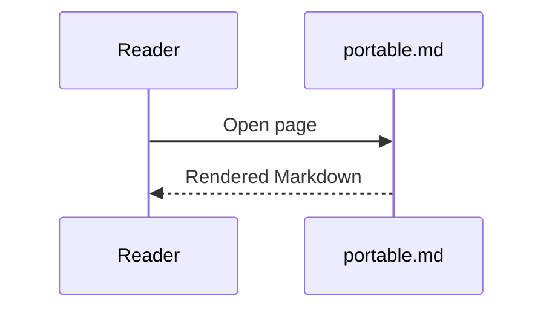

:::spoiler See the source

````md

````

:::

Open the Mermaid builder for the other templates in this family.

<!--pmd
id:"diagram_classdiagram"
title:"classDiagram"
parent:"diagrams"
updated:"2026-09-26"
showUpdated:"false"
-->
# classDiagram

Software types and their relationships. Use only attributes and methods supported by the source.

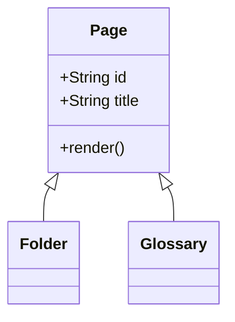

:::spoiler See the source

````md

````

:::

Open the Mermaid builder for the other templates in this family.

<!--pmd
id:"diagram_statediagram_v2"
title:"stateDiagram-v2"
parent:"diagrams"
updated:"2026-09-26"
showUpdated:"false"
-->
# stateDiagram-v2

States and allowed transitions. Show a state machine, not a chronological task list.

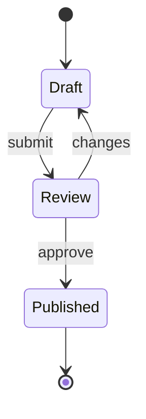

:::spoiler See the source

````md

````

:::

Open the Mermaid builder for the other templates in this family.

<!--pmd
id:"diagram_erdiagram"
title:"erDiagram"
parent:"diagrams"
updated:"2026-09-26"
showUpdated:"false"
-->
# erDiagram

Data entities, keys and cardinality. Do not invent a relationship because two records share a word.

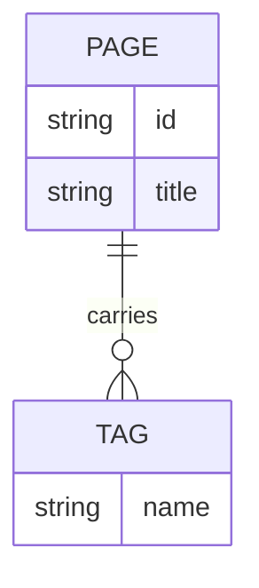

:::spoiler See the source

````md

````

:::

Open the Mermaid builder for the other templates in this family.

<!--pmd
id:"diagram_journey"
title:"journey"
parent:"diagrams"
updated:"2026-09-26"
showUpdated:"false"
-->
# journey

A person’s experience across stages and actors. Scores must be supplied or explicitly labeled illustrative; this is distinct from a PMD reading journey.

```mermaid
journey
  title Reading a page
  section Arrive
    Open link: 5: Reader
    Skim headings: 3: Reader
  section Read
    Follow journey: 4: Reader
```

:::spoiler See the source

````md
```mermaid
journey
  title Reading a page
  section Arrive
    Open link: 5: Reader
    Skim headings: 3: Reader
  section Read
    Follow journey: 4: Reader
```
````

:::

Open the Mermaid builder for the other templates in this family.

<!--pmd
id:"diagram_gantt"
title:"gantt"
parent:"diagrams"
updated:"2026-09-26"
showUpdated:"false"
-->
# gantt

A schedule with actual dates/durations/dependencies. Proposed plans must be labeled; do not convert update dates into commitments.

```mermaid
gantt
  title Release plan
  dateFormat YYYY-MM-DD
  section Writing
  Draft :a1, 2026-08-01, 7d
  Review :after a1, 3d
```

:::spoiler See the source

````md
```mermaid
gantt
  title Release plan
  dateFormat YYYY-MM-DD
  section Writing
  Draft :a1, 2026-08-01, 7d
  Review :after a1, 3d
```
````

:::

Open the Mermaid builder for the other templates in this family.

<!--pmd
id:"diagram_pie"
title:"pie"
parent:"diagrams"
updated:"2026-09-26"
showUpdated:"false"
-->
# pie

A small number of nonnegative parts of one whole. Use a table/bar chart when precise comparison matters.

```mermaid
pie title Page kinds
  "Articles" : 42
  "Folders" : 9
  "Glossary" : 3
```

:::spoiler See the source

````md
```mermaid
pie title Page kinds
  "Articles" : 42
  "Folders" : 9
  "Glossary" : 3
```
````

:::

Open the Mermaid builder for the other templates in this family.

<!--pmd
id:"diagram_quadrantchart"
title:"quadrantChart"
parent:"diagrams"
updated:"2026-09-26"
showUpdated:"false"
-->
# quadrantChart

Items positioned on two meaningful dimensions. Explain axes and the basis for placements.

```mermaid
quadrantChart
  title Effort and value
  x-axis Low effort --> High effort
  y-axis Low value --> High value
  Rewrite intro: [0.3, 0.8]
  Fix typos: [0.2, 0.3]
  New diagrams: [0.7, 0.7]
```

:::spoiler See the source

````md
```mermaid
quadrantChart
  title Effort and value
  x-axis Low effort --> High effort
  y-axis Low value --> High value
  Rewrite intro: [0.3, 0.8]
  Fix typos: [0.2, 0.3]
  New diagrams: [0.7, 0.7]
```
````

:::

Open the Mermaid builder for the other templates in this family.

<!--pmd
id:"diagram_requirementdiagram"
title:"requirementDiagram"
parent:"diagrams"
updated:"2026-09-26"
showUpdated:"false"
-->
# requirementDiagram

Trace requirements to verification and dependent elements. Preserve IDs and source evidence.

```mermaid
requirementDiagram

  requirement search {
    id: 1
    text: Pages must be findable
    risk: medium
    verifymethod: test
  }

  element index {
    type: index
  }

  index - satisfies -> search
```

:::spoiler See the source

````md
```mermaid
requirementDiagram

  requirement search {
    id: 1
    text: Pages must be findable
    risk: medium
    verifymethod: test
  }

  element index {
    type: index
  }

  index - satisfies -> search
```
````

:::

Open the Mermaid builder for the other templates in this family.

<!--pmd
id:"diagram_gitgraph"
title:"gitGraph"
parent:"diagrams"
updated:"2026-09-26"
showUpdated:"false"
-->
# gitGraph

Branch/merge history or a proposed workflow. A diagram does not create Git commits.

```mermaid
gitGraph
  commit id: "draft"
  branch review
  commit id: "edits"
  checkout main
  merge review
  commit id: "publish"
```

:::spoiler See the source

````md
```mermaid
gitGraph
  commit id: "draft"
  branch review
  commit id: "edits"
  checkout main
  merge review
  commit id: "publish"
```
````

:::

Open the Mermaid builder for the other templates in this family.

<!--pmd
id:"diagram_c4context"
title:"C4Context"
parent:"diagrams"
updated:"2026-09-26"
showUpdated:"false"
-->
# C4Context

People and systems, or containers within a system. Choose the right abstraction level and name boundaries.

```mermaid
C4Context
  title Reader and portable.md
  Person(reader, "Reader", "Reads the wiki")
  System(pmd, "portable.md", "Static wiki")
  System_Ext(host, "Static host", "Serves the files")
  Rel(reader, pmd, "Opens pages")
  Rel(pmd, host, "Fetches Markdown", "HTTPS")
```

:::spoiler See the source

````md
```mermaid
C4Context
  title Reader and portable.md
  Person(reader, "Reader", "Reads the wiki")
  System(pmd, "portable.md", "Static wiki")
  System_Ext(host, "Static host", "Serves the files")
  Rel(reader, pmd, "Opens pages")
  Rel(pmd, host, "Fetches Markdown", "HTTPS")
```
````

:::

Open the Mermaid builder for the other templates in this family.

<!--pmd
id:"diagram_mindmap"
title:"mindmap"
parent:"diagrams"
updated:"2026-09-26"
showUpdated:"false"
-->
# mindmap

A concept hierarchy for exploration. Use page hierarchy or a list for straightforward navigation.

```mermaid
mindmap
  root((portable.md))
    Pages
      Tags
      Journeys
    Rendering
      Markdown
      Diagrams
```

:::spoiler See the source

````md
```mermaid
mindmap
  root((portable.md))
    Pages
      Tags
      Journeys
    Rendering
      Markdown
      Diagrams
```
````

:::

Open the Mermaid builder for the other templates in this family.

<!--pmd
id:"diagram_timeline"
title:"timeline"
parent:"diagrams"
updated:"2026-09-26"
showUpdated:"false"
-->
# timeline

Named historical periods/events. Keep dates factual and distinguish this authored diagram from a page-update timeline.

```mermaid
timeline
  title Bundle history
  2026-07 : First draft
  2026-08 : Review : Published
```

:::spoiler See the source

````md
```mermaid
timeline
  title Bundle history
  2026-07 : First draft
  2026-08 : Review : Published
```
````

:::

Open the Mermaid builder for the other templates in this family.

<!--pmd
id:"diagram_sankey_beta"
title:"sankey-beta"
parent:"diagrams"
updated:"2026-09-26"
showUpdated:"false"
-->
# sankey-beta

Quantities flowing between stages. Verify units and conservation assumptions; not a generic dependency graph.

```mermaid
sankey-beta

Search,Article,40
Search,Glossary,10
Article,Journey,25
```

:::spoiler See the source

````md
```mermaid
sankey-beta

Search,Article,40
Search,Glossary,10
Article,Journey,25
```
````

:::

Open the Mermaid builder for the other templates in this family.

<!--pmd
id:"diagram_xychart_beta"
title:"xychart-beta"
parent:"diagrams"
updated:"2026-09-26"
showUpdated:"false"
-->
# xychart-beta

Numeric comparisons or trends with labeled axes/units. Preserve measured data and avoid fabricated points.

```mermaid
xychart-beta
  title "Pages per month"
  x-axis [jan, feb, mar, apr]
  y-axis "Pages" 0 --> 60
  bar [12, 24, 38, 55]
  line [12, 24, 38, 55]
```

:::spoiler See the source

````md
```mermaid
xychart-beta
  title "Pages per month"
  x-axis [jan, feb, mar, apr]
  y-axis "Pages" 0 --> 60
  bar [12, 24, 38, 55]
  line [12, 24, 38, 55]
```
````

:::

Open the Mermaid builder for the other templates in this family.

<!--pmd
id:"diagram_block_beta"
title:"block-beta"
parent:"diagrams"
updated:"2026-09-26"
showUpdated:"false"
-->
# block-beta

A deliberate block arrangement or layered structure. Prefer flowchart when layout is secondary to connections.

```mermaid
block-beta
  columns 3
  reader(("Reader")):3
  space:3
  shell["Shell"] render["Renderer"] store[("Bundle")]

  reader --> shell
  shell --> render
  render --> store
```

:::spoiler See the source

````md
```mermaid
block-beta
  columns 3
  reader(("Reader")):3
  space:3
  shell["Shell"] render["Renderer"] store[("Bundle")]

  reader --> shell
  shell --> render
  render --> store
```
````

:::

Open the Mermaid builder for the other templates in this family.

<!--pmd
id:"diagram_packet"
title:"packet"
parent:"diagrams"
updated:"2026-09-26"
showUpdated:"false"
-->
# packet

Bit fields in a packet/header. Validate offsets, widths and total size against the real format.

```mermaid
packet
  title Page record
  0-15: "Page id"
  16-31: "Flags"
  32-63: "Updated"
  64-127: "Title"
```

:::spoiler See the source

````md
```mermaid
packet
  title Page record
  0-15: "Page id"
  16-31: "Flags"
  32-63: "Updated"
  64-127: "Title"
```
````

:::

Open the Mermaid builder for the other templates in this family.

<!--pmd
id:"diagram_kanban"
title:"kanban"
parent:"diagrams"
updated:"2026-09-26"
showUpdated:"false"
-->
# kanban

An authored work-board snapshot. It is not a live task database; changes require source edits.

```mermaid
kanban
  Todo
    [Write intro]
  Doing
    [Review diagrams]
  Done
    [Ship bundle]
```

:::spoiler See the source

````md
```mermaid
kanban
  Todo
    [Write intro]
  Doing
    [Review diagrams]
  Done
    [Ship bundle]
```
````

:::

Open the Mermaid builder for the other templates in this family.

<!--pmd
id:"diagram_architecture_beta"
title:"architecture-beta"
parent:"diagrams"
updated:"2026-09-26"
showUpdated:"false"
-->
# architecture-beta

Services, infrastructure groups and links. Diagram actual components rather than decorative cloud boxes.

```mermaid
architecture-beta
  group site(cloud)[Static site]
  service pages(server)[Pages] in site
  service assets(disk)[Assets] in site
  pages:R -- L:assets
```

:::spoiler See the source

````md
```mermaid
architecture-beta
  group site(cloud)[Static site]
  service pages(server)[Pages] in site
  service assets(disk)[Assets] in site
  pages:R -- L:assets
```
````

:::

Open the Mermaid builder for the other templates in this family.

<!--pmd
id:"diagram_radar_beta"
title:"radar-beta"
parent:"diagrams"
updated:"2026-09-26"
showUpdated:"false"
-->
# radar-beta

Several comparable metrics on the same scale. Explain normalization; a table is clearer for exact values.

```mermaid
radar-beta
  title Page quality
  axis clarity["Clarity"], depth["Depth"], links["Links"], media["Media"]
  curve now["Now"]{3, 4, 2, 5}
```

:::spoiler See the source

````md
```mermaid
radar-beta
  title Page quality
  axis clarity["Clarity"], depth["Depth"], links["Links"], media["Media"]
  curve now["Now"]{3, 4, 2, 5}
```
````

:::

Open the Mermaid builder for the other templates in this family.

<!--pmd
id:"diagram_treemap_beta"
title:"treemap-beta"
parent:"diagrams"
updated:"2026-09-26"
showUpdated:"false"
-->
# treemap-beta

Nested quantitative composition. Use meaningful nonnegative sizes and a stable hierarchy.

```mermaid
treemap-beta
"Bundle"
  "Articles": 42
  "Folders": 9
  "Glossary": 3
```

:::spoiler See the source

````md
```mermaid
treemap-beta
"Bundle"
  "Articles": 42
  "Folders": 9
  "Glossary": 3
```
````

:::

Open the Mermaid builder for the other templates in this family.

<!--pmd
id:"diagram_venn_beta"
title:"venn-beta"
parent:"diagrams"
updated:"2026-09-26"
showUpdated:"false"
-->
# venn-beta

Set membership and overlap. Do not imply measured overlap sizes without supporting data.

```mermaid
venn-beta
  title "Page kinds"
  set Tagged
  set Journey
  union Tagged,Journey["Both"]
```

:::spoiler See the source

````md
```mermaid
venn-beta
  title "Page kinds"
  set Tagged
  set Journey
  union Tagged,Journey["Both"]
```
````

:::

Open the Mermaid builder for the other templates in this family.

<!--pmd
id:"diagram_ishikawa_beta"
title:"ishikawa-beta"
parent:"diagrams"
updated:"2026-09-26"
showUpdated:"false"
-->
# ishikawa-beta

Candidate causes grouped around a problem. Label hypotheses rather than presenting them as verified causes.

```mermaid
ishikawa-beta
  Page went stale
    People
      No owner
    Process
      No review date
```

:::spoiler See the source

````md
```mermaid
ishikawa-beta
  Page went stale
    People
      No owner
    Process
      No review date
```
````

:::

Open the Mermaid builder for the other templates in this family.

<!--pmd
id:"diagram_wardley_beta"
title:"wardley-beta"
parent:"diagrams"
updated:"2026-09-26"
showUpdated:"false"
-->
# wardley-beta

A strategy map of user needs, dependencies and evolution. Explain positioning assumptions.

```mermaid
wardley-beta
  title Publishing chain
  anchor Reader [0.9, 0.7]
  component Page [0.75, 0.6]
  component Bundle [0.6, 0.4]
  Reader -> Page
  Page -> Bundle
```

:::spoiler See the source

````md
```mermaid
wardley-beta
  title Publishing chain
  anchor Reader [0.9, 0.7]
  component Page [0.75, 0.6]
  component Bundle [0.6, 0.4]
  Reader -> Page
  Page -> Bundle
```
````

:::

Open the Mermaid builder for the other templates in this family.

<!--pmd
id:"diagram_cynefin_beta"
title:"cynefin-beta"
parent:"diagrams"
updated:"2026-09-26"
showUpdated:"false"
-->
# cynefin-beta

Situations classified by decision context. Explain the classification rather than implying scientific measurement.

```mermaid
cynefin-beta
  clear "Fix a typo"
  complicated "Restructure journeys"
  complex "Rewrite the manual"
  chaotic "Recover a lost bundle"
```

:::spoiler See the source

````md
```mermaid
cynefin-beta
  clear "Fix a typo"
  complicated "Restructure journeys"
  complex "Rewrite the manual"
  chaotic "Recover a lost bundle"
```
````

:::

Open the Mermaid builder for the other templates in this family.

<!--pmd
id:"diagram_eventmodeling"
title:"eventmodeling"
parent:"diagrams"
updated:"2026-09-26"
showUpdated:"false"
-->
# eventmodeling

Commands, events and read models across a process. Keep order and system ownership explicit.

```mermaid
eventmodeling

tf 01 ui SearchUI
tf 02 cmd OpenPage
tf 03 evt PageOpened
tf 04 rmo JourneyReader ->> 03
```

:::spoiler See the source

````md
```mermaid
eventmodeling

tf 01 ui SearchUI
tf 02 cmd OpenPage
tf 03 evt PageOpened
tf 04 rmo JourneyReader ->> 03
```
````

:::

Open the Mermaid builder for the other templates in this family.

<!--pmd
id:"diagram_treeview_beta"
title:"treeView-beta"
parent:"diagrams"
updated:"2026-09-26"
showUpdated:"false"
-->
# treeView-beta

A file or structural tree. For a navigable knowledge space, actual PMD pages still carry the content.

```mermaid
treeView-beta
    pmd-project/
        index.html
        content/
            pmd.json
            portable.md
            assets/
                example-image.png
```

:::spoiler See the source

````md
```mermaid
treeView-beta
    pmd-project/
        index.html
        content/
            pmd.json
            portable.md
            assets/
                example-image.png
```
````

:::

Open the Mermaid builder for the other templates in this family.

<!--pmd
id:"diagram_railroad_abnf_beta"
title:"railroad-abnf-beta"
parent:"diagrams"
updated:"2026-09-26"
showUpdated:"false"
-->
# railroad-abnf-beta

A grammar supplied in ABNF. Verify alternatives and repetitions against the real grammar.

```mermaid
railroad-abnf-beta
    title Page route

    route = "#" page-id *( "#" page-id ) ;
    page-id = 1*( ALPHA / DIGIT / "_" ) ;
```

:::spoiler See the source

````md
```mermaid
railroad-abnf-beta
    title Page route

    route = "#" page-id *( "#" page-id ) ;
    page-id = 1*( ALPHA / DIGIT / "_" ) ;
```
````

:::

Open the Mermaid builder for the other templates in this family.

<!--pmd
id:"diagram_railroad_ebnf_beta"
title:"railroad-ebnf-beta"
parent:"diagrams"
updated:"2026-09-26"
showUpdated:"false"
-->
# railroad-ebnf-beta

A grammar supplied in EBNF. Keep terminal/nonterminal distinctions explicit.

```mermaid
railroad-ebnf-beta
    title Query option

    query = "{{pages" option* "}}" ;
    option = name "=" value ;
    name = letter+ ;
    letter = "a" | "b" | "c" ;
```

:::spoiler See the source

````md
```mermaid
railroad-ebnf-beta
    title Query option

    query = "{{pages" option* "}}" ;
    option = name "=" value ;
    name = letter+ ;
    letter = "a" | "b" | "c" ;
```
````

:::

Open the Mermaid builder for the other templates in this family.

<!--pmd
id:"diagram_railroad_beta"
title:"railroad-beta"
parent:"diagrams"
updated:"2026-09-26"
showUpdated:"false"
-->
# railroad-beta

A railroad diagram written as Mermaid’s intermediate representation. Use when that source form is supplied.

```mermaid
railroad-beta
    title Page route

    route = sequence(terminal("#"), nonterminal("id"), zeroOrMore(sequence(terminal("#"), nonterminal("id")))) ;
    id = oneOrMore(nonterminal("letter")) ;
    letter = choice(terminal("a"), terminal("b")) ;
```

:::spoiler See the source

````md
```mermaid
railroad-beta
    title Page route

    route = sequence(terminal("#"), nonterminal("id"), zeroOrMore(sequence(terminal("#"), nonterminal("id")))) ;
    id = oneOrMore(nonterminal("letter")) ;
    letter = choice(terminal("a"), terminal("b")) ;
```
````

:::

Open the Mermaid builder for the other templates in this family.

<!--pmd
id:"diagram_railroad_peg_beta"
title:"railroad-peg-beta"
parent:"diagrams"
updated:"2026-09-26"
showUpdated:"false"
-->
# railroad-peg-beta

A parsing-expression grammar. Ordered alternatives are not interchangeable with ABNF/EBNF choices.

```mermaid
railroad-peg-beta
    title Tag filter

    Filter <- Tag ("," Tag)* ;
    Tag <- Letter+ ;
    Letter <- "a" / "b" / "c" ;
```

:::spoiler See the source

````md
```mermaid
railroad-peg-beta
    title Tag filter

    Filter <- Tag ("," Tag)* ;
    Tag <- Letter+ ;
    Letter <- "a" / "b" / "c" ;
```
````

:::

Open the Mermaid builder for the other templates in this family.

<!--pmd
id:"diagram_zenuml"
title:"zenuml"
parent:"diagrams"
updated:"2026-09-26"
showUpdated:"false"
-->
# zenuml

A sequence diagram in ZenUML notation. PMD loads its pinned registration; do not relabel arbitrary Java-like code as a diagram.

```mermaid
zenuml
  title Page request
  @Actor Reader
  @Boundary Shell
  Reader->Shell.openPage(id) {
    Renderer.render(page)
  }
```

:::spoiler See the source

````md
```mermaid
zenuml
  title Page request
  @Actor Reader
  @Boundary Shell
  Reader->Shell.openPage(id) {
    Renderer.render(page)
  }
```
````

:::

Open the Mermaid builder for the other templates in this family.

<!--pmd
id:"skills"
title:"03 · Skills"
parent:"home"
updated:"2026-09-26"
showUpdated:"false"
-->
# Build with your AI app

Two skills help an AI app author ordinary portable.md projects. You bring the material and intent; the result remains editable files and a publishable reader.

::::columns 2
### pmd-create
Turn notes, documents or an idea into a **new project**.

[Create a project](#/skills/skill_create)
::::column
### pmd-edit
Understand and improve an **existing project**, in files or a permitted live editor.

[Edit a project](#/skills/skill_edit)
::::

{{pages parent="skills" view="cards"}}

The skills are instructions and helpers, not an AI service or a bundled connector. Your AI app supplies the model and its actual file/browser tools.

<!--pmd
id:"skill_create"
title:"pmd-create: a new project"
parent:"skills"
updated:"2026-09-26"
showUpdated:"false"
-->
# From material to connected pages

```mermaid
flowchart LR
  Notes[Notes, documents or idea] --> AI[AI app with pmd-create]
  AI --> ZIP[Editable content ZIP]
  ZIP --> Editor[Import in editor]
  Editor --> Reader[Publish a reader]
```

1. Open **Tools > Create a project with AI**, or **Already have knowledge to organize?** in Open.
2. Download pmd-create and install the complete skill ZIP in your AI app using that app's supported method.
3. Supply your material and a prompt like the one below.
4. Use **Import project ZIP**, choose a workspace, inspect the pages and save.

```text
Use pmd-create to turn these notes into a portable.md field guide
for a first-time reader. Preserve the useful detail and sources.
Use short connected pages and working local examples.
Return a new editable content ZIP. Do not publish it.
```

No live editor connection is needed. The ZIP root contains `content/pmd.json`, `content/portable.md` and any assets. If the AI app cannot make ZIPs, use the content-folder alternative in **Prompting help**.

Downloading a skill does not install it. Older installed skills and downloaded offline editors do not update themselves; get a fresh package when needed.


> [!NOTE]
> **Video TODO · skill-create-project.webm**
> Record downloading the skill, a short prompt in your AI app, importing its ZIP, inspecting the result and saving. See the [recording list](#/editor/recording_todos).

<!--pmd
id:"skill_edit"
title:"pmd-edit: an existing project"
parent:"skills"
updated:"2026-09-26"
showUpdated:"false"
-->
# Improve what you already have

| Mode | Supply | Result |
| --- | --- | --- |
| File project | The actual content folder/ZIP and your request | Preserved existing content with reviewed file changes |
| Live editor | The copied connection prompt and enabled access | Changes in the current project through normal editing transactions |
| Question | The accessible project and your question | Read-only explanation unless you ask for edits |

```text
Use pmd-edit to add the missing steps from these notes.
Keep my annotations, completed tasks, sources and branding.
Show me the proposed changes before applying them.
```

For direct work, ask for the concrete change. For review-first work, the skill prepares a proposal. Accepted live milestones support Undo and enter the normal save lane; a proposal is not a saved result.

In file mode, keep recoverable originals and avoid another writer against an editor's unsaved project. Reopen the changed project to inspect it.

[Connect the live editor](#/skills/agent_connection) · [Understand proposals](#/skills/agent_workflow)

<!--pmd
id:"agent_connection"
title:"Connect an agent"
parent:"skills"
updated:"2026-09-26"
showUpdated:"false"
-->
# Connect once, check what succeeded

1. Open **Tools > Agent** (or F8).
2. Download and install **pmd-edit**, including its references and scripts.
3. Check **Allow agent to read and edit this project** yourself.
4. Paste the connection prompt unchanged into your AI app.
5. Look for a successful route in **Connection status** and the AI's confirmed project context.

| Route | Needs |
| --- | --- |
| JavaScript / WebMCP / CDP | A capable permitted browser integration |
| Supplied local HTTP | This computer's supplied relay and copied endpoint |
| MCP | The [desktop app](#/skills/desktop_app) and an AI app connected to it; no prompt to paste |
| Manual JSON fallback | Advanced > Connection mode; paste request, Run, copy response |

The skill tries supported available routes. It cannot connect a remote cloud app to a local browser by itself. **Connection help** contains host-specific setup; the status distinguishes observed requests from reported attempts.

**Pause** blocks requests while retaining the connection. **Resume** needs fresh context. **Stop** revokes access and hides the Agent bar. Opening another project resets project access. Never paste credentials into a demonstration recording.


> [!NOTE]
> **Video TODO · skill-live-connection.webm**
> Record setup, a successful context read, connection status, Pause/Resume and Stop; hide endpoint secrets and credentials. See the [recording list](#/editor/recording_todos).

<!--pmd
id:"desktop_app"
title:"Desktop app (Windows and Linux)"
parent:"skills"
updated:"2026-10-03"
showUpdated:"false"
-->
# The editor in its own window

The **portable.md** desktop app runs this editor and the reader without a browser tab, a launcher script or Python. On macOS, use the editor in your browser.

A thin strip above the editor holds the app's own actions, and is also the title bar: drag its empty space to move the window.

| Strip | What it does |
| --- | --- |
| The project menu | Your projects and **Scratch**; see **Projects** below |
| **Editor** / **Reader** | Edit the project, or read it full-window as its readers see it |
| **Connect agent** | Connect AI apps; its dot is green when an approved app can work, amber when agent access is off |
| **More** | Open in browser, Zoom in, Zoom out, Actual size, Full screen, Reload, Developer tools, Check for updates, **Show Connect agent**, About |

If you do not use AI apps, clear **More > Show Connect agent** to hide that button; **Connect agent…** stays in **More**.

Keys work as in a browser: Ctrl+= and Ctrl+- zoom, Ctrl+0 resets, F11 is full screen, F5 reloads.

1. Install it for your account (no administrator prompt) and open it from the Start menu.
2. Click **Connect agent** in the strip.
3. **Connect** each AI app you use, then restart that app.
4. Open a project and check **Allow agent to read and edit this project** in **Tools > Agent**, as in the browser.
5. Ask the AI app for a change. Its first request asks **Allow … to work with portable.md?** Deny is the default.

The Agent bar then reads **Connected through MCP**. Changes arrive as one Undo step and use the normal save lane. Approval lasts until the app quits; **Connect agent** lists the approved apps, and **Revoke** asks again before an app's next request.

| AI app | Connect |
| --- | --- |
| Claude Desktop, Cursor, VS Code, Windsurf, Gemini CLI, Codex | **Connect** writes its MCP settings and keeps a backup beside them |
| Claude Code | **Connect** runs its own `claude mcp add` command |
| Any other MCP app | **Copy MCP settings (JSON)** or **Copy URL settings**; keep the URL key private |
| An AI tool inside a browser | **More > Open in browser**, then connect as in the browser |

**Files from your computer.** An AI app adds a local file with `pmd_upload_file` instead of sending its bytes. portable.md asks once per folder and connection before anything is read.

**Guidance included.** Over MCP, the app serves the pmd-edit guide as `pmd_guide`, so installing the skill is optional there.

## Reading

**Reader** in the strip shows the open project full-window; **Editor** or the reader's **Edit** button returns. A project folder or exported page given to the app, for example dropped on its icon or by a Read shortcut, opens read-only in its own window, without the editor. **Open in editor** then opens it: one of your projects opens as that project, another folder is asked for as a Local folder in **Scratch**, and an exported page is imported. Those reader windows use a separate local address, so a project's own scripts never reach the editor, its Browser drafts or the agent connection.

## Projects

Until you choose a project, the strip shows **Scratch (not saved)**: nothing you try there is kept. Each project is a folder, in **%APPDATA%\portable.md\Projects** for the installed app or beside the portable app:

| In a project folder | Holds |
| --- | --- |
| `content` | The project, exactly as a browser's Local folder workspace keeps it |
| `.portable.md` | That project's drafts, History and editor settings |

The project button opens the project menu:

| Project menu | What it does |
| --- | --- |
| A project, or Scratch | Opens it, after asking about unsaved work |
| **New project folder…** | Creates a project folder and opens it as a Local folder workspace, with no folder picker. From Scratch, your draft moves into it; from a project, a new project starts there |
| **Rename…** / **Delete…** | Renames the open project, or moves it to the Recycle Bin after a confirmation. portable.md keeps an open project's drafts in use while it runs, so this happens at the next start, or now with **Restart now** |
| **Create shortcut…** | A `.pmd` shortcut that opens the project; see **Shortcuts** below |
| **Show project folder** | Opens the folder |

A project always opens from its `content` folder. **Auto save** is on for projects until you turn it off, so your edits reach the folder on their own. In a project, **Local folder** means that project's folder. A `content` folder copied into the projects folder becomes a project. Web addresses, Markdown files and other folders open in **Scratch**, never inside a project.

Uninstalling the app asks whether to delete your projects too. **No** is the default and keeps them for a later install.

## Trust

The editor asks **Trust imported project** only when a project can run JavaScript, in the browser too: `<script>` with **Allow scripts from Markdown** on in **Project config**, or, whatever that setting, inline event handlers such as `onerror=`, `javascript:` links, embedded frames, scripts in the published site's head, or `.html` files. Projects the desktop app made never ask.

## Shortcuts

A shortcut is a small `.pmd` file that opens the app on a project with a double-click, like a desktop shortcut (not a keyboard shortcut). It holds one JSON object:

```json
{ "pmd": 1, "mode": "reader", "folder": "." }
```

| Field | Meaning |
| --- | --- |
| `mode` | `"editor"` (the default) or `"reader"` |
| Editor options | The URL helper's options: `source`, `workspace`, `folder`, `repo`, `branch`, `path`, `agent`, `view`, `route` |
| Reader options | `folder` or `page`, and an optional `route` such as `"#/home"` |

Paths are relative to the `.pmd` file, so a shortcut kept beside a project's `content` folder travels with it. Shortcuts never hold tokens: one with `pat` or `source-pat` is refused, and the editor asks when it needs a token.

**Create shortcut…** in the project menu writes one for you. For a project, it opens that project; in Scratch, choose what it opens (a project folder, a web address or GitHub repository, or whatever the app has open). Choose **Edit** or **Read**, an optional page and, for Edit, the agent option. The window shows the exact file and closes once it is saved. It is named **Edit _project_.pmd** or **Read _project_.pmd**.

## Portable app

The **portable** version is one `.exe` that runs without installing, for example from a USB stick. It keeps everything in a **portable.md data** folder beside itself: one folder per project, and `.app` for window size, approvals and connection keys. AI apps connect to it with **Copy URL settings** while it is open.

To open shortcuts with a double-click, choose **More > Open .pmd shortcuts with this app**. It applies to your Windows account only and can be turned off the same way. If you move the portable app, open it once from its new place. If a shortcut still opens with another app, right-click it, choose **Open with > Choose another app**, select **portable.md** and choose **Always**. You can also drop a shortcut onto the portable `.exe`.

## Updates

Builds with a release feed check for updates. The app asks before downloading and again before restarting; restarting asks about unsaved work as usual. Otherwise the update installs the next time you quit. **Check for updates** is in **More**.

> [!NOTE]
> The desktop app keeps its own browser storage. Browser drafts made in your web browser stay there: save or export a project to move it.

<!--pmd
id:"agent_workflow"
title:"Proposals, milestones and recovery"
parent:"skills"
updated:"2026-09-26"
showUpdated:"false"
-->
# See what changed

```mermaid
flowchart LR
  Request[Your request] --> Context[Read current context]
  Context --> Work[Prepare a coherent change]
  Work --> Review[Optional proposal review]
  Review --> Apply[Apply exact proposal]
  Work --> Apply
  Apply --> Check[Issues and Preview]
  Check --> Save[Normal save lane]
```

| State | Meaning |
| --- | --- |
| Proposal / candidate | Pending work; inspect the diff before Apply when you asked for review |
| Milestone | Accepted content and staged assets, one coherent Undo step |
| Activity / follow | Progress and optional navigation to the work |
| Saved | The workspace save actually succeeded |

An agent can read/write supported pages, metadata, configuration and files. It cannot grant itself access. The live API has no save/export/import/Undo/History permission shortcut; UI actions remain separate.

After a conflict or interrupted request, inspect status and fresh context before retrying. Undo recent accepted work in the editor, discard a pending proposal, or restore a checkpoint according to the state you mean.


> [!NOTE]
> **Video TODO · skill-proposal-review.webm**
> Record a read-only question, review-first diff, Apply, Issues, a milestone and Undo. See the [recording list](#/editor/recording_todos).

<!--pmd
id:"skill_prompts"
title:"Prompt recipe book"
parent:"skills"
updated:"2026-09-26"
showUpdated:"false"
-->
# Describe the reader's task

| Aim | Copy and adapt |
| --- | --- |
| Onboarding | “Turn these notes into a first-day guide. Put prerequisites before actions and keep a source link beside each policy.” |
| Encyclopedia | “Keep the detail, split topics into connected entries, add an overview and a glossary. Use actual media where useful.” |
| Evidence | “Separate observations from interpretations. Keep conflicting sources visible and cite the material supplied.” |
| Improve a project | “Find hard-to-scan pages, shorten repeated explanations, and preserve IDs, annotations and completed tasks.” |
| Slides | “Create a concise derived presentation from this page. Keep the original and use native H2 slides.” |
| Rich explanation | “Explain this process with a diagram and a small worked example. Mark unknown facts; do not invent data.” |

Give the audience, desired outcome, actual source material and any non-negotiable constraints. You need not pick a diagram syntax or list every feature.

The skills can choose pages, tables, columns, diagrams, Canvas, queries, journeys, glossary, citations, media and native presentations. Images/documents require real available tools and bytes. A filename alone is not an attached file.

<!--pmd
id:"skill_sources"
title:"Source material and coverage"
parent:"skills"
updated:"2026-09-26"
showUpdated:"false"
-->
# Preserve meaning while changing form

```mermaid
flowchart LR
  Inventory[Inventory all sources] --> Extract[Read or extract]
  Extract --> Map[Map sources to pages]
  Map --> Enrich[Connect and explain]
  Enrich --> Check[Check coverage and claims]
```

**Useful request:** “Account for every source file. Keep the meaning and supporting detail; label conflicts and uncertainty. Tell me what could not be read.”

PDFs, audio, video and scanned documents can inform authoring only if the AI app has tools to inspect them. The skills do not bundle universal OCR, transcription or a citation-verification service.

For large material, process coherent batches and keep a source-to-page coverage account. Do not mistake a limited preview or paginated response for the whole archive. Keep private extraction files outside the publishable content unless you intend to share them.

Use [references and footnotes](#/pmd_features/notes_and_references) to make claims traceable. Syntax checks do not establish source accuracy.

<!--pmd
id:"skill_runtime"
title:"From skill output to published reader"
parent:"skills"
updated:"2026-09-26"
showUpdated:"false"
-->
# The project is the handoff

```text
project/
  content/
    pmd.json       project identity and settings
    portable.md   every page and its metadata
    assets/       actual images, audio, video and documents
```

Open the content folder or project ZIP in the editor. Inspect the overview, links, citations, media, Issues and narrow Preview. Then choose a [delivery](#/editor/publishing/assets_builds).

| Need | Next step |
| --- | --- |
| Keep authoring with AI or by hand | Keep the editable content project |
| Publish the runtime as a site | Export a full project or publish a website folder |
| Read offline | Export one-file offline HTML and reopen it offline |
| Keep the editor too | Export a portable editor with the project |

A skill-created content folder alone is not a standalone website. The reader/runtime comes from the editor's publication/export flow. Do not publish a candidate or an old preview snapshot by accident.

**Try:** use the manual's full project ZIP as a small project, reopen it, and verify one media page in the produced reader.

<!--pmd
id:"skill_validation"
title:"Checks and troubleshooting"
parent:"skills"
updated:"2026-09-26"
showUpdated:"false"
-->
# Check the result at three levels

| Check | Establishes |
| --- | --- |
| Canonical model / Issues | Supported structure, references and checked syntax |
| Actual reader / export | The content renders and files travel with it |
| Source and editorial review | Claims, coverage and reader usefulness |

The packaged validators are read-only. With a compatible editor checkout:

```sh
node scripts/validate-project.mjs --project /path/to/project --editor /path/to/pmd-editor
```

For existing content use pmd-edit's helper with `--profile existing`. Its `inspect-changes.mjs` compares private before/candidate/current copies and detects staleness; it does not apply edits or approve them.

| Problem | Next action |
| --- | --- |
| Skill unavailable | Install the full downloaded ZIP using the AI app's supported method |
| No connection | Inspect Connection status/help; use a supported route or file workflow |
| Wrong project / stale context | Stop and reconnect/read current context before editing |
| Missing asset | Supply real bytes and repair the source path |
| Pending renderer | Open the real Preview and report what remains unchecked |
| New feature absent from an old skill | Download the current compatible package; inspect version differences |

Do not treat “validation passed” as proof of a factual claim, a successful deployment or universal host compatibility.

<!--pmd
id:"large-projects"
title:"Large archives and media"
parent:"skills"
updated:"2026-09-26"
showUpdated:"false"
-->
# Keep the whole archive, deliver it sensibly

| Accepted-project budget | Ceiling |
| --- | --- |
| Pages / Markdown | 20,000 / 128 MiB UTF-8 |
| pmd.json | 32 MiB UTF-8 |
| Editable project | 5 GiB / 25,000 files |
| Headings | 100,000 total / 5,000 per page |
| Journeys | 2,000 names / 100,000 memberships / 100 per page |
| One-file assets / HTML imports | 512 MiB each; browser memory may run out earlier |

These are ceilings, not speed guarantees. Use current context for applicable limits. Prefer folder or ZIP delivery for large media libraries; Browser drafts and checkpoints are not durable media storage.

For a connected agent, the request budget is 8 MiB JSON. Large attachments use **upload begin → chunk → finish**, then the ordinary staged `put_file` edit. Chunks are at most 4 MiB decoded. The supplied upload helper uses the existing permitted connection; it does not create a bridge or save a project.

Work in complete milestones, follow pagination to the end, preserve source coverage and verify the final saved files. Hosting and AI tools may impose smaller limits.

<!--pmd
id:"recording_todos"
title:"Video recording list"
parent:"editor"
updated:"2026-09-26"
showUpdated:"false"
-->
# Screen demonstrations to record

The manual already includes a real local playback sample. The items below are **unrecorded interface demonstrations**, with filenames and shot lists ready for production.

Record a disposable project, keep pointer and text readable, show the result, and avoid credentials or private material. Add captions or a transcript. After recording, put the file under `pmd-content-docs/content/assets/`, embed it on the target page as `assets/...`, and check the item off.

- [ ] **editor-first-project.webm**: [Five-minute start](#/editor/quick_start). Record a new project, a page, Compare, a link, Issues and a saved full project ZIP in 60–90 seconds.

- [ ] **editor-panels.webm**: [Workspace and panels](#/editor/workspace). Record docking, resizing, pinning a command and keyboard navigation.

- [ ] **editor-find-replace.webm**: [Find / Replace](#/editor/find_replace). Record Page versus All pages, next/previous match, a replacement and Undo.

- [ ] **editor-page-tree.webm**: [Organize pages](#/editor/organize_pages). Record creating a child and sibling, drag/reorder, a title rename, a simple-folder conversion and Undo.

- [ ] **editor-preview.webm**: [Preview and navigation](#/editor/preview). Record Compare, full Preview, phone preview, detached preview refresh and returning to the same editing position.

- [ ] **editor-files.webm**: [Files and remote assets](#/editor/files). Record image paste, file upload, insertion, usage inspection and a missing-file repair.

- [ ] **editor-save-workspace.webm**: [Open, save, and GitHub](#/editor/publishing/open_save_publish). Record Browser draft to Local folder, Auto save state, a full project ZIP, then a GitHub save using a disposable repository without revealing credentials.

- [ ] **editor-offline-export.webm**: [Exports and offline delivery](#/editor/publishing/assets_builds). Record exporting this manual, disabling the network, opening its one-file reader and portable editor, and playing the local media.

- [ ] **reader-navigation.webm**: [Reader navigation](#/pmd_features/reader_navigation). Record search, heading links, breadcrumbs, graph pan/zoom/drag, reading width and panel toggles.

- [ ] **reader-floating-previews.webm**: [Floating previews](#/pmd_features/floating_previews). Record link and glossary previews, pinning, resizing, an internal preview link, pop-out and closing.

- [ ] **reader-media.webm**: [Video and silent loops](#/pmd_features/media/video). Record video play/seek/fullscreen, captions, audio, PDF navigation and CSV controls.

- [ ] **reader-remote-embed.webm**: [HTML, iframe and remote video](#/pmd_features/media/embeds). Record inserting your own published recording, showing its fallback link and verifying playback in the served reader.

- [ ] **reader-journey.webm**: [Journeys](#/pmd_features/journeys). Record starting a journey, stepping forward/back, opening the index and returning to normal navigation.

- [ ] **editor-canvas.webm**: [Canvas](#/pmd_features/canvas). Record adding text/link/file cards, multi-select, grouping, connecting, color, pan/zoom, Apply and Undo.

- [ ] **reader-presentations.webm**: [Presentations](#/pmd_features/presentations). Record Present, next/previous slide, fullscreen and returning to the article.

- [ ] **editor-diagrams.webm**: [Diagram atlas](#/pmd_features/diagrams). Record choosing a template, editing labels, previewing it, fixing an invalid diagram and inserting the result.

- [ ] **skill-create-project.webm**: [pmd-create: a new project](#/skills/skill_create). Record downloading the skill, a short prompt in your AI app, importing its ZIP, inspecting the result and saving.

- [ ] **skill-live-connection.webm**: [Connect an agent](#/skills/agent_connection). Record setup, a successful context read, connection status, Pause/Resume and Stop; hide endpoint secrets and credentials.

- [ ] **skill-proposal-review.webm**: [Proposals, milestones and recovery](#/skills/agent_workflow). Record a read-only question, review-first diff, Apply, Issues, a milestone and Undo.

- [ ] **editor-libraries.webm**: [Glossary and reference managers](#/editor/libraries). Record glossary aliases, a reference import, duplicate review, Stage import, Apply and a citation popover.
